DNS Record Types

DNS isn't just for websites though, and multiple types of DNS record exist. We'll go over some of the most common ones that you're likely to come across.

A Record

These records resolve to IPv4 addresses, for example 104.26.10.229

AAAA Record

These records resolve to IPv6 addresses, for example 2606:4700:20::681a:be5

CNAME Record

These records resolve to another domain name, for example, TryHackMe's online shop has the subdomain name store.tryhackme.com which returns a CNAME record shops.shopify.com. Another DNS request would then be made to shops.shopify.com to work out the IP address.

MX Record

These records resolve to the address of the servers that handle the email for the domain you are querying, for example an MX record response for tryhackme.com would look something like alt1.aspmx.l.google.com. These records also come with a priority flag. This tells the client in which order to try the servers, this is perfect for if the main server goes down and email needs to be sent to a backup server.

TXT Record

TXT records are free text fields where any text-based data can be stored. TXT records have multiple uses, but some common ones can be to list servers that have the authority to send an email on behalf of the domain (this can help in the battle against spam and spoofed email). They can also be used to verify ownership of the domain name when signing up for third party services.

GET Request

This is used for getting information from a web server.

POST Request

This is used for submitting data to the web server and potentially creating new records

PUT Request

This is used for submitting data to a web server to update information

DELETE Request

This is used for deleting information/records from a web server.
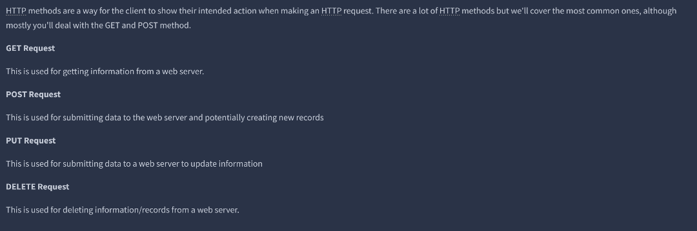

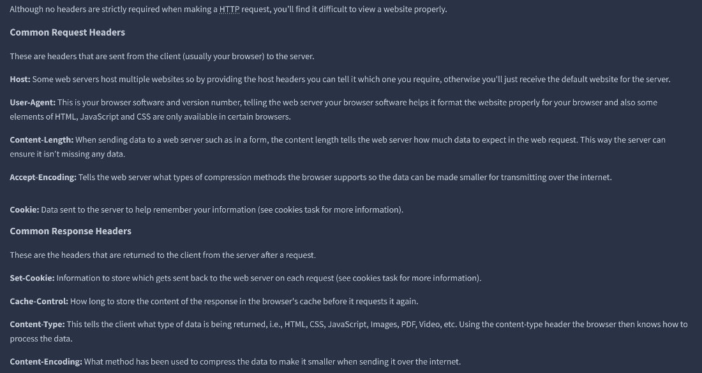

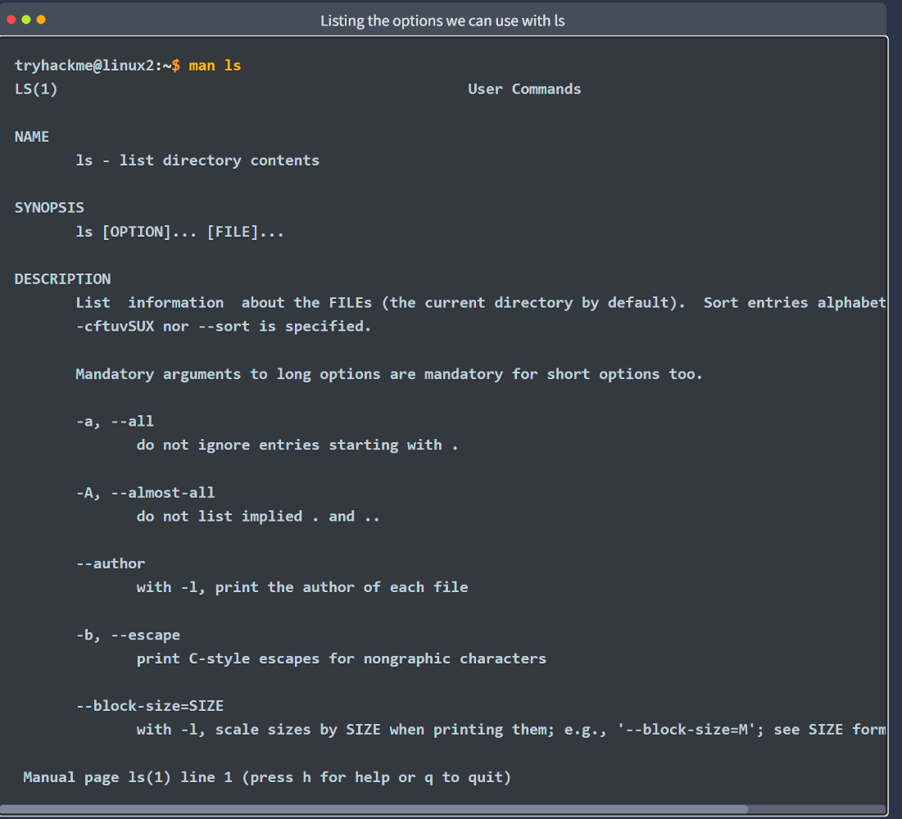

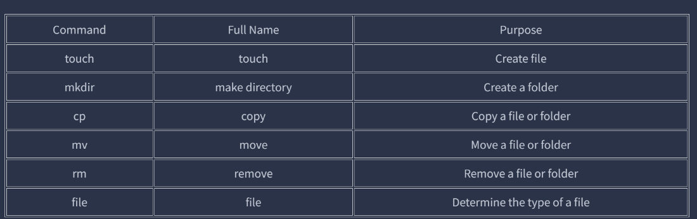

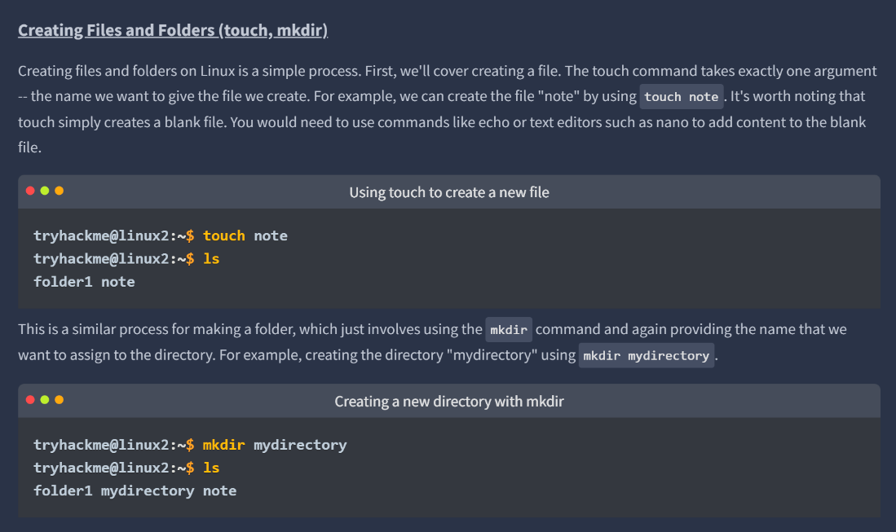

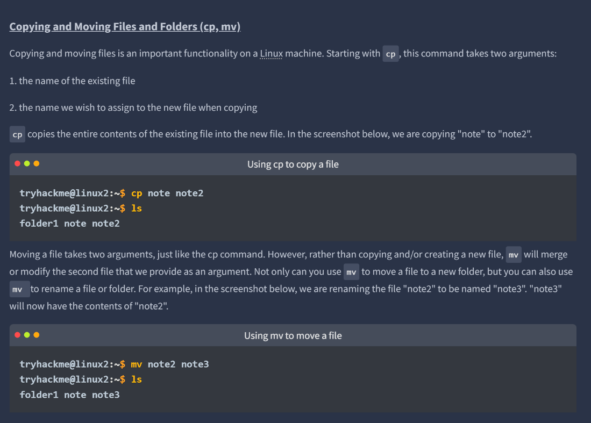

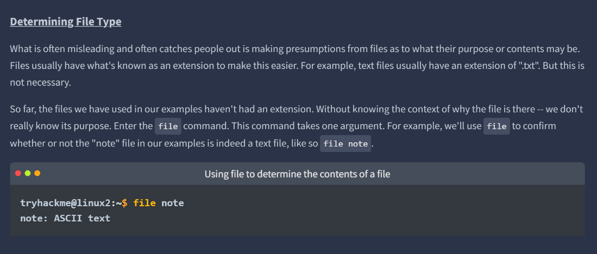

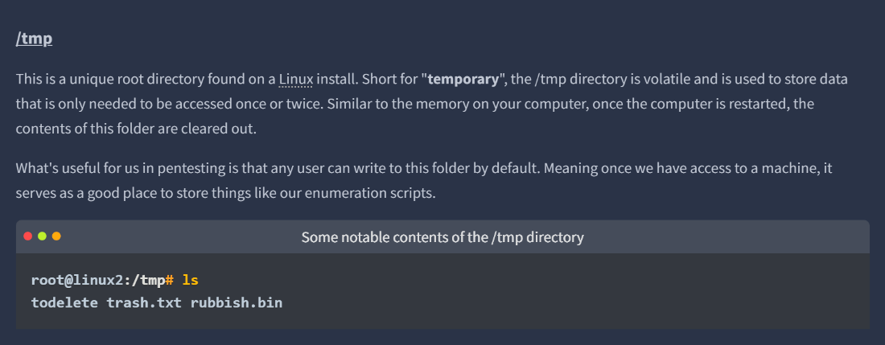

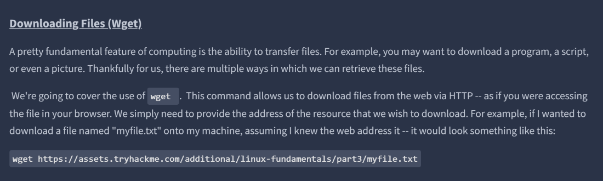

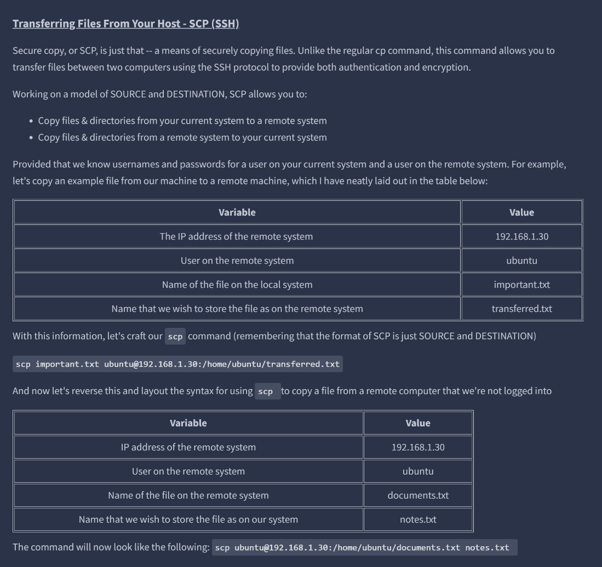

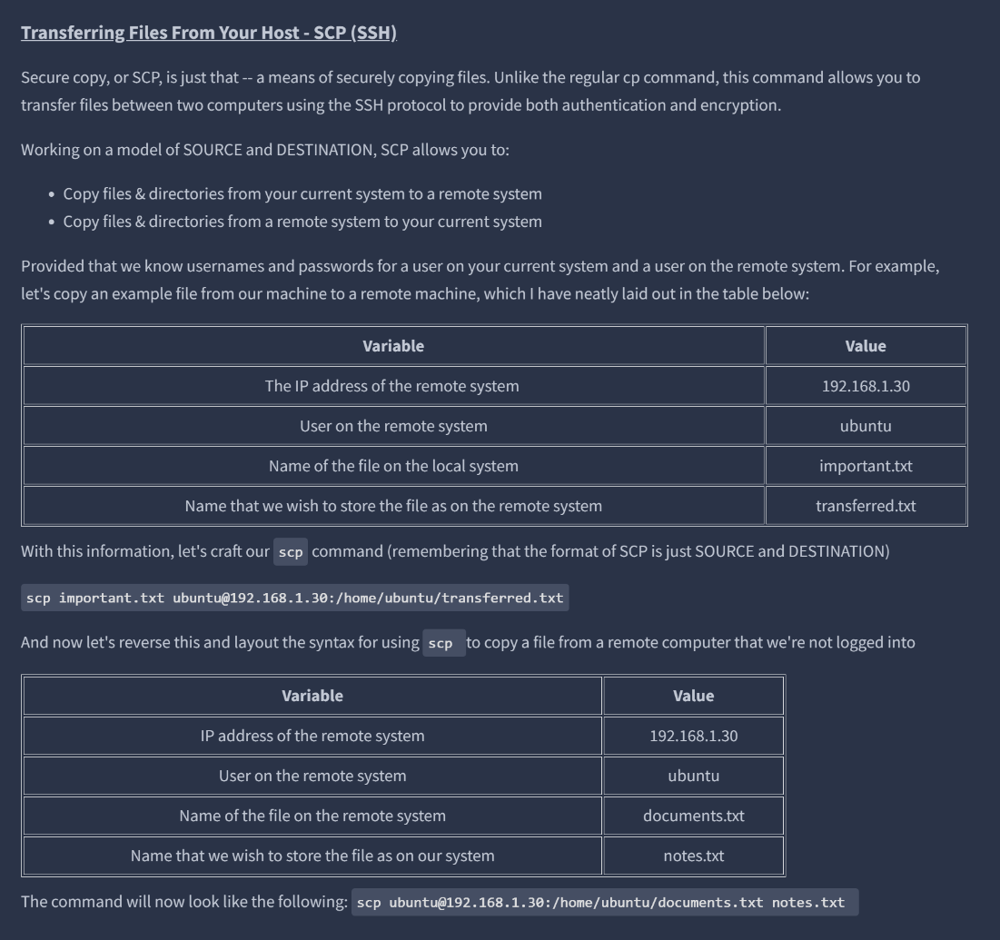

