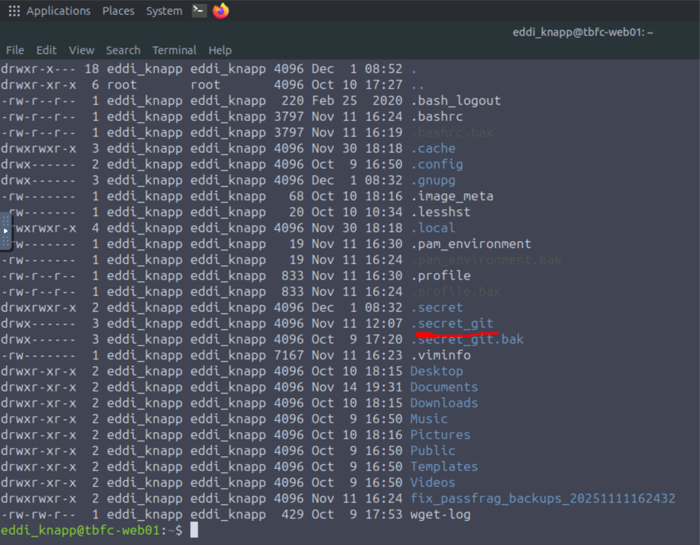
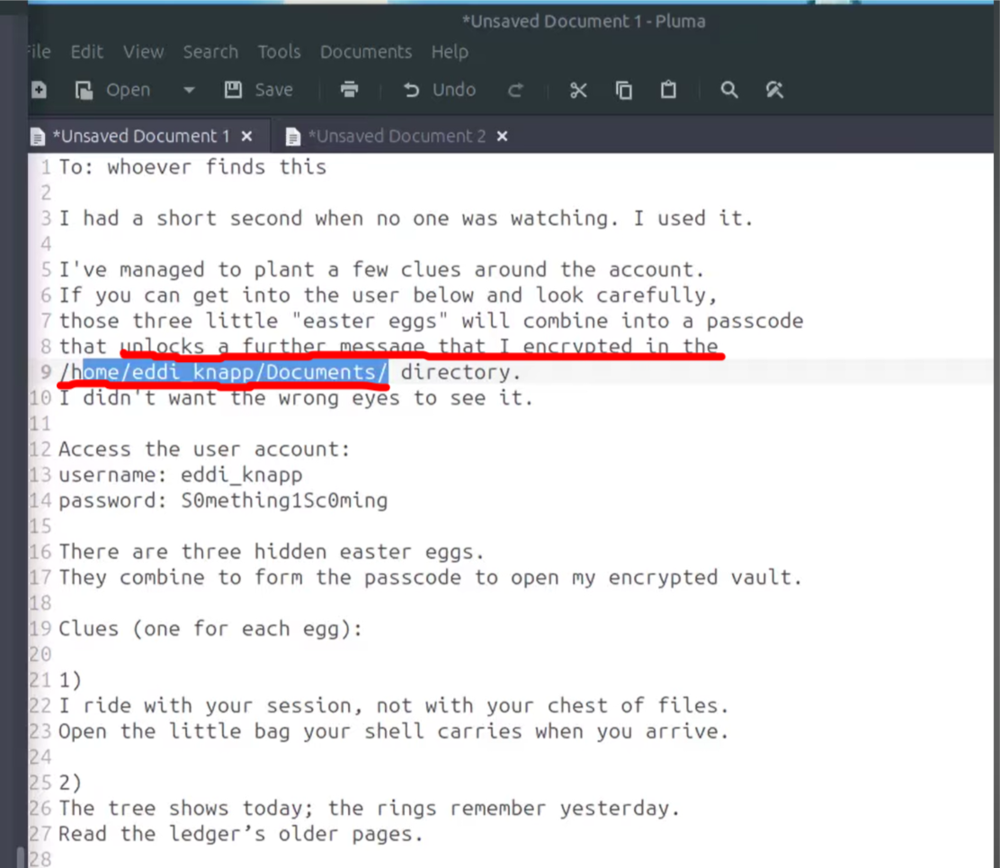
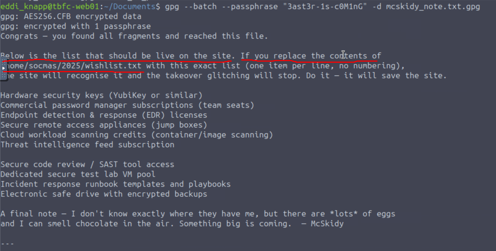
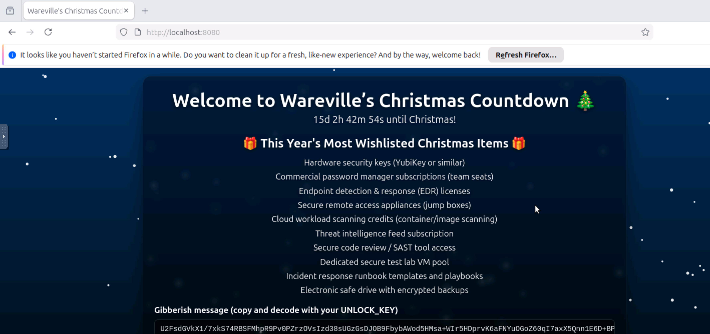
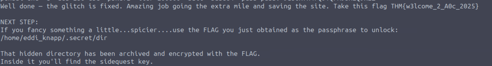
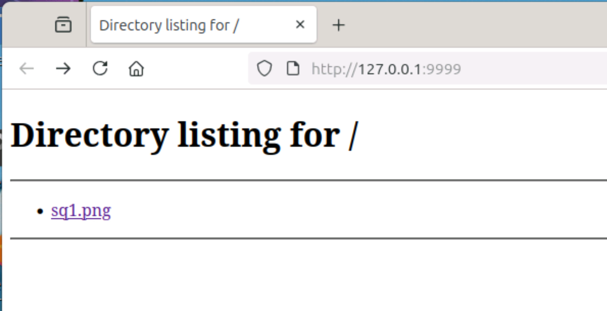
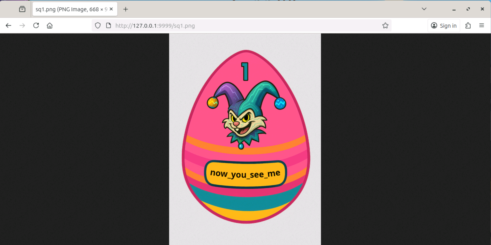

Go to the directory mentioned
```
mcskidy@tbfc-web01:~$ cd /home/mcskidy/Documents/
mcskidy@tbfc-web01:~/Documents$ ls
read-me-please.txt
mcskidy@tbfc-web01:~/Documents$ cat read-me-please.txt 
```

from the file we get the login credentials
> username: eddi_knapp
> word: S0mething1Sc0ming

change user
```
mcskidy@tbfc-web01:~/Documents$ sudo su
root@tbfc-web01:/home/mcskidy/Documents$ su eddi_knapp
eddi_knapp@tbfc-web01:/home/mcskidy/Documents$ cd ~
eddi_knapp@tbfc-web01:~$ ls -al
-rw-r--r--  1 eddi_knapp eddi_knapp 3797 Nov 11 16:24 .bashrc
```
go to home directory and do ls

> 1. “I ride with your session, not with your chest of files. Open the little bag your shell carries when you arrive.”

Decoding the Riddle:
- “Ride with your session” → exists during your login session
- “Not with your chest of files” → not stored in permanent files
- “Little bag your shell carries” → shell environment variables

Solution:
Environment variables are typically set in shell configuration files like `.bashrc`, which loads when you start a shell session.

```
eddi_knapp@tbfc-web01:~$ cat .bashrc

export PASSFRAG1="3ast3r"
```

> <span style="color:rgb(255, 0, 0)">PASSFRAG1="3ast3r"</span>

> 2) The tree shows today; the rings remember yesterday.  
Read the ledger’s older pages.

Decoding the Riddle:
- “Tree shows today” → current state of a git repository
- “Rings remember yesterday” → like tree rings, git commits record history
- “Ledger’s older pages” → old commit history

Solution:
Git repositories maintain complete history of all changes, including deleted content. Even if sensitive information is removed in a later commit, it remains in the repository history.

From the home directory listing:



```
eddi_knapp@tbfc-web01:~$ cd .secret_git
eddi_knapp@tbfc-web01:~/.secret_git$ ls -al
drwx------  8 eddi_knapp eddi_knapp 4096 Nov 11 12:07 .git

eddi_knapp@tbfc-web01:~/.secret_git$ cd .git
eddi_knapp@tbfc-web01:~/.secret_git/.git$ ls -al
-rwx------  1 eddi_knapp eddi_knapp  467 Nov 11 12:07 COMMIT_EDITMSG

eddi_knapp@tbfc-web01:~/.secret_git/.git$ cat COMMIT_EDITMSG 
# Last commands done (2 commands done):
#    edit b65ff21 add private note
#    pick 98f546c remove sensitive note
# No commands remaining.
# You are currently rebasing branch 'master' on '0a7462a'.
#
# Changes to be committed:
#	deleted:    secret_note.txt

eddi_knapp@tbfc-web01:~/.secret_git/.git$ git show b65ff21:secret_note.txt
PASSFRAG2: -1s-
```

OR

```
eddi_knapp@tbfc-web01:~/.secret_git$ git log --all --full-history
commit e924698378132991ee08f050251242a092c548fd (HEAD -> master)
Author: mcskiddy <mcskiddy@robco.local>
Date:   Thu Oct 9 17:20:11 2025 +0000
    remove sensitive note

eddi_knapp@tbfc-web01:~/.secret_git$ git show e924698378132991ee08f050251242a092c548fd

-PASSFRAG2: -1s-
```

> <span style="color:rgb(255, 0, 0)">PASSFRAG2: -1s-</span>

**Clues 3:**

> When pixels sleep, their tails sometimes whisper plain words.  
Listen to the tail.

Decoding the Riddle:
- “Pixels sleep” → static/stored images
- “Tails sometimes whisper plain words” → data hidden at the end of image files
- “Listen to the tail” → use tools like `tail`, `strings`, or check file metadata

Solution:
The riddle suggests looking at image files, specifically their “tails” (end of file) or metadata.

```
eddi_knapp@tbfc-web01:~$ cd Pictures/
eddi_knapp@tbfc-web01:~/Pictures$ ls -la
-rw-rw-r--  1 eddi_knapp eddi_knapp    1442 Oct  9 18:07 .easter_egg

eddi_knapp@tbfc-web01:~/Pictures$ cat .easter_egg
PASSFRAG3: c0M1nG
```

> <span style="color:rgb(255, 0, 0)">PASSFRAG3: c0M1nG</span>

## Combine the Password Fragments

Assemble the three fragments in order:

- PASSFRAG1: `3ast3r`
- PASSFRAG2: `-1s-`
- PASSFRAG3: `c0M1nG`

**Complete Password:** `3ast3r-1s-c0M1nG`



```
eddi_knapp@tbfc-web01:~$ cd Documents/
eddi_knapp@tbfc-web01:~/Documents$ ls -la
-rw-rw-r--  1 eddi_knapp eddi_knapp 1004 Nov 14 19:31 mcskidy_note.txt.gpg
```

**Decrypt using GPG:**
```
gpg --batch --passphrase "3ast3r-1s-c0M1nG" -d mcskidy_note.txt.gpg
```

> <span style="color:rgb(255, 0, 0)">UNLOCK_KEY: 91J6X7R4FQ9TQPM9JX2Q9X2Z</span>




McSkidy’s note contains:
1. **A corrected wishlist** that needs to replace the compromised one
2. **An unlock key** for decrypting website ciphertext
3. **A cryptic warning** about eggs and chocolate

**Navigate to the web directory:**

```
eddi_knapp@tbfc-web01:~/Documents$ cd /home/socmas/2025/
```

**Replace with the correct wishlist:**
```
cat > wishlist.txt << 'EOF'  
Hardware security keys (YubiKey or similar)  
Commercial password manager subscriptions (team seats)  
Endpoint detection & response (EDR) licenses  
Secure remote access appliances (jump boxes)  
Cloud workload scanning credits (container/image scanning)  
Threat intelligence feed subscription  
Secure code review / SAST tool access  
Dedicated secure test lab VM pool  
Incident response runbook templates and playbooks  
Electronic safe drive with encrypted backups  
EOF
```

After the wishlist is corrected, the glitching should stop and a block of **ciphertext** will be displayed.




**Decrypt using OpenSSL**
```
echo "U2FsdGVkX1/7xkS74RBSFMhpR9Pv0PZrzOVsIzd38sUGzGsDJOB9FbybAWod5HMsa+WIr5HDprvK6aFNYuOGoZ60qI7axX5Qnn1E6D+BPknRgktrZTbMqfJ7wnwCExyU8ek1RxohYBehaDyUWxSNAkARJtjVJEAOA1kEOUOah11iaPGKxrKRV0kVQKpEVnuZMbf0gv1ih421QvmGucErFhnuX+xv63drOTkYy15s9BVCUfKmjMLniusI0tqs236zv4LGbgrcOfgir+P+gWHc2TVW4CYszVXlAZUg07JlLLx1jkF85TIMjQ3B91MQS+btaH2WGWFyakmqYltz6jB5DOSCA6AMQYsqLlx53ORLxy3FfJhZTl9iwlrgEZjJZjDoXBBMdlMCOjKUZfTbt3pnlHWEaGJD7NoTgywFsIw5cz7hkmAMxAIkNn/5hGd/S7mwVp9h6GmBUYDsgHWpRxvnjh0s5kVD8TYjLzVnvaNFS4FXrQCiVIcp1ETqicXRjE4T0MYdnFD8h7og3ZlAFixM3nYpUYgKnqi2o2zJg7fEZ8c=" | openssl enc -d -aes-256-cbc -pbkdf2 -iter 200000 -salt -base64 -pass pass:'91J6X7R4FQ9TQPM9JX2Q9X2Z'
```

> THM{w3lcome_2_A0c_2025}



Navigate to the secret directory:

```
cd /home/eddi_knapp/.secret/  
ls -la
-rw-------  1 eddi_knapp eddi_knapp 419589 Dec  1 08:32 dir.tar.gz.gpg
```

## Decrypt the Archive

Use the main challenge flag as the passphrase:
```
gpg --batch --passphrase "THM{w3lcome_2_A0c_2025}" -d dir.tar.gz.gpg > dir.tar.gz
```

**Verify decryption:**
```
ls -la dir.tar.gz  
file dir.tar.gz
```

## Extract the Archive
```
tar -xzf dir.tar.gz
```

Navigate into the directory:
```
cd dir/  
ls -la
```
You’ll find a single PNG image: `sq1.png` (approximately 420KB)

Your terminal can’t open a graphic image directly. So you need a **method to view it from your machine**.

|Option|How|
|---|---|
|Download via SCP|scp user@host:/path/file .|
|Expose via web server|Copy to web-accessible directory|

From your Local Machine, run:
```
scp eddi_knapp@<IP Machine>:~/.secret/dir/sq1.png ~/Downloads/
```

OR 

Start a temporary Python web server in the directory and view through AttackBox browser

```
eddi_knapp@tbfc-web01:~/.secret/dir$ ls
sq1.png
```


```
eddi_knapp@tbfc-web01:~/.secret/dir$ python3 -m http.server 9999
```
This serves the **current directory** over HTTP.

On the AttackBox browser, open:
```
http://<TARGET_IP>:9999/sq1.png
```





> now_you_see_me

