## Flowchart components

Process = assigning values

# Sum of 2 numbers

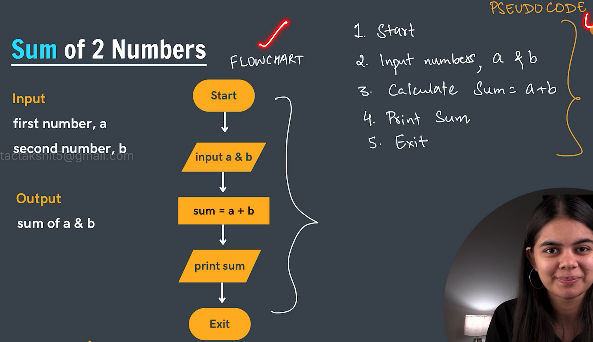

# Calculate simple interest

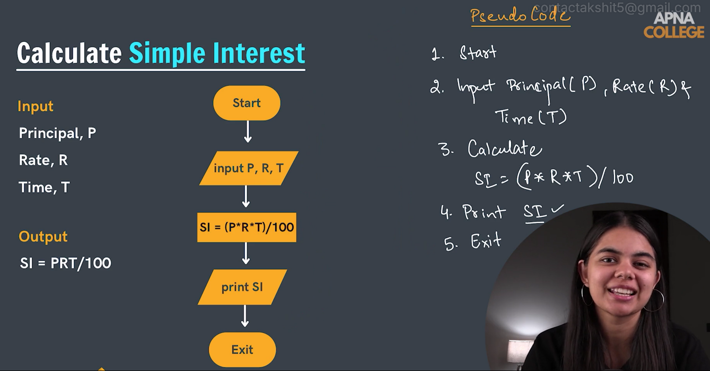

# Max of 3 numbers

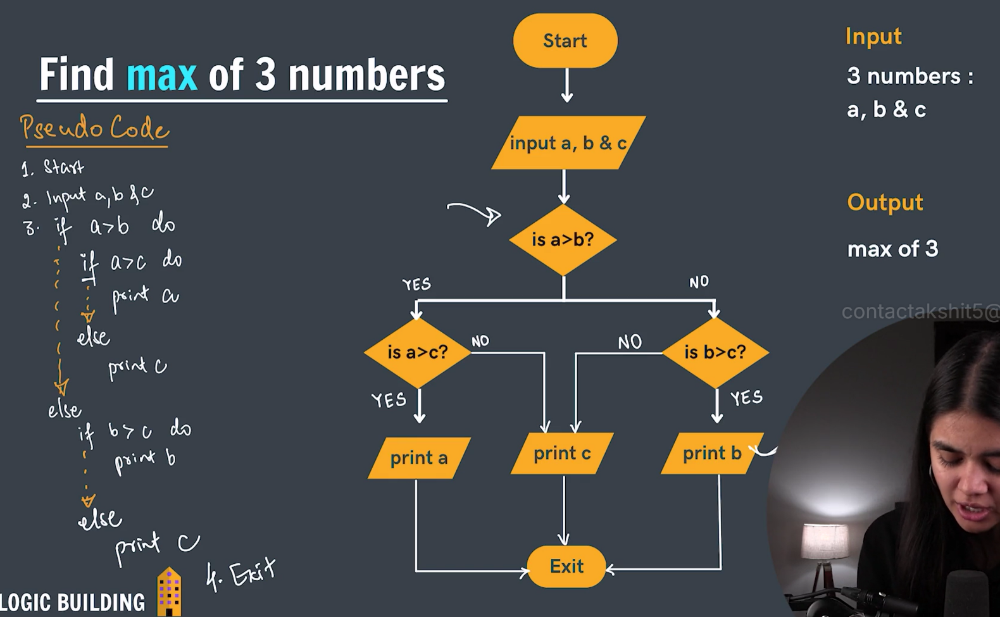

# Find if a number is prime or not

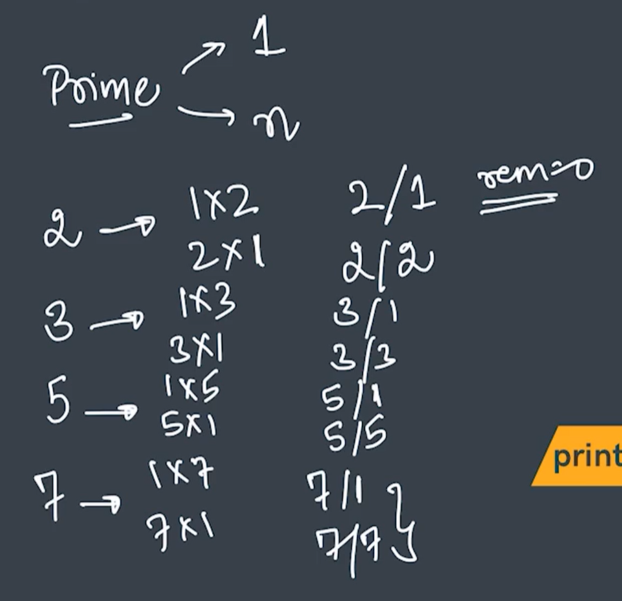

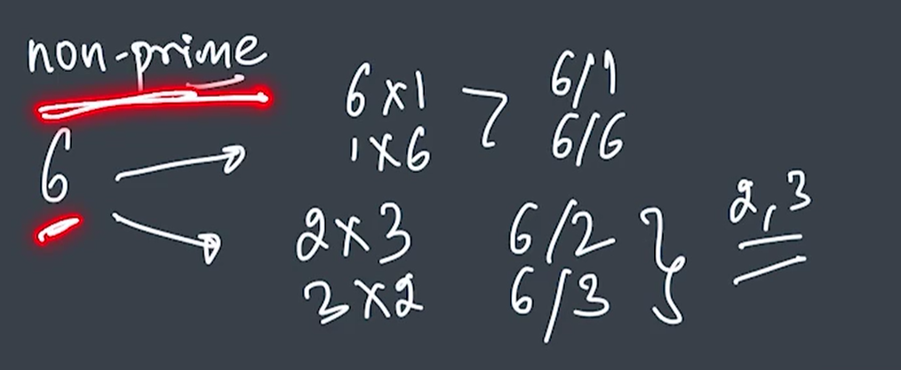

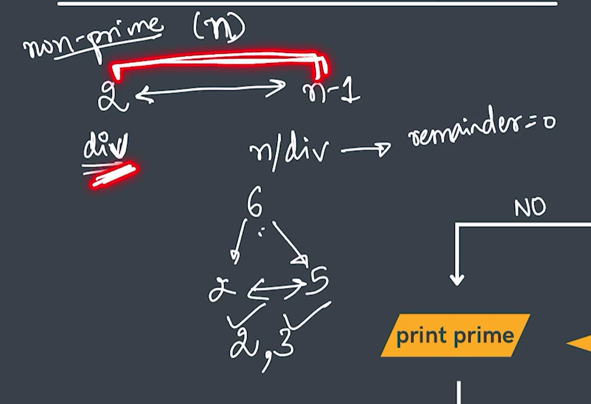

a%b - a divided by b - a modulo b

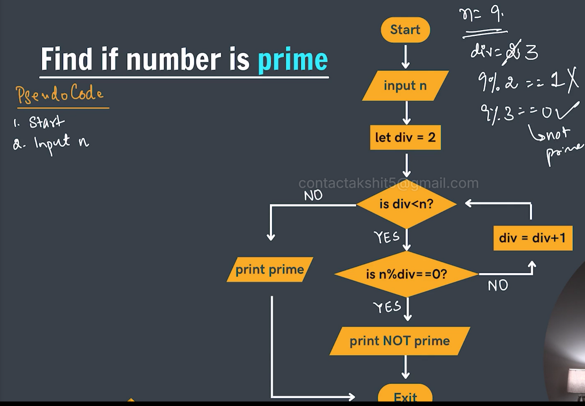

While = loop
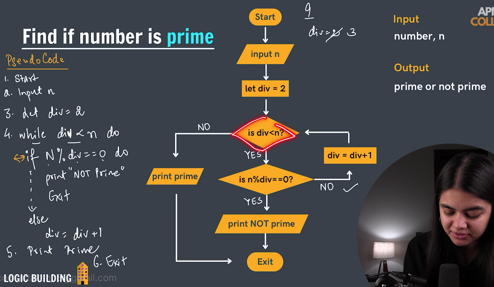

# Sum of first n natural numbers

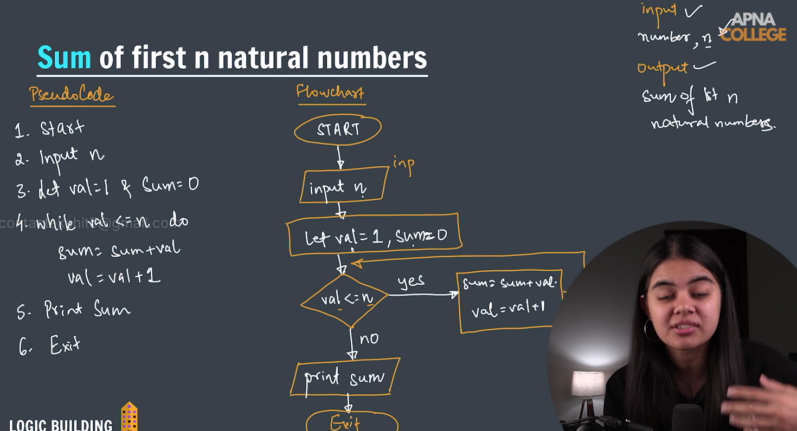

[Question File (3).pdf](be49f8f875684f80b10fd3633ccb8621.pdf)

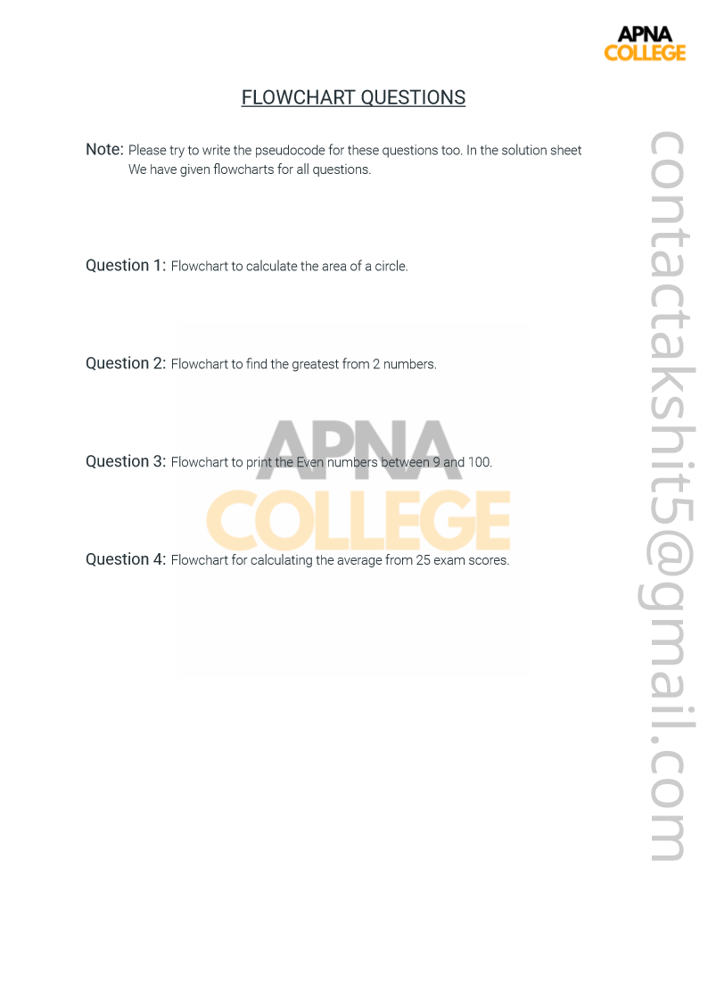[Solution File (3).pdf](e4548e1fb9a0440e864282084fcfb034.pdf)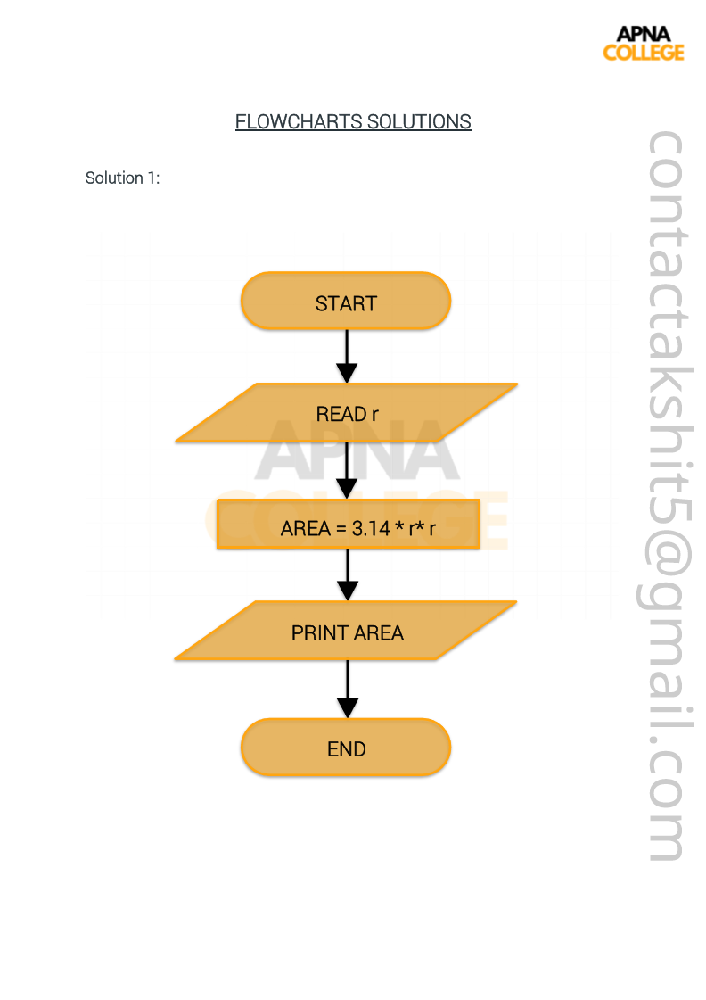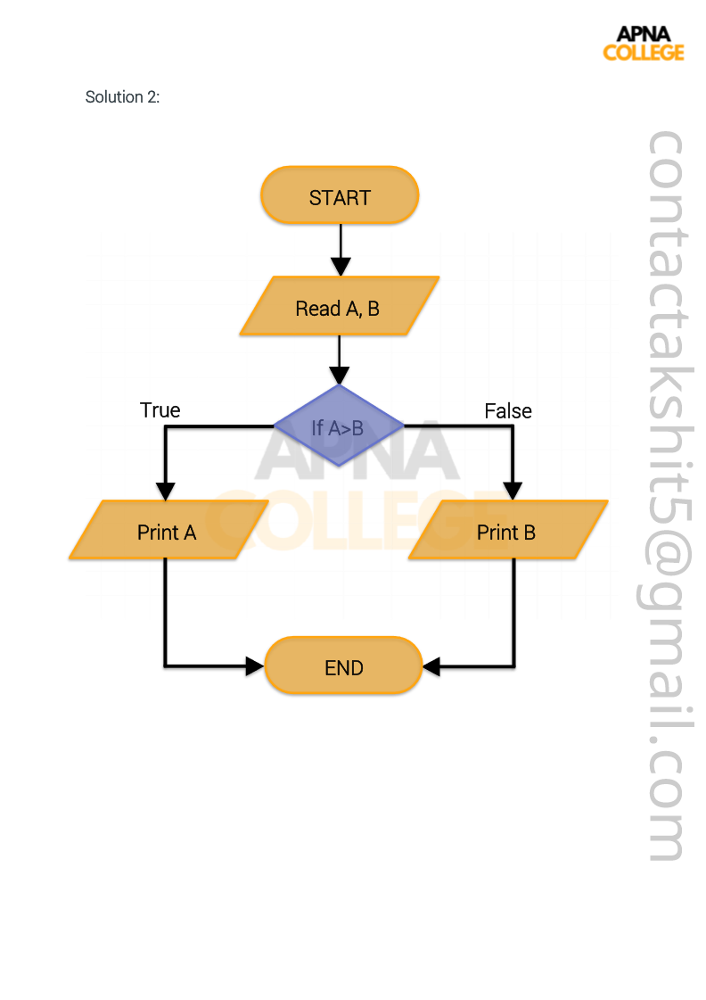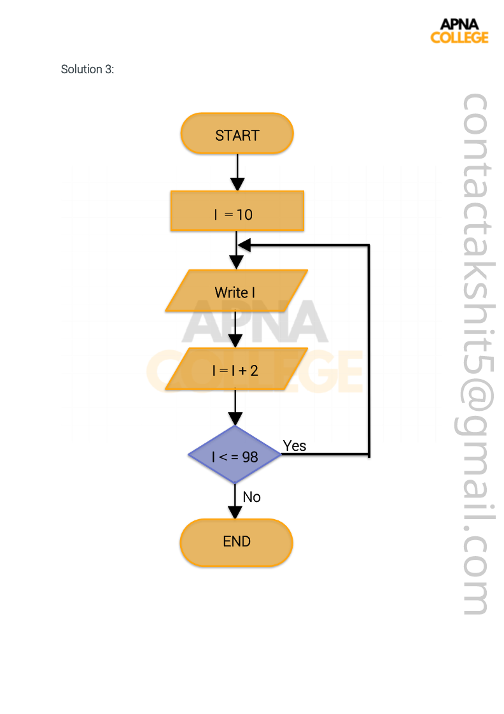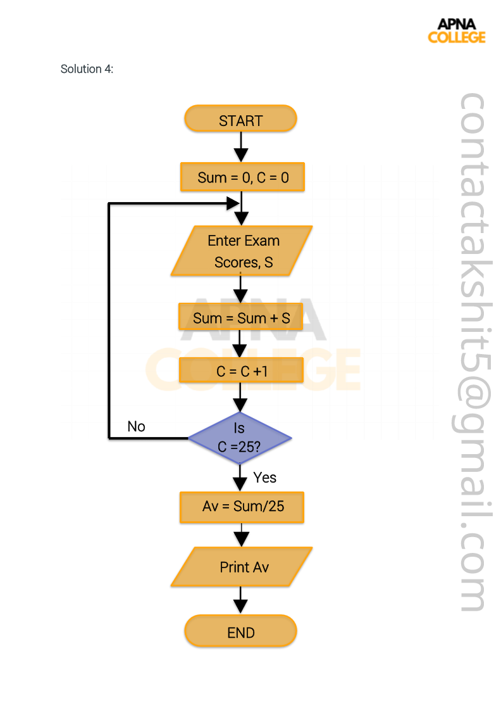
