## Boilerplate code

```
public class JavaBasics {
    public static void main(String args[]) {
        //code here
    }
}
//boiler plate code
```
This template will stay same everywhere
## Output in Java

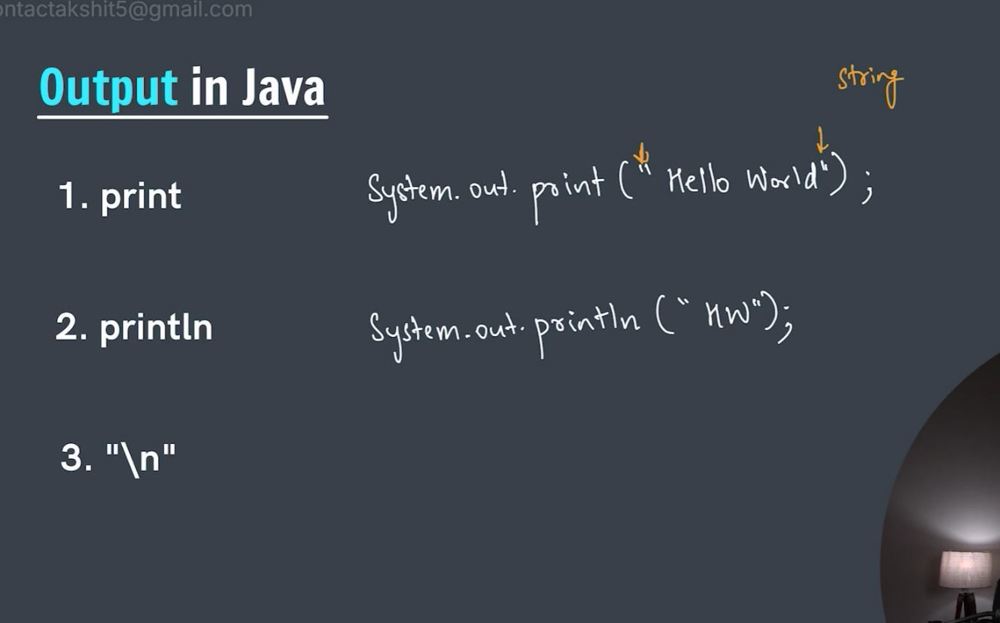
ln - add line
\n - add line

```
public class JavaBasics {
    public static void main(String args[]) {
        System.out.println("Hello World");
        System.out.println("Hello World");
        System.out.println("Hello World");
    }
}
```

## Print a pattern

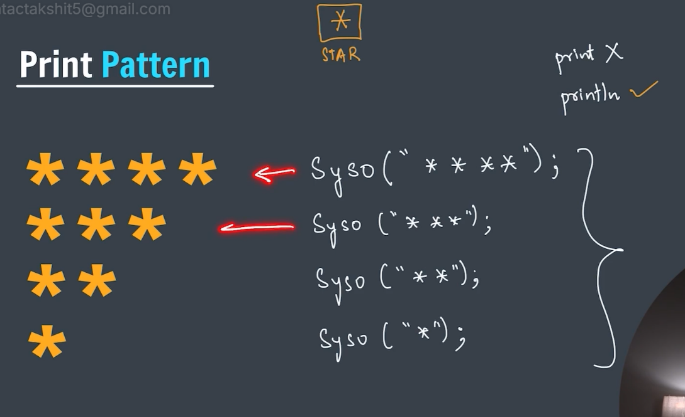

```
public class JavaBasics {
    public static void main(String args[]) {
        System.out.println("****");
        System.out.println("***");
        System.out.println("**");
        System.out.println("*");
    }
}
```
## Variables in Java

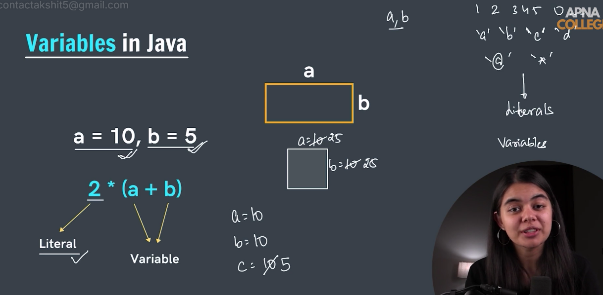

Literals - whose values don’t change
Ex. \* , @ , 2

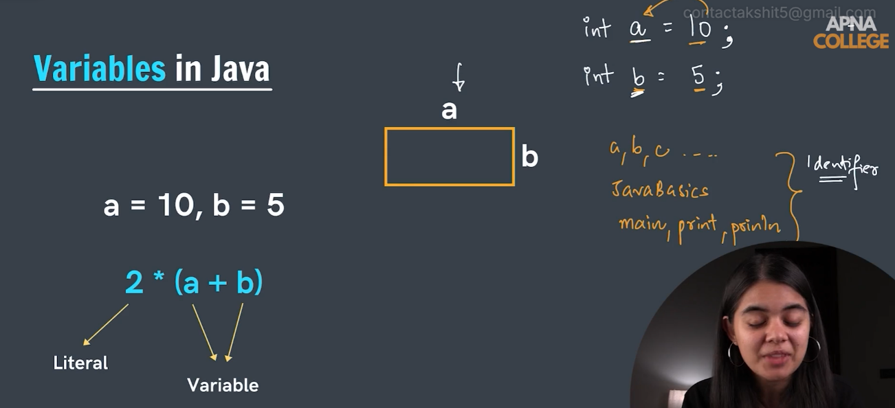
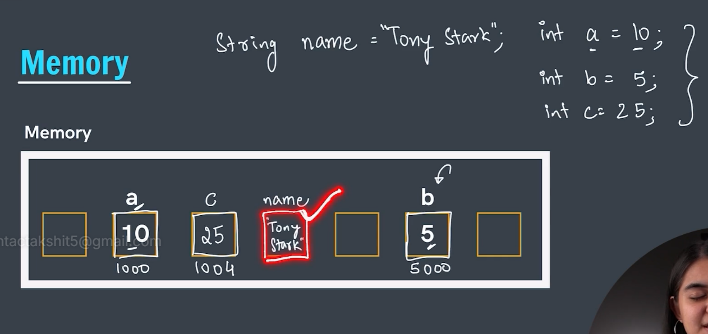

```
public class JavaBasics {
    public static void main(String args[]) {
        int a = 10;
        int b = 5;
        System.out.println(a);
        System.out.println(b);
        String name = "Tony Stark";
        System.out.println(name);
        a = 50;
        System.out.println(a);
    }
}
```
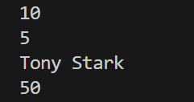
Can change variable value anytime

Note : we don’t have to print 'a' in double quotes , as it will print letter 'a' itself only
```
public class JavaBasics {
    public static void main(String args[]) {
        int a = 10;
        int b = 5;
        System.out.println("a");
    }
}
```
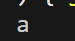
## Data Types in Java

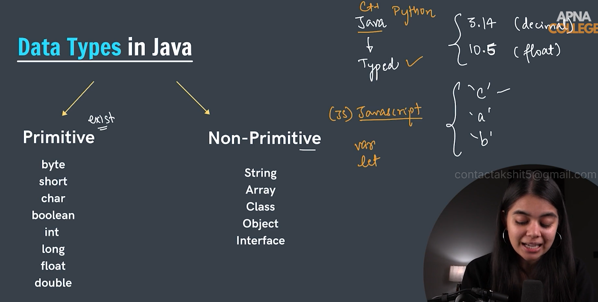
### Primitive Data Types

These are the **built-in** data types in Java.  
They hold **simple values**, not objects.
There are **8 primitive types** grouped by category:

| Category           | Type      | Size              | Range                             | Example                               | Default Value |
| ------------------ | --------- | ----------------- | --------------------------------- | ------------------------------------- | ------------- |
| **Integer**        | `byte`    | 1 byte            | -128 to 127 (total 256 numbers)   | `byte age = 25;`                      | 0             |
|                    | `short`   | 2 bytes           | -32,768 to 32,767                 | `short salary = 32000;`               | 0             |
|                    | `int`     | 4 bytes           | -2,147,483,648 to 2,147,483,647   | `int population = 100000;`            | 0             |
|                    | `long`    | 8 bytes           | ±9 quintillion                    | `long worldPopulation = 8000000000L;` | 0L            |
| **Floating Point** | `float`   | 4 bytes           | ~6–7 decimal digits               | `float price = 9.99f;`                | 0.0f          |
|                    | `double`  | 8 bytes           | ~15 decimal digits                | `double pi = 3.1415926535;`           | 0.0d          |
| **Character**      | `char`    | 2 bytes           | Single Unicode character (a to z) | `char grade = 'A';`                   | '\u0000'      |
| **Boolean**        | `boolean` | 1 bit (virtually) | true or false                     | `boolean isOn = true;`                | false         |

### Non-Primitive Data Types

Also called **reference types** — they store **references (addresses)** to objects rather than the actual values.

| Type        | Description                      | Example                            |
| ----------- | -------------------------------- | ---------------------------------- |
| **String**  | Sequence of characters           | `String name = "Akshit";`          |
| **Arrays**  | Collection of similar data types | `int[] numbers = {1, 2, 3};`       |
| **Classes** | Blueprint for creating objects   | `class Car { ... }`                |
```
public class JavaBasics {
    public static void main(String args[]) {
        byte b = 8;
        System.out.println(b);
        char ch = 'a';
        System.out.println(ch);
        boolean var = false;
        float price = 25;
        int number = 25;
        short n = 240;
    }
}
```

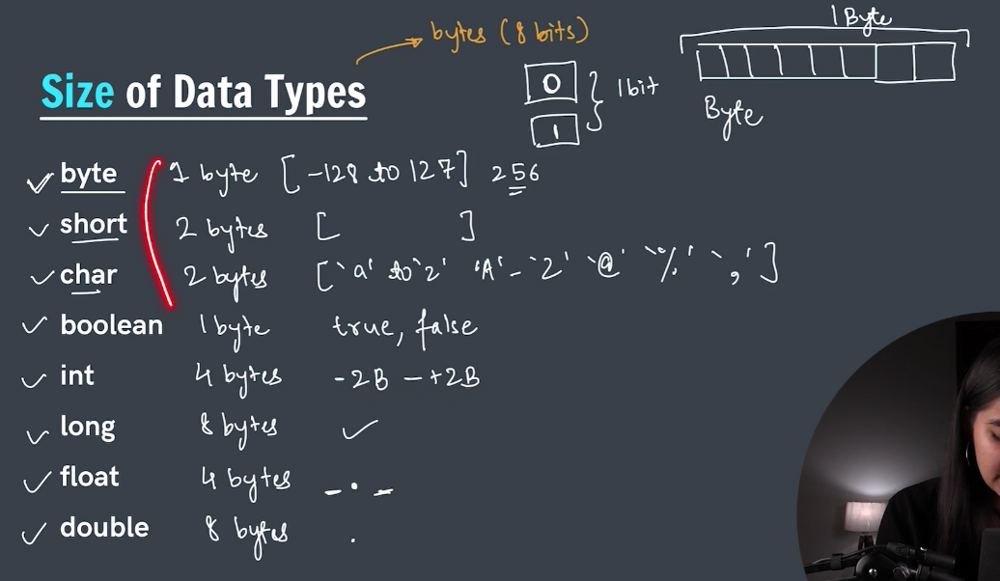

## Sum of a and b

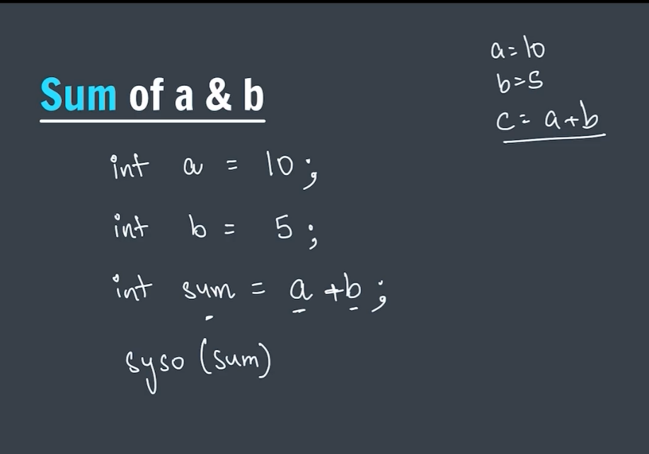

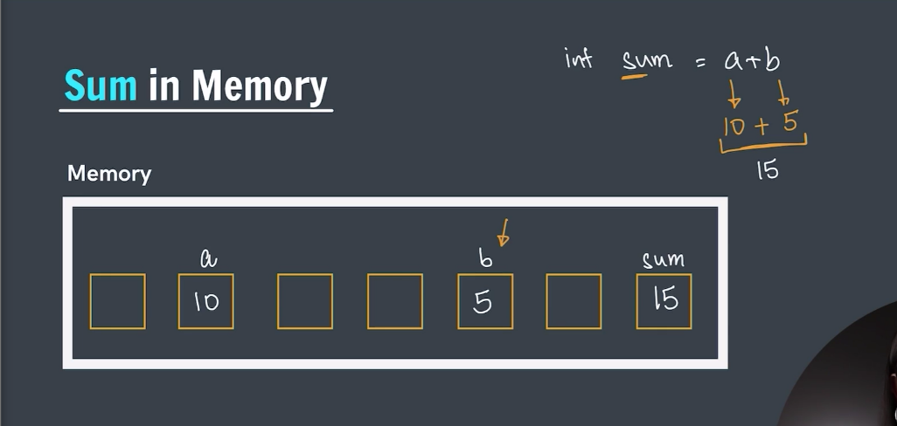

```
public class JavaBasics {
    public static void main(String args[]) {
        int a = 10;
        int b = 5;
        int sum = a + b;
        System.out.println(sum);
    }
}
```

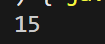
## Comments in java

That part of code that doesn’t get executed
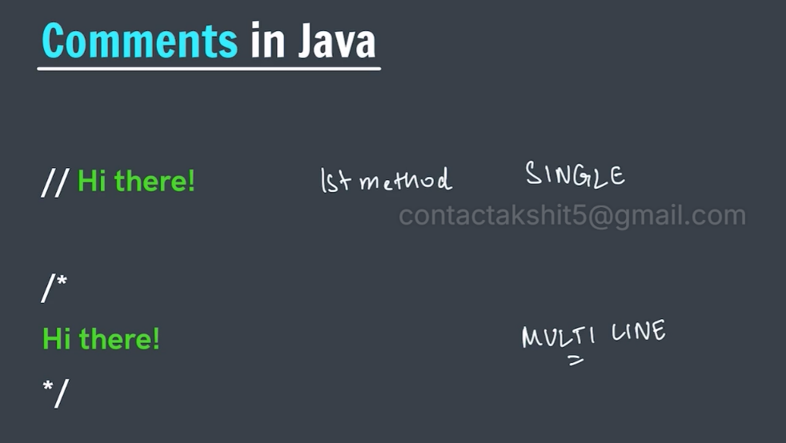

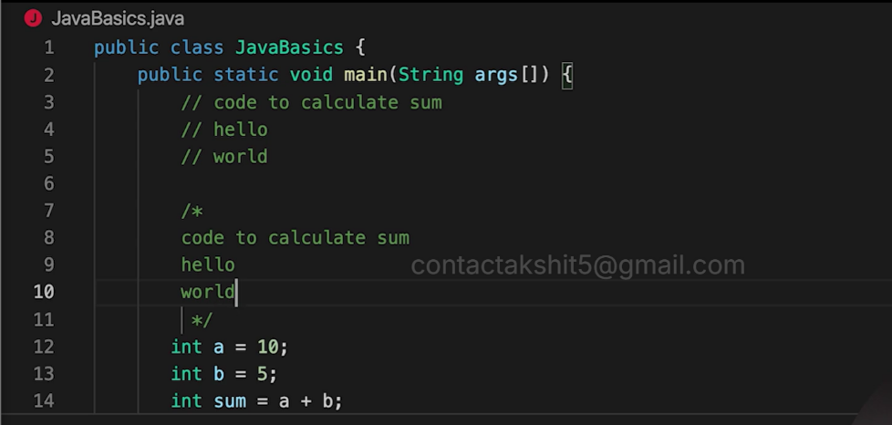

## Input in java

```
import java.util.*;
public class Main {
    public static void main(String[] args) {
        Scanner sc = new Scanner(System.in);
        String input = sc.next();
        System.out.println(input);
    }
}

hello
hello
```
java.util.* - comprises of all the pre made classes 
scanner here is a pre made class
"Scanner sc" - here , 'scanner' is class and 'sc' is the new object
"System.in" - to give input , tell to take an input
"sc.next()" - to take any input
"next()" - it is a function which stores input
"String input" - we will store the input in a string named input , 'input' is our variable here


```
import java.util.*;
public class Main {
    public static void main(String[] args) {
        Scanner sc = new Scanner(System.in);
        String name = sc.nextLine();
        System.out.println(name);
    }
}

hello this is java
hello this is java
```
Next() - only prints a single word /till space
nextLine() - prints the entire line


```
import java.util.*;
public class Main {
    public static void main(String[] args) {
        Scanner sc = new Scanner(System.in);
        
        int number = sc.nextInt();
        System.out.println(number);

        float price = sc.nextFloat();
        System.out.println(price);
        
        Boolean number = sc.nextBoolean();
        System.out.println(number);
    }
}


4
4
3.14
3.14
true
true
```
to input integer we use "nextInt()"
"nextFloat()" for float value
we modify the next function according to the type of value we want to take input as

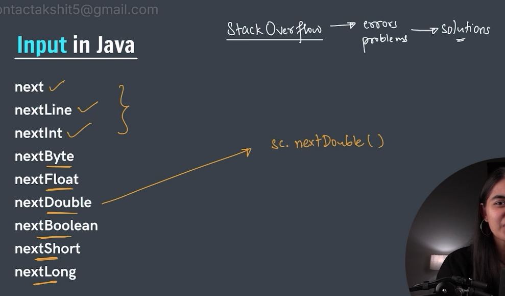

## Sum of a and b (input from user)


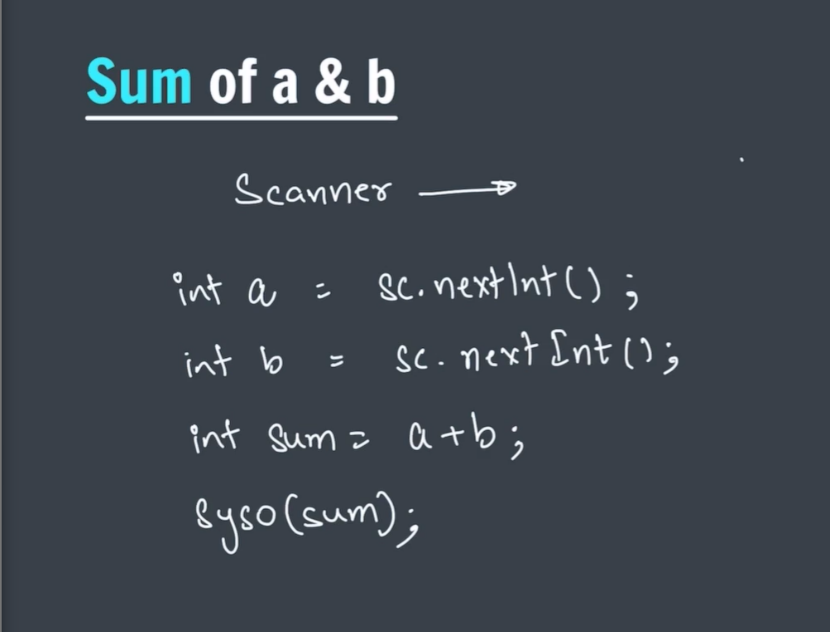

```
import java.util.*;
public class Main {
    public static void main(String[] args) {
        Scanner sc = new Scanner(System.in);
        int a = sc.nextInt();
        int b = sc.nextInt();
        int sum = a + b;
        System.out.println(sum);
    }
}
```

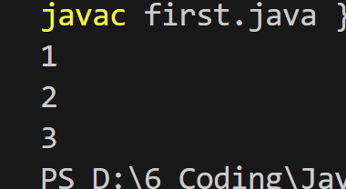

# Product of a and b

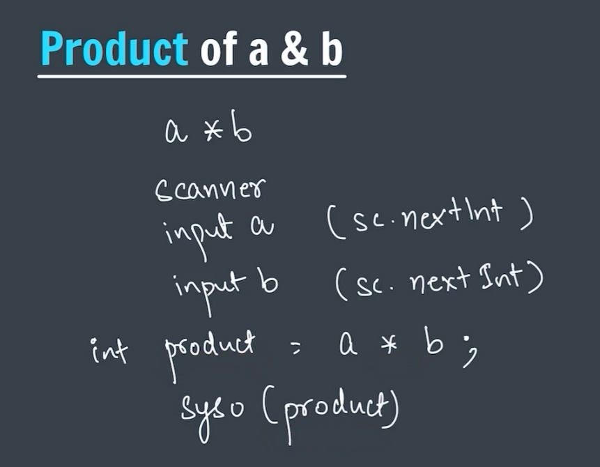

```
import java.util.*;
public class Main {
    public static void main(String[] args) {
        Scanner sc = new Scanner(System.in);
        int a = sc.nextInt();
        int b = sc.nextInt();
        int sum = a * b;
        System.out.println(sum);
    }
}
```

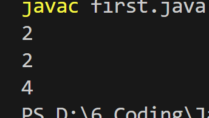

# Area of a circle

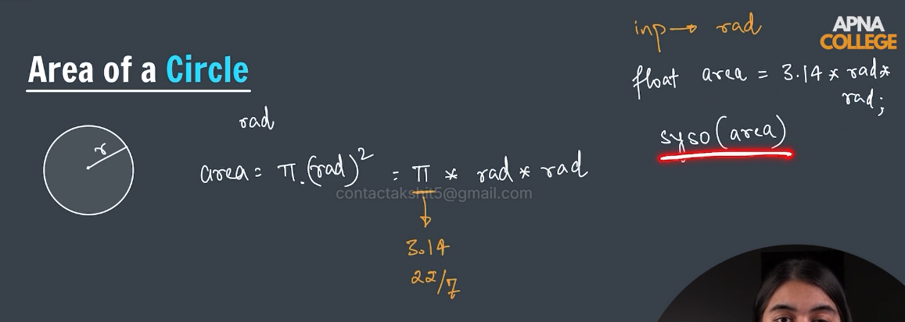

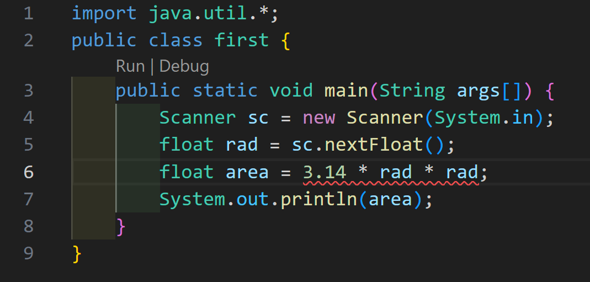

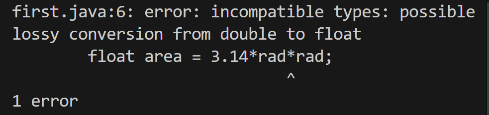

Add f after 3.14 to specify the value as float (or select the value as double)
**Any number with a decimal point is automatically a `double` unless you add `f`**
```
import java.util.*;
public class Main {
    public static void main(String[] args) {
        Scanner sc = new Scanner(System.in);
        System.out.println("Enter radius");
        float radius = sc.nextFloat();
        float area = 3.14f * radius * radius;
        System.out.println("Area is " + area);
    }
}
```


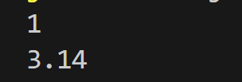

# Type Conversion

```
import java.util.*;
public class Main {
    public static void main(String[] args) {
        int a = 25;
        long b = a;
        System.out.println(b);
    }
}
```

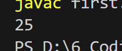

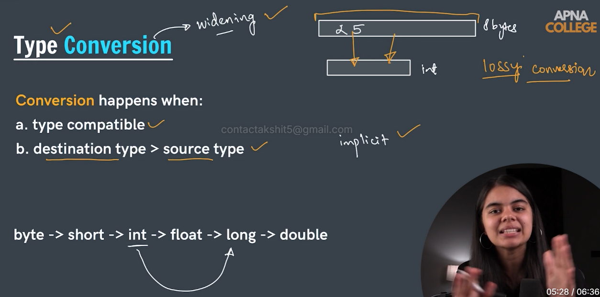

Lossy conversion
Since some data will get lost
Due to transfer from 8 bytes to 4 bytes

# Type casting 

```
import java.util.*;
public class Main {
    public static void main(String[] args) {
        float a = 25.22;
        int b = a;
        System.out.println(b);
    }
}
```

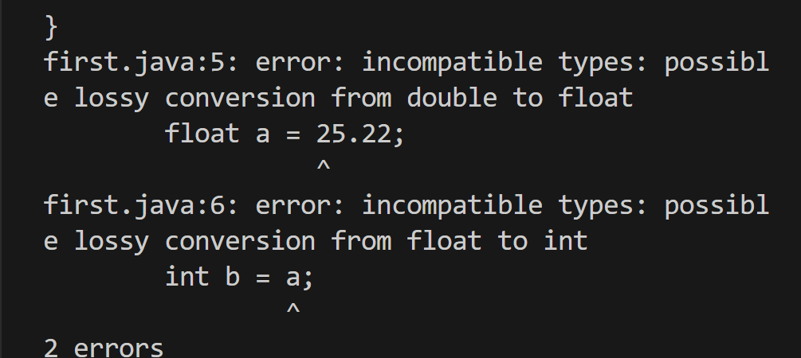

❌ **Error 1 — 25.22 is NOT a float**

`25.22` is **double** by default.
So Java sees this:
`float a = double value;`

This is illegal because **double → float** can lose precision.

Fix:
`float a = 25.22f;`
Add the `f` → now it’s a float literal.

---

❌ **Error 2 — You cannot directly convert float → int**

You wrote:
`int b = a;`

This is **not allowed** because:
- `float` has decimals
    
- `int` does NOT support decimals
    
- So this conversion **loses decimal information**
    

Java **blocks it** to prevent accidental data loss.
This is called:
👉 **lossy conversion: float → int**

---

✅ **How to fix it?**

You need to use **explicit casting**:

`float a = 25.22f; int b = (int) a;   // explicit cast System.out.println(b);`

---

🧠 Output:
`25`

Why 25?
Because converting float → int **removes the decimal part** (not round).

We now add "f" after decimal value
And put (int) before a
To forcefully convert the float value into integer

```
import java.util.*;
public class Main {
    public static void main(String[] args) {
        float a = 25.999f;
        int b = (int) a;
        System.out.println(b);
    }
}
```

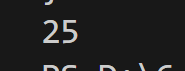


Character's value's starts from 97
A = 97
B = 98….

```
public class Main {
    public static void main(String[] args) {
        char ch1 = 'a';
        char ch2 = 'b';
        int number1 = ch1;
        int number2 = ch2;
        System.out.println(number1);
        System.out.println(number2);
    }
}
```

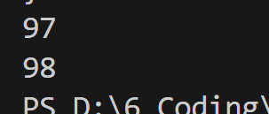

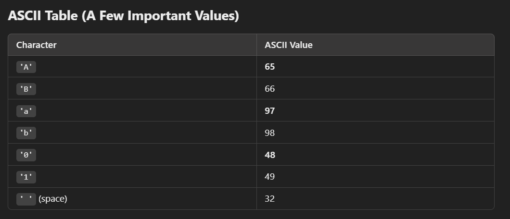

# Type promotion in expressions


Important
1. When evaluation an expression - byte , short , char > integer
2. long , float , double > gets converted to largest one respectively

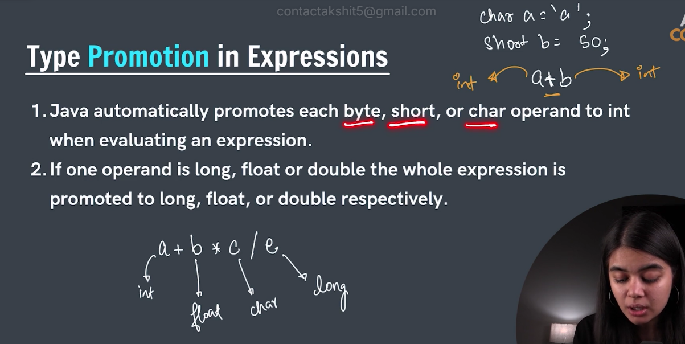

```
public class Main {
    public static void main(String[] args) {
        char a = 'a';
        char b = 'b';
        System.out.println(b - a);
    }
}


Output :
1
```


Here, the character "a" and "b" first gets converted to "int" value
Then subtracts

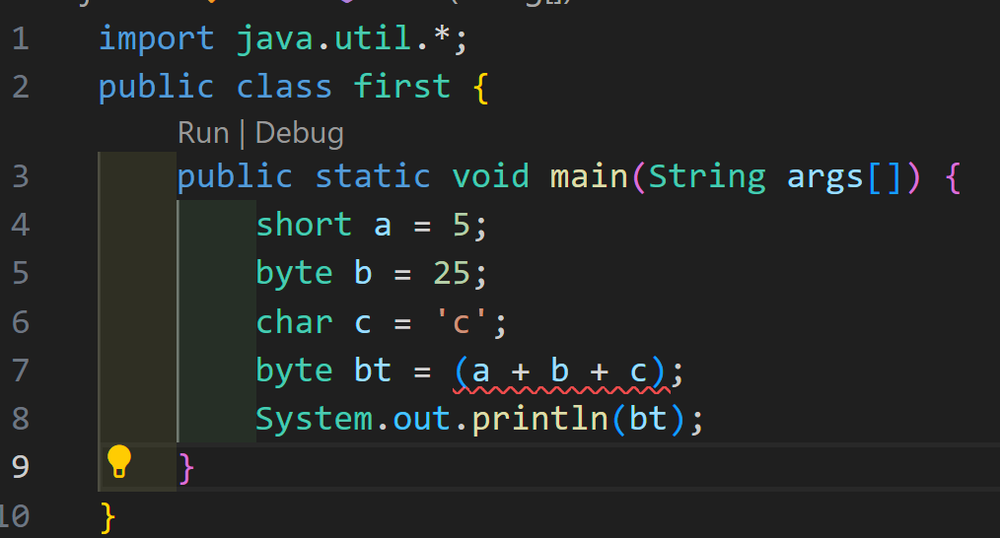

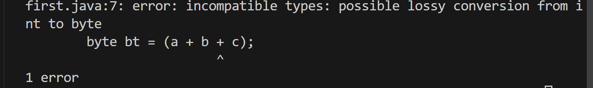

We are getting error of lossy conversion
So we do type casting to forcefully convert it to byte value

```
public class Main {
    public static void main(String[] args) {
        short a = 5;
        byte b = 25;
        char c = 'c';
        byte bt = (byte) (a + b + c);
        System.out.println(bt);
    }
}


-127
```

```
public class Main {
    public static void main(String[] args) {
        int a = 10;
        float b = 20.25f;
        long c = 25;
        double d = 30;
        double ans = a + b + c + d;
        System.out.println(ans);
    }
}


85.25
```

```
public class Main {
    public static void main(String[] args) {
        int a = 10;
        float b = 20.25f;
        long c = 25;
        double d = 30;
        double ans = (int) (a + b + c + d);
        System.out.println(ans);
    }
}


85.0
```


Here , we have to add "(byte)" before the expressions

Because if we don't add ,
Java will do type promotion and consider 'b' as an integer and not as a byte
and will do type promotion automatically since it a expression
so byte will get converted to int

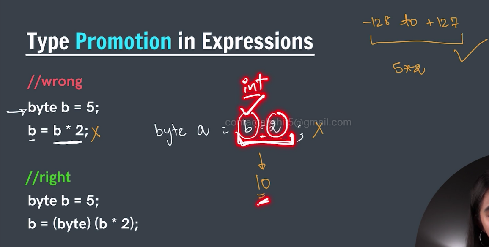

Error code :

```
public class Main {
    public static void main(String[] args) {
        byte b = 5;
        byte a = b * 2;
        System.out.println(a);
    }
}


// since b*2 becomes an expression , 
```

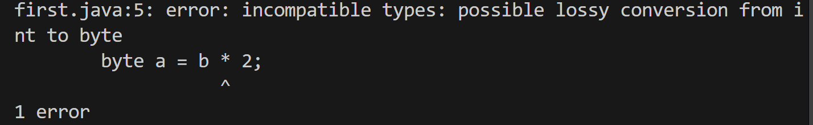

Correct code :

```
public class Main {
    public static void main(String[] args) {
        byte b = 5;
        byte a = (byte) (b * 2);
        System.out.println(a);
    }
}


10
```

# How does java code run ?

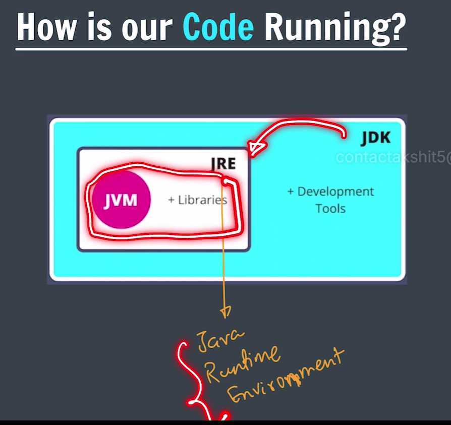

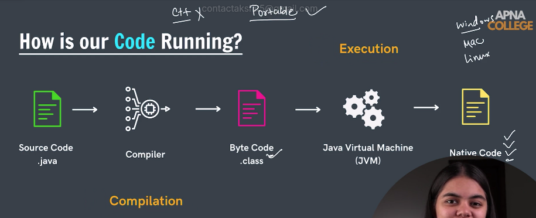

JVM converts the byte code to native code i.e different for windows , linux , mac

c++ is not a portable language because after the code gets converted into a byte class , it will not run on every machine

But java's byte code (.class) will run on any machine
