# Types of operators

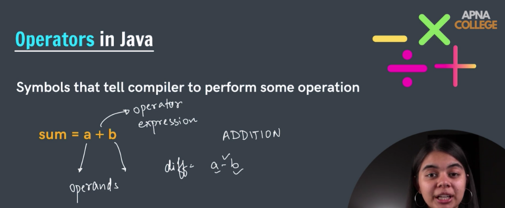

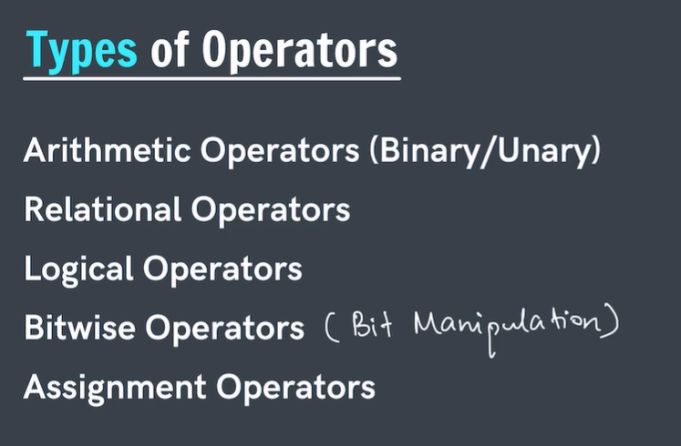

# Arithmetic Operators

Binary - 2 operands
Unary - single operand

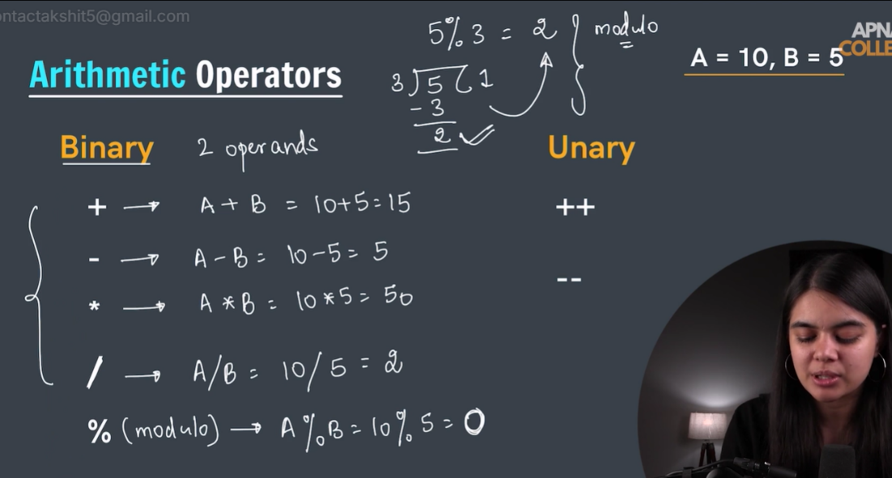

```
public class Main {
    public static void main(String[] args){
        int A = 10;
        int B = 5;
        System.out.println("modulo(remainder) = " + (A%B));
    }
}
```

# Unary Operators

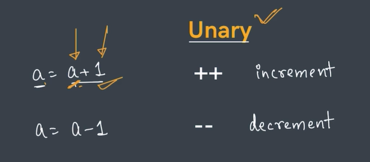

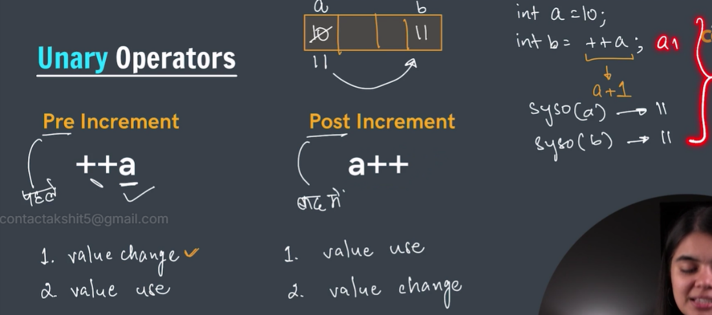


✅ **1. `++a` → PREFIX (Increment first, use later)**

Meaning:
> Increase `a` **first**,  
> then use the new value.
### Example:
`int a = 10; System.out.println(++a);`

Step-by-step:
- First: `a` becomes `11`
    
- Then: print `11`
    
### Output:
`11`

---

✅ **2. `a++` → POSTFIX (Use first, increment later)**
### Meaning:
> Use the value **first**,  
> then increase it.
### Example:
`int a = 10; System.out.println(a++);`

Step-by-step:

- First: print `10`
    
- Then: `a` becomes `11`
    
### Output:
`10`

---

# 🎯 SUPER SIMPLE SUMMARY

|Expression|When increment happens|Printed value|
|---|---|---|
|`++a`|BEFORE printing|prints **11**|
|`a++`|AFTER printing|prints **10**|

Both result in `a = 11` after the line runs —  
the only difference is **when** the increment occurs.

```
public class Main {
    public static void main(String[] args){
        int a = 10;
        int b = ++a;
        System.out.println(a);
        System.out.println(b);
    }
}


11
11
```

```
public class Main {
    public static void main(String[] args){
        int a = 10;
        int b = a++;
        System.out.println(a);
        System.out.println(b);
    }
}


11
10
```


```
public class Main {
    public static void main(String[] args){
        int a = 10;
        int b = --a;
        System.out.println(a);
        System.out.println(b);
    }
}


9
9
```

```
public class Main {
    public static void main(String[] args){
        int a = 10;
        int b = a--;
        System.out.println(a);
        System.out.println(b);
    }
}


9
10
```


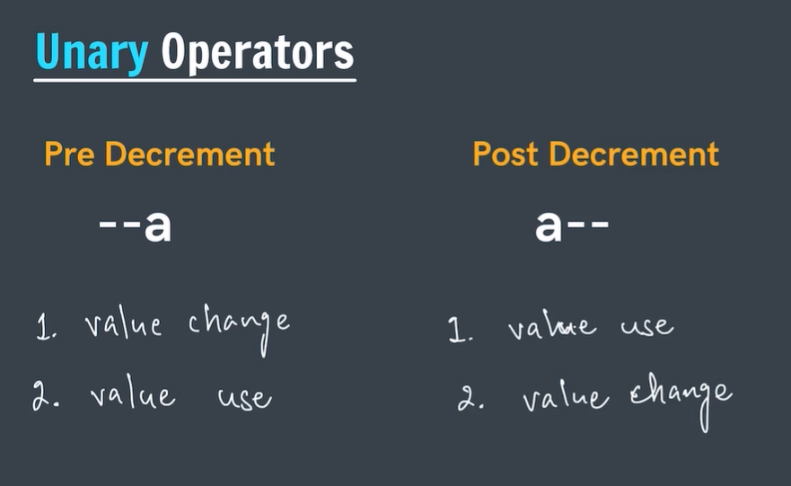

# Relational Operators

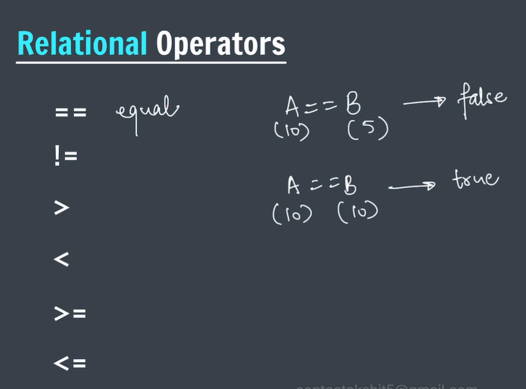

```
public class Main {
    public static void main(String[] args){
        int a = 10;
        int b = 10;
        System.out.println(a == b);
    }
}


true
```

```
public class Main {
    public static void main(String[] args){
        int a = 10;
        int b = 5;
        System.out.println(a == b);
    }
}

false
```

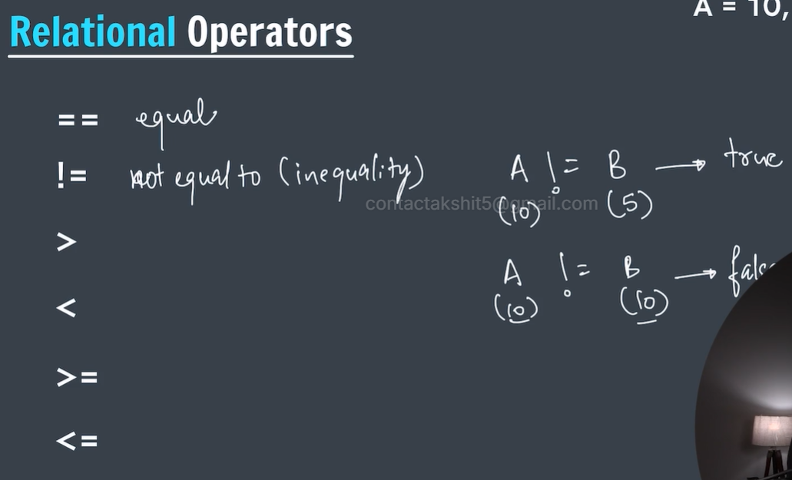

```
public class Main {
    public static void main(String[] args){
        int a = 10;
        int b = 10;
        System.out.println(a != b);
    }
}


false
```

```
public class Main {
    public static void main(String[] args){
        int a = 10;
        int b = 5;
        System.out.println(a != b);
    }
}


true
```


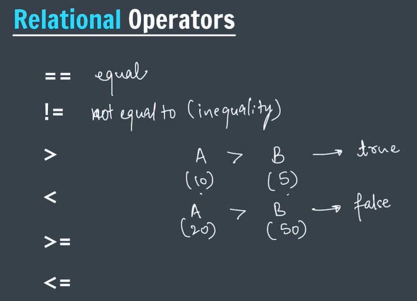

```
public class Main {
    public static void main(String[] args){
        int a = 10;
        int b = 5;
        System.out.println(a > b);
    }
}


true
```

```
public class Main {
    public static void main(String[] args){
        int a = 10;
        int b = 5;
        System.out.println(a < b);
    }
}


false
```

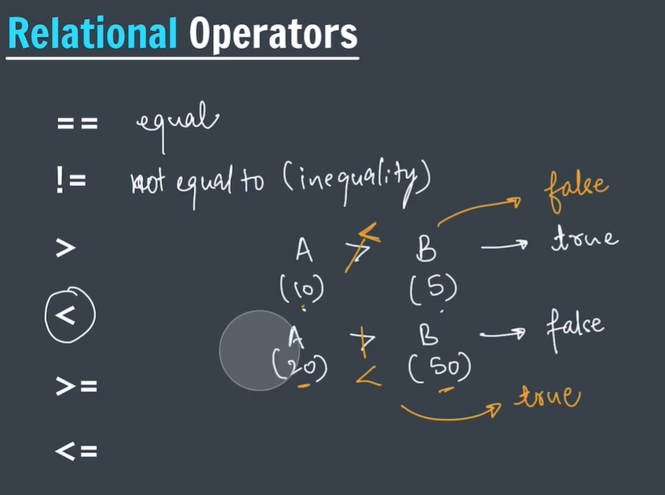

```
public class Main {
    public static void main(String[] args){
        int a = 10;
        int b = 5;
        System.out.println(a <= b);
    }
}


false
```

# Logical Operators

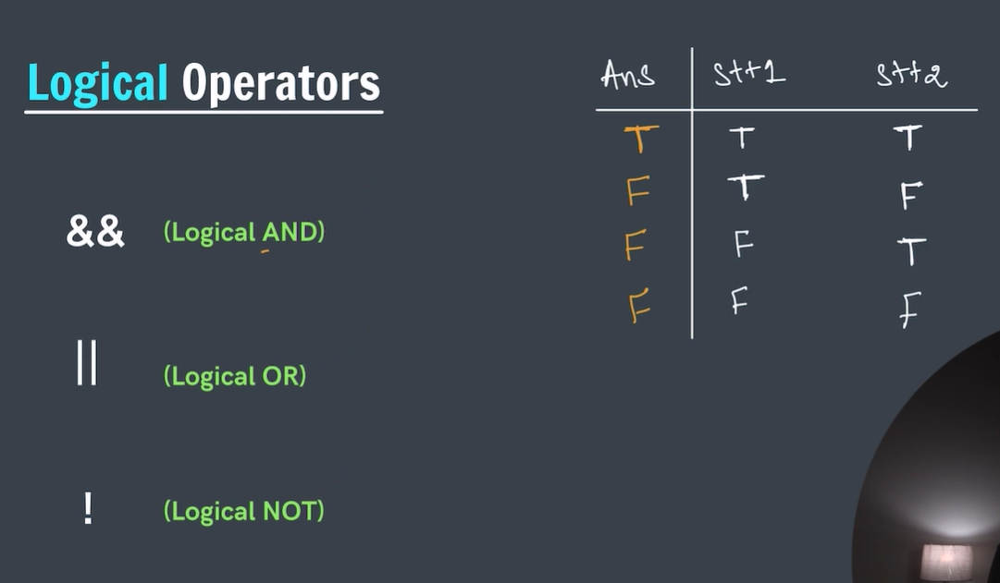

```
public class Main {
    public static void main(String[] args){
        System.out.println( (3>2) && (5>0));
    }
}


true
```

```
public class Main {
    public static void main(String[] args){
        System.out.println( (3<2) && (5>0));
    }
}


false
```


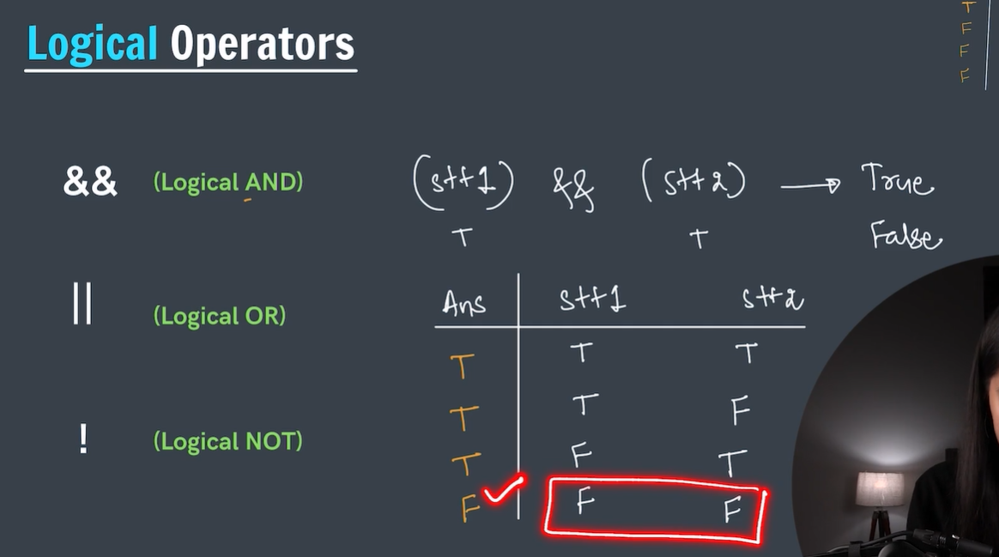


```
public class Main {
    public static void main(String[] args){
        System.out.println( (3<2) || (5<0));
    }
}


false
```


```
public class Main {
    public static void main(String[] args){
        System.out.println( (3<2) || (5>0));
    }
}


true
```

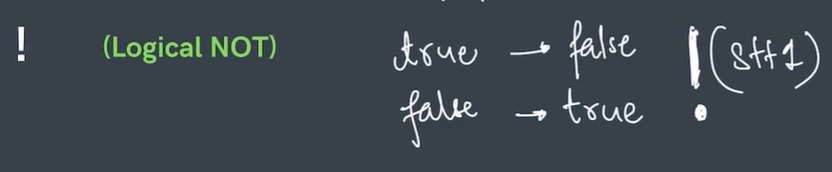

Logical NOT converts a true value to false 
and a false value to true

Just put it in front of a expression 

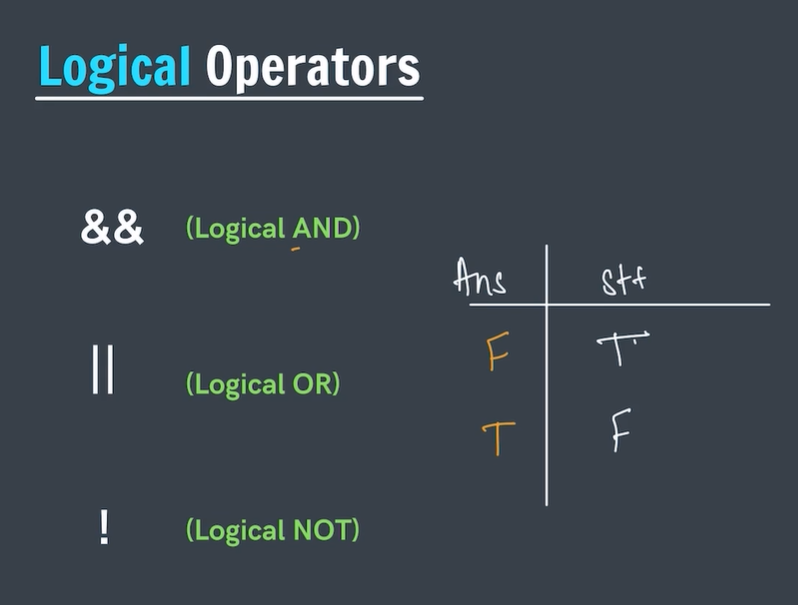

```
public class Main {
    public static void main(String[] args){
        System.out.println( !(3>2));
    }
}


false
```

```
public class Main {
    public static void main(String[] args){
        System.out.println( !(0>5));
    }
}


true
```


# Assignment Operators

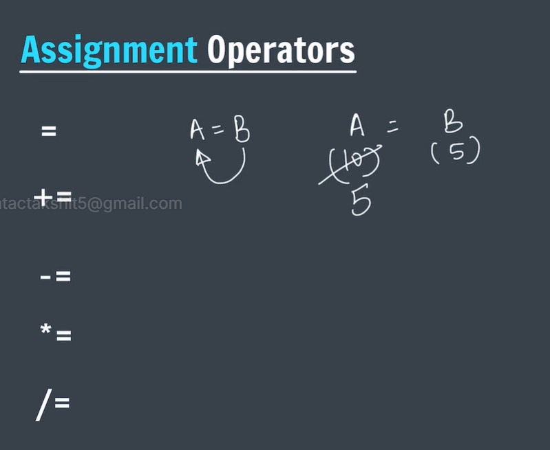

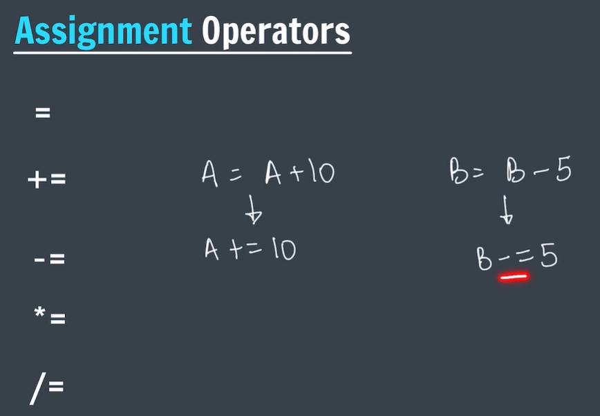


```
public class Main {
    public static void main(String[] args){
        int A = 10;
        A = A + 10;
        System.out.println(A);
    }
}


20
```

```
public class Main {
    public static void main(String[] args){
        int A = 10;
        //A = A + 10;
        A += 10; //Faster execution
        System.out.println(A);
    }
}


20
```

```
public class Main {
    public static void main(String[] args){
        int B = 5;
        // B = B -5;
        B -= 5;
        System.out.println(B);
    }
}


0
```


```
public class Main {
    public static void main(String[] args){
        int B = 5;
        B *= 5; // B = B * 5;
        System.out.println(B);
    }
}


25
```

```
public class Main {
    public static void main(String[] args){
        int B = 5;
        B /= 5;
        System.out.println(B);
    }
}

1
```

```
public class Main {
    public static void main(String[] args){
        int B = 5;
        B %= 5;
        System.out.println(B);
    }
}

0
```

