1
### 🔥 Important:

`y / x = 5 / 2`

Because both are **int**, the result is **integer division**:

`5 / 2 = 2   (NOT 2.5)`

So now:

`exp2 = 2 * 2 = 4`

[Operators Questions.pdf](c197ba1004154be19acfc207860fae22.pdf)
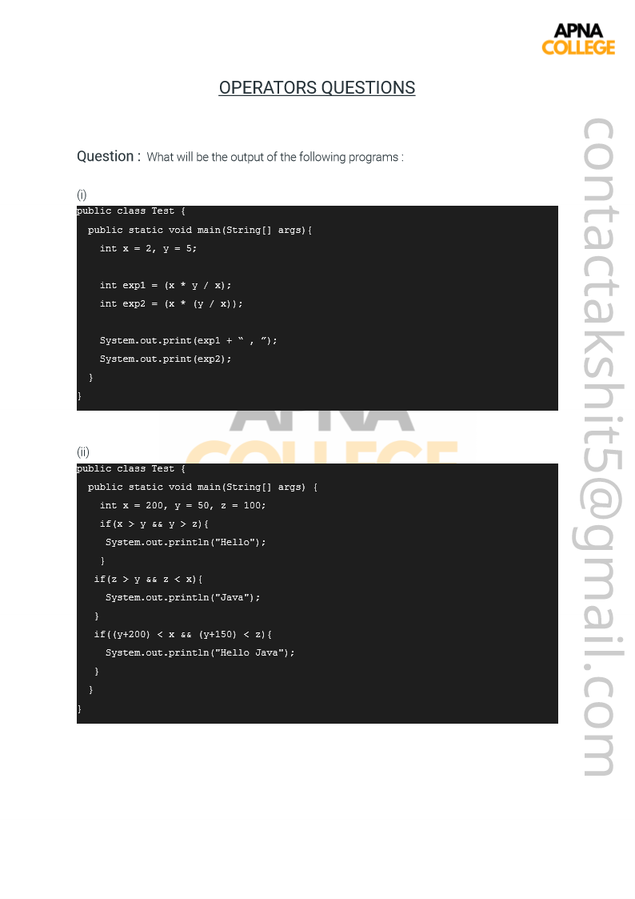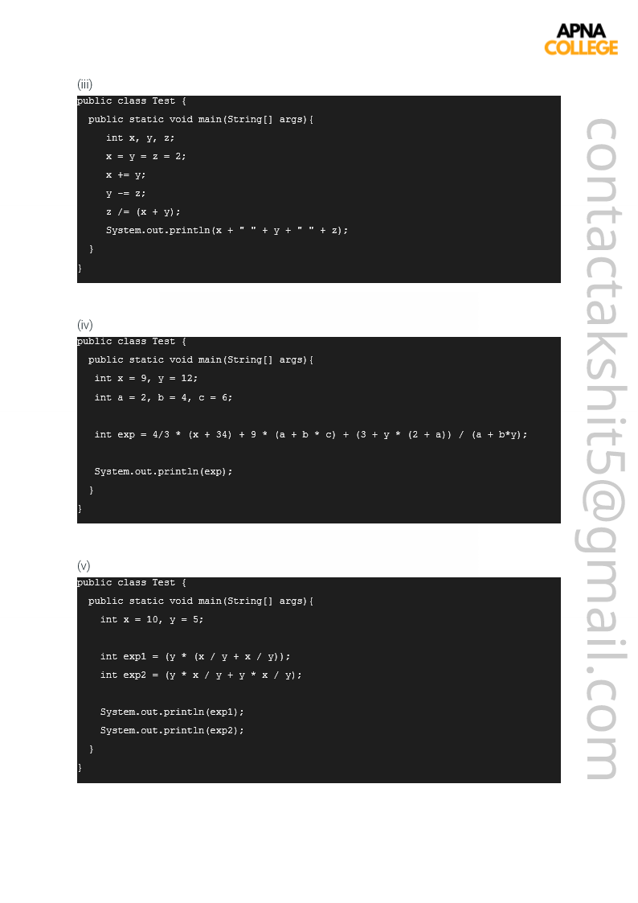[Operators Solutions.pdf](25b44673182e41b6a7da653d33a4ca45.pdf)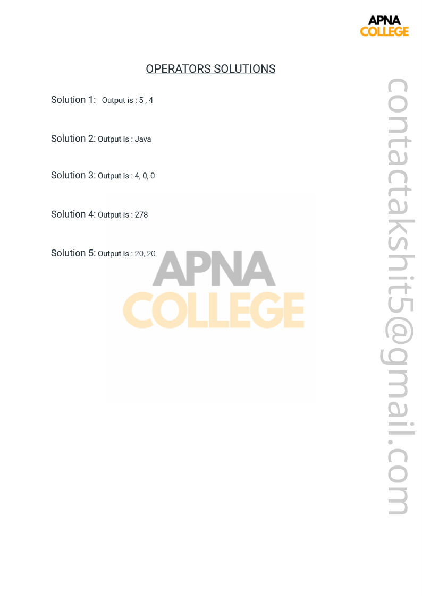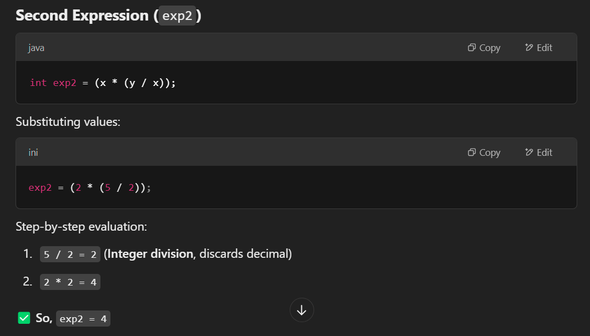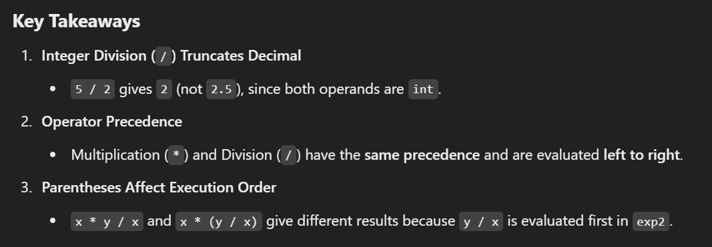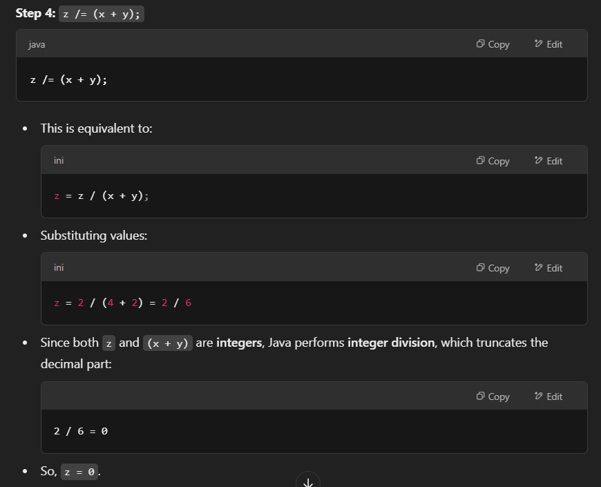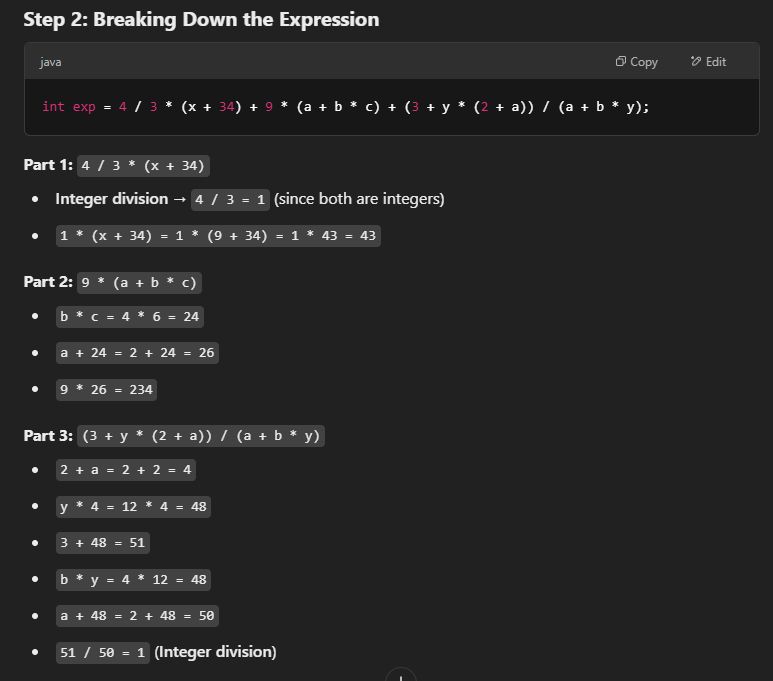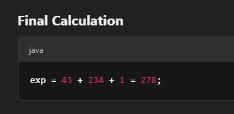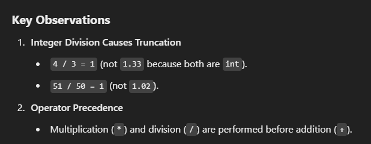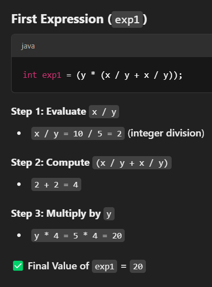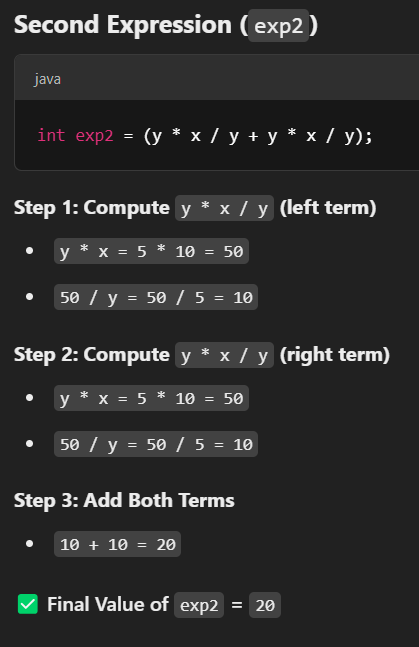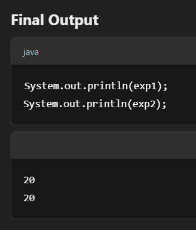
