# If else

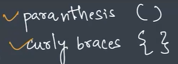

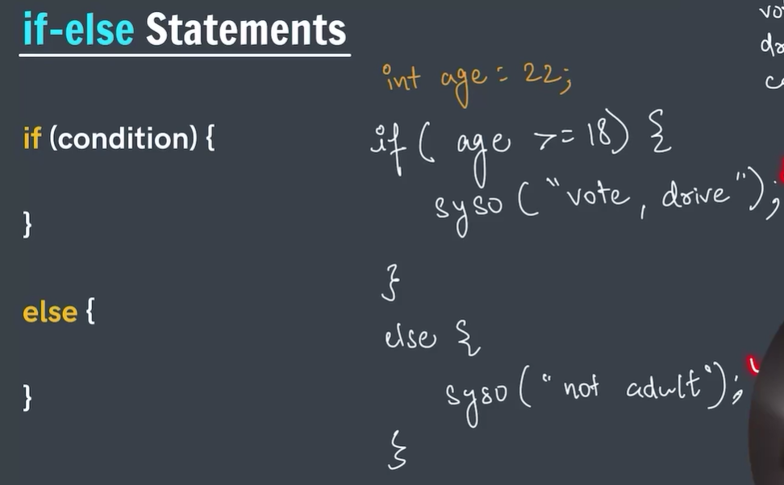

```
public class Main {
    public static void main(String[] args){
        int age = 16;
        if (age>=18) {
            System.out.println("adult : drive , vote");
        }
        else {
            System.out.println("not adult");
        }
    }
}


not adult
```


```
public class Main {
    public static void main(String[] args){
        int age = 16;
        if (age>=18) {
            System.out.println("adult : drive , vote");
        }

        if (age>=13 && age<18) {
            System.out.println("Teenager");
        }
        else {
            System.out.println("not adult");
        }
    }
}


Teenager
```

# Print the largest of 2 numbers 

```
public class Main {
    public static void main(String[] args){
        int A = 1;
        int B = 5;
        if (A>=B) {
            System.out.println("A is largest of 2");
        }
        else {
            System.out.println("B is largest of 2");
        }
    }
}


B is largest of 2
```

# Print if number is odd or even


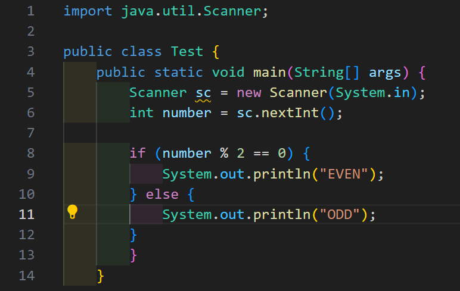

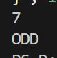

# Else if 

If the first 'if' is true then the 'else if' statement will not be checked
Only if the first 'if' is false then 'else if' will be checked

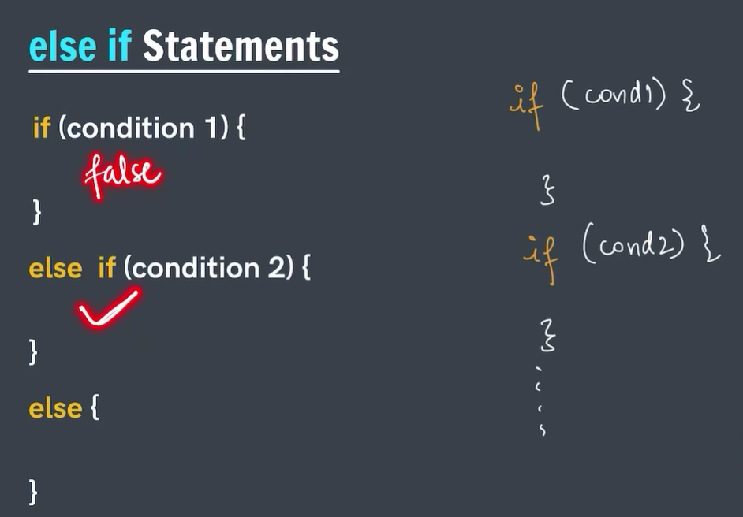

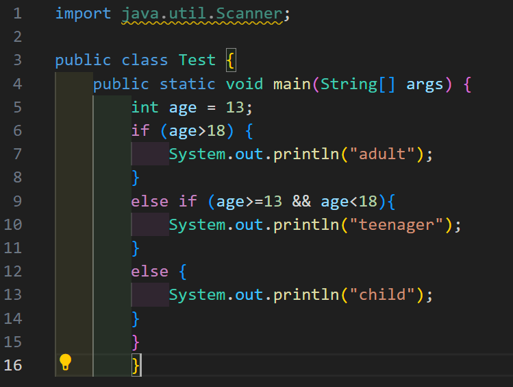

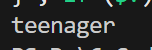

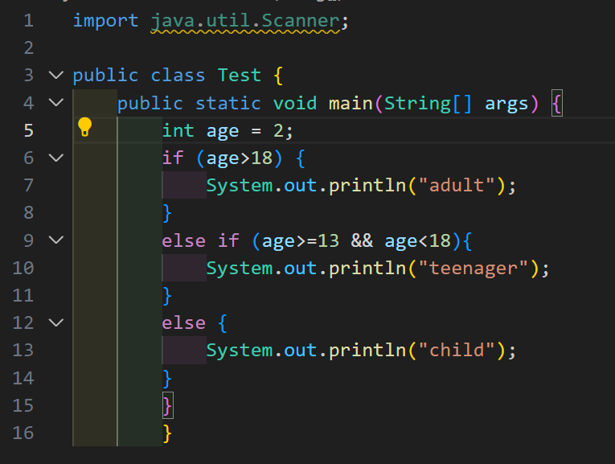

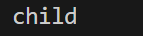

# Income Tax Calculator


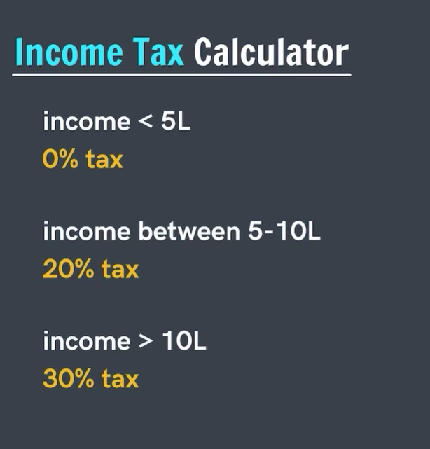

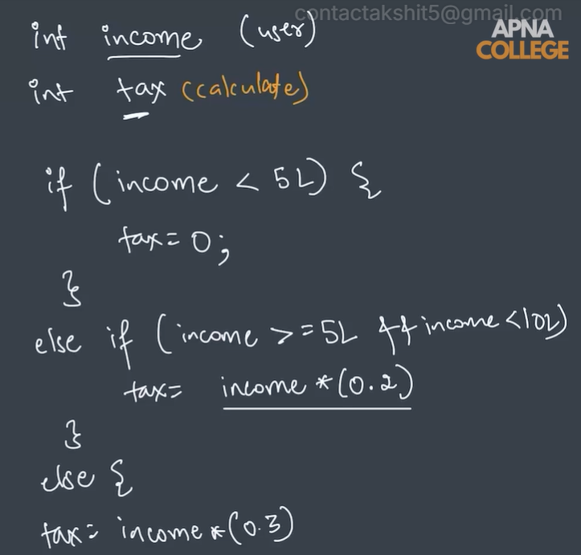

# Print the largest of 3 numbers

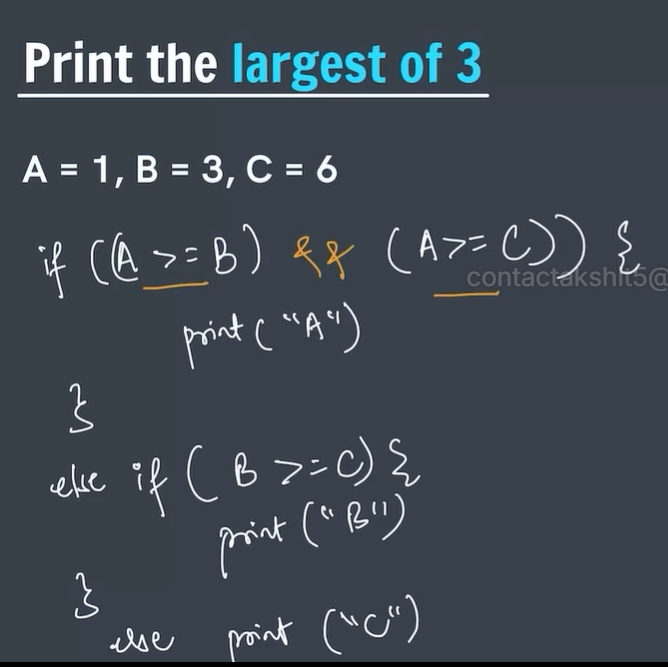

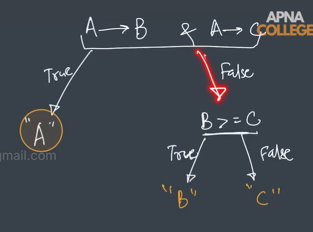

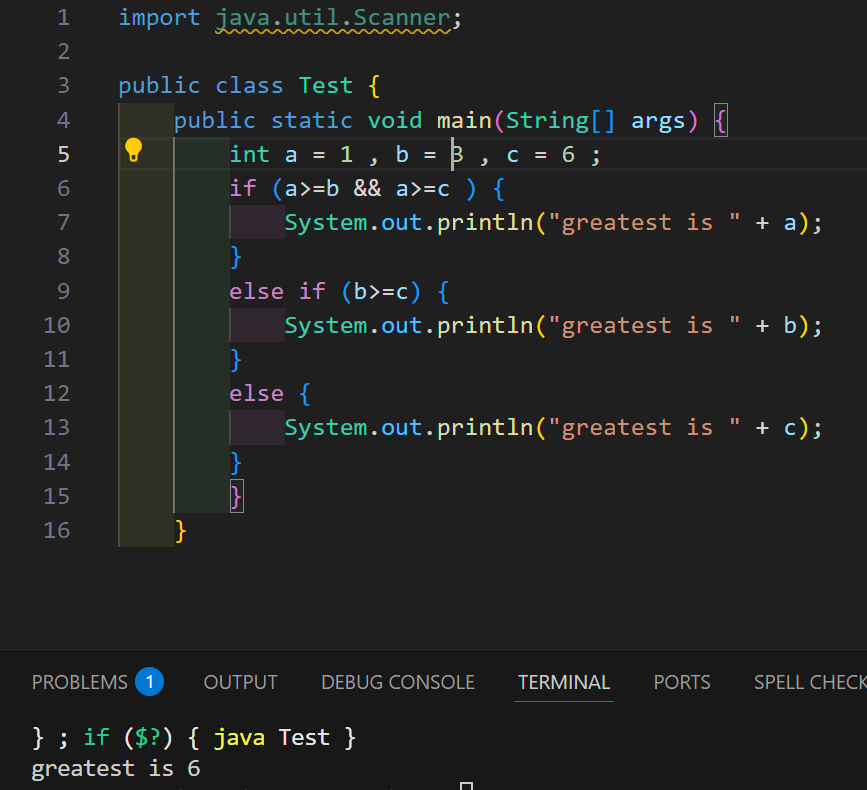

# Ternary operator

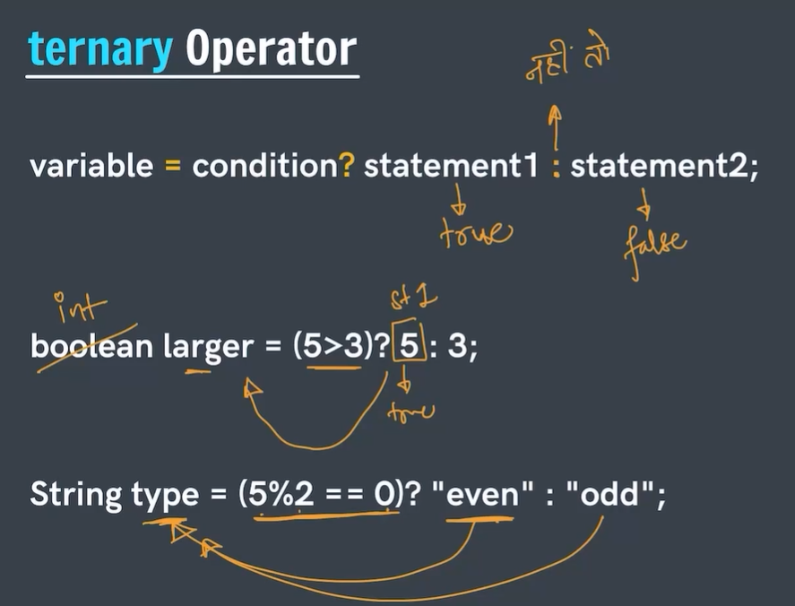

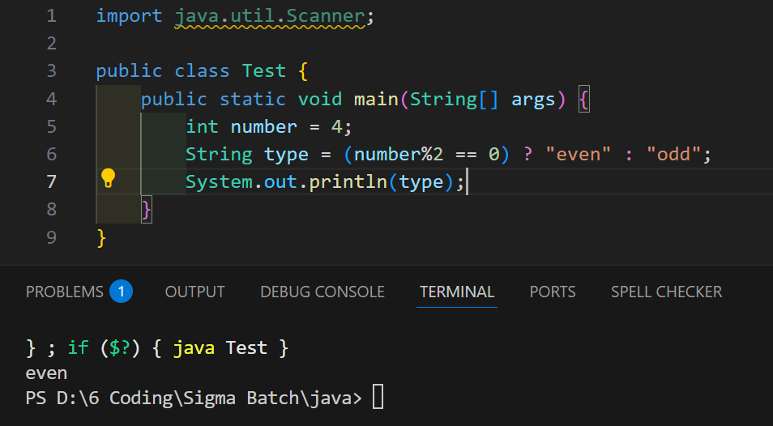

# Check if a student will Pass or Fail

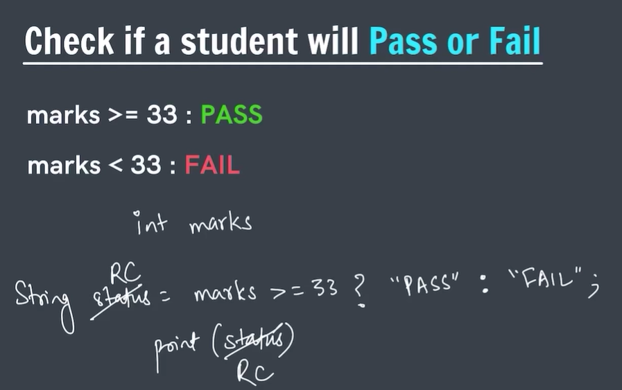

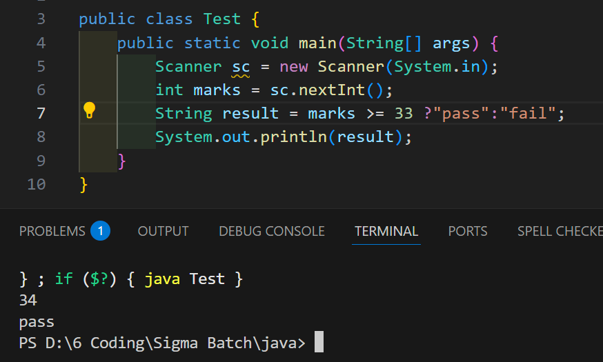

# Switch statement 

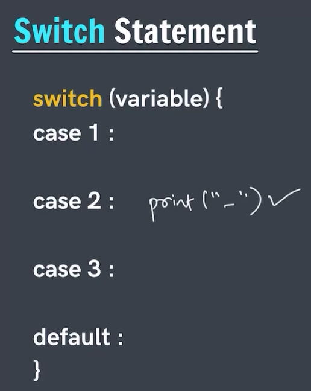
It matches value after case to variable
Example , if value of variable is 2 , case 2 gets printed

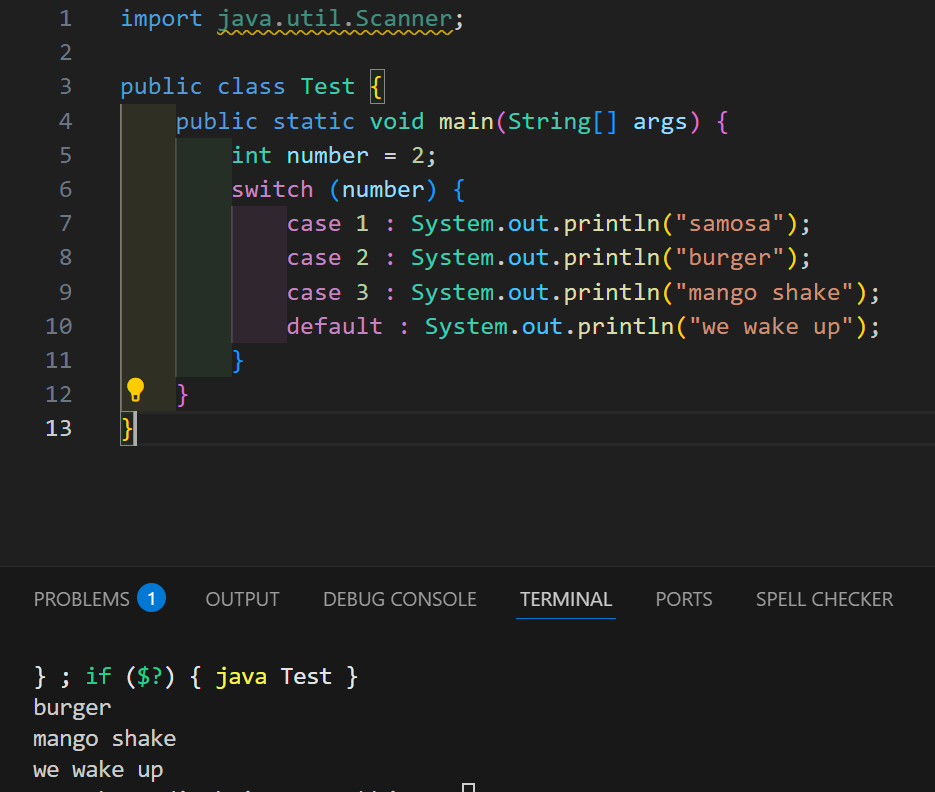
What is after the case matches the value of number
If the value is matched it prints what is written in the case

Also , also lines after the case gets printed if the case is matched

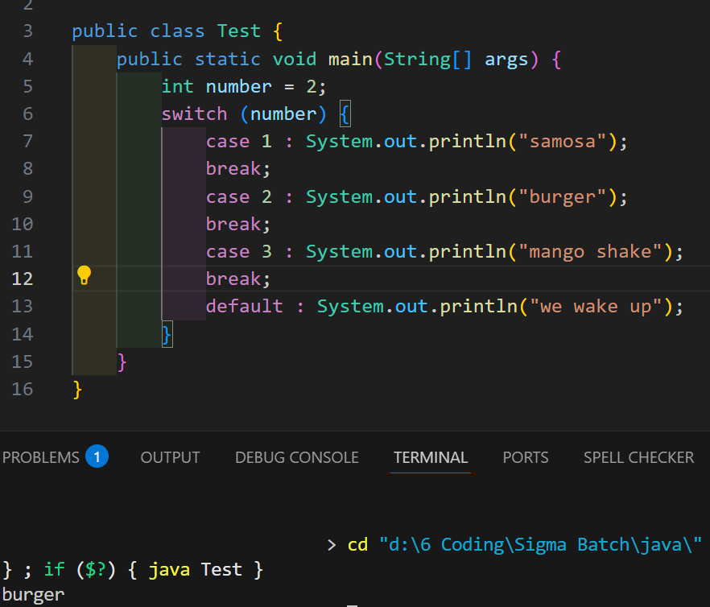
To print only the line of the matched case ,
Break ;
Is added after each line

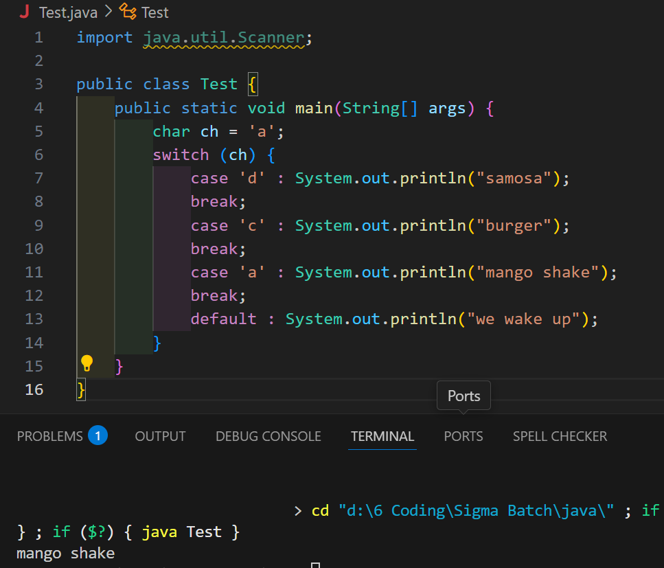
Characters can also be used instead of numbers
Or float values

# 
# Calculator

import java.util.Scanner;

public class Test {
public static void main(String\[\] args) {
Scanner sc = new Scanner(System.in);
System.out.println("enter a : ");
int a = sc.nextInt();
System.out.println("enter b : ");
int b = sc.nextInt();
System.out.println("enter operator : ");
char operator = sc.next().charAt(0);
switch (operator) {
case '+' : System.out.println(a+b);
break ;
case '-' : System.out.println(a-b);
break ;
case '\*' : System.out.println(a\*b);
break ;
case '/' : System.out.println(a/b);
break ;
case '%' : System.out.println(a%b);
break ;
default : System.out.println("wrong operator");
}
}
}

