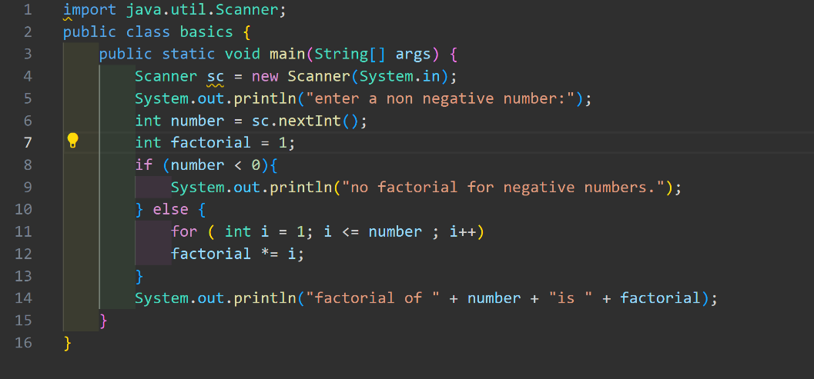
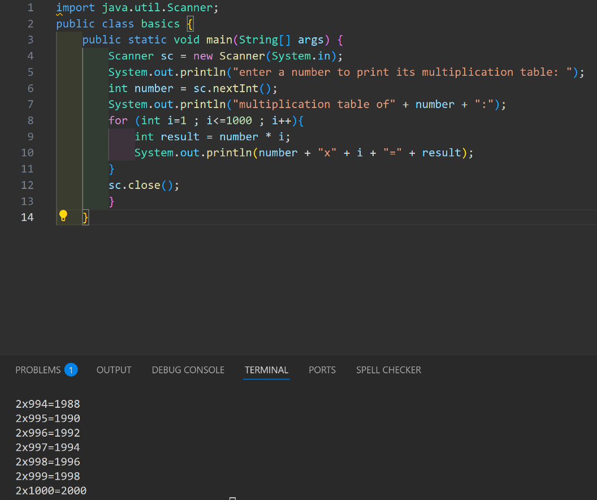
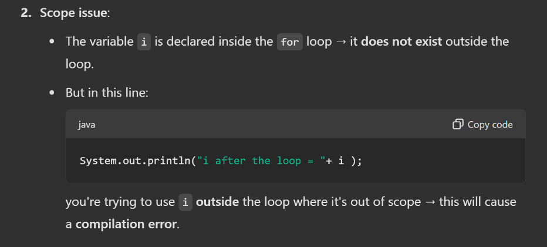
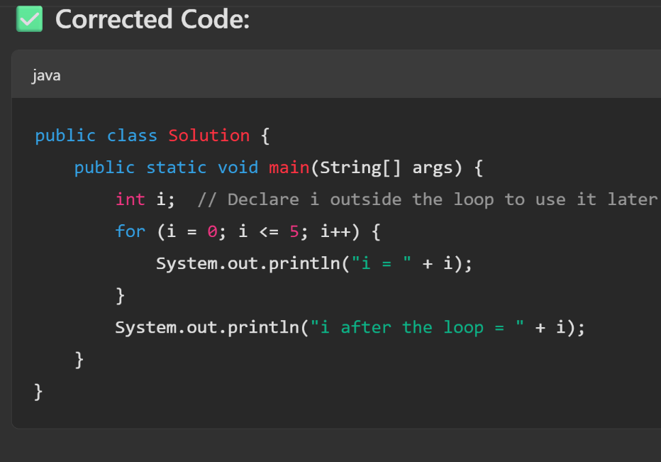

# ANS 1

Hello is printed 2 times.

# ANS 2 

import java.util.Scanner;
public class basics {
public static void main(String\[\] args) {
Scanner scanner = new Scanner(System.in);
int evenSum = 0;
int oddSum = 0;
System.out.println("enter integers (enter 0 to stop): ");
while(true) {
int num = scanner.nextInt();
if (num == 0){
break;
}
if (num % 2 == 0) {
evenSum += num;
} else {
oddSum += num;
}
}
System.out.println("sum of even numbers: " + evenSum);
System.out.println("sum of odd number " + oddSum);
scanner.close();
}
}

# ANS 3

# ANS 4

# ANS 5 

