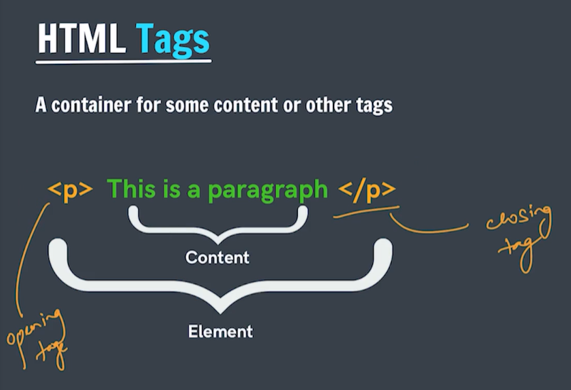

## Introduction to HTML

HTML - Hyper Text Markup Language
structure and formatting


## HTML Elements & Tags

Standard elements that browsers recognize
The component used to design the structure of websites are called HTML tags.
### Paragraph
```
<p> abcd </p>
```
### Heading
```
<h> heading </p>
```



## Hello World
```
<p>Hello World <b> Apna College</b> </p>
<p>Akshit</p>
```


## Paragraph Element

HTML doesn't count spaces

nesting -> nested tags
putting one tag inside another

```
<p>This is my first paragraph.
    <b>This is my second paragraph</b>
</p>
```

## Heading Elements

```
The <h1> to <h6> HTML elements represent six levels of section headings. <h1> is the highest section level and <h6> is the lowest.
```

