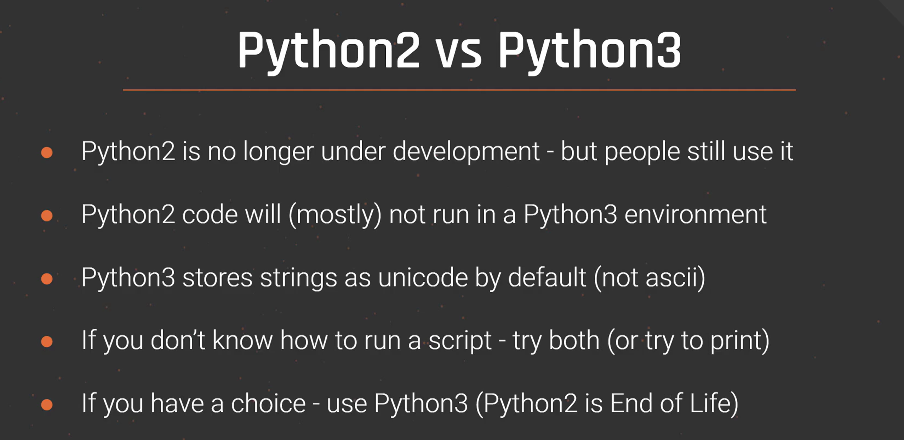

# 🧠 First: What Is Unicode?

**Unicode** is a universal system for representing characters from _all languages_ in the world.

This includes:

- English letters → A, B, C
    
- Numbers → 0–9
    
- Emojis → 😀🔥❤️
    
- Hindi → नमस्ते
    
- Chinese → 你好
    
- Arabic → مرحبا
    
- Special symbols → © ™ € μ
    

Unicode can represent **over 100,000+ characters**.

---

# 🧠 What Is ASCII?

ASCII is an **old character system** that can only represent:

- Basic English letters (A–Z, a–z)
    
- Numbers (0–9)
    
- Some symbols (!, @, #, $, %, etc.)
    

ASCII supports only **128 characters**.

---

# 🔍 So What Does This Mean for Python 3?

In Python 2:

- Strings were ASCII by default (English-only)
    
- Unicode needed special syntax
    

In Python 3:

### ✔️ **Every string is stored as Unicode automatically**

`s = "Hello" s2 = "नमस्ते" s3 = "こんにちは" s4 = "😊🔥💯"`

All these work **without any extra code**.

Python 3 can handle ANY language or emoji out of the box.

---

# 📦 Why Is This Important?

### 1. **You can use any language**

`print("مرحبا") print("你好")`

### 2. **You can use emojis**

`print("Hello 😄🔥")`

### 3. **You avoid encoding errors**

Older languages had problems like:

`UnicodeDecodeError UnicodeEncodeError`

Python 3 avoids many of these.

### 4. **Better for web, databases, APIs**

Because modern apps use many languages.

---

# 🎯 Super Simple Summary

|ASCII|Unicode|
|---|---|
|128 symbols only|All characters from all languages|
|English only|Worldwide|
|No emoji|Supports emojis|
|Not flexible|Very flexible|

### 🧁 Final Summary Sentence:

**Python 3 stores strings in Unicode so it can handle ALL languages and emojis automatically.**