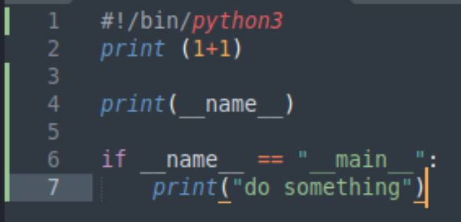
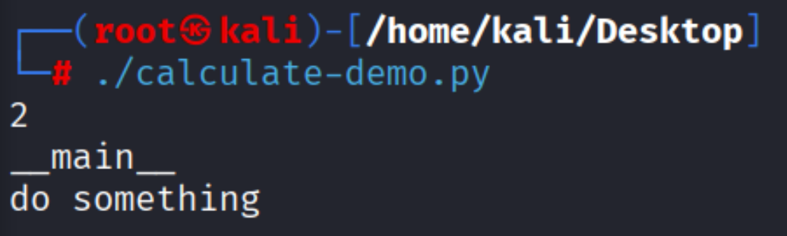

2 ways to run a script 

```
python3 calculate-demo.py
```

or 

add to the top of python file/first line
```
#!/bin/python3
```
then run after giving permissions :
```
chmod +x calculate-demo.py 
./calculate-demo.py 
```

--- 

before executing a source file , python will read the source file and define standard variables

and if the interpreter is running the current file as the main program , 
it will set the 

```
if __name__ == "__main__":
	print("do something")
```

and it is being imported into a module then
```
__name__ will be set to "__#that module's name instead__"
```


because the interpreter is running the current file as the main file :





