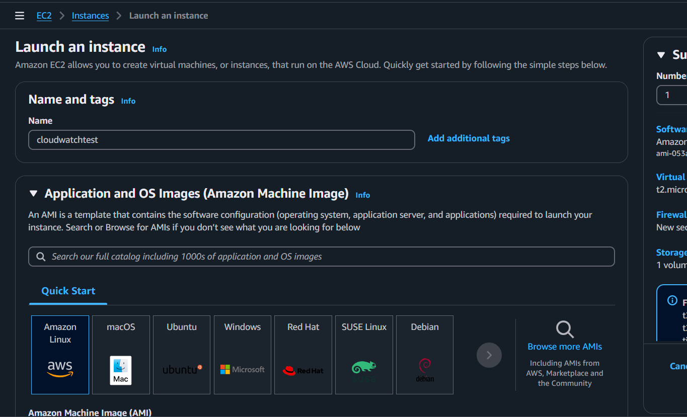

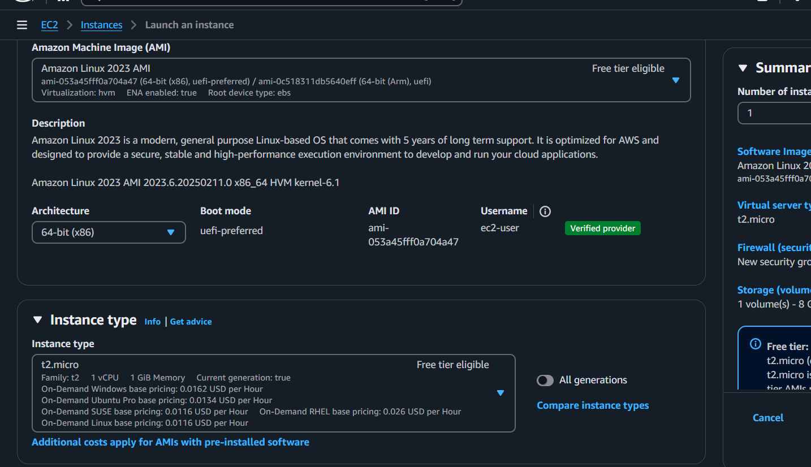

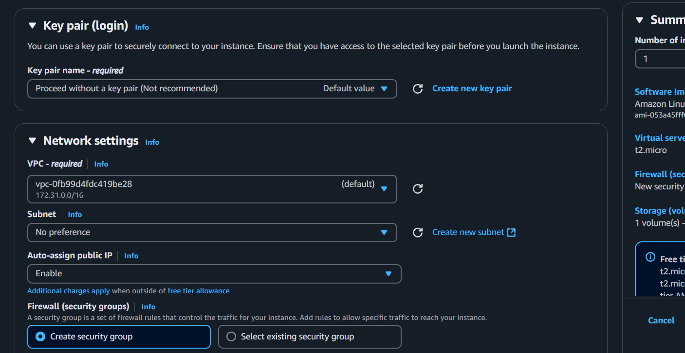

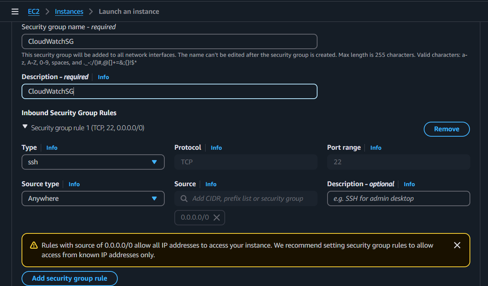

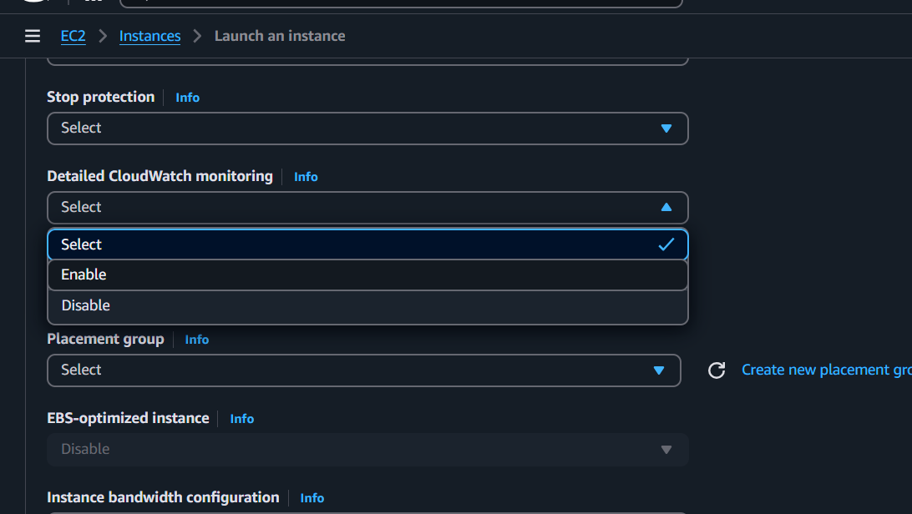

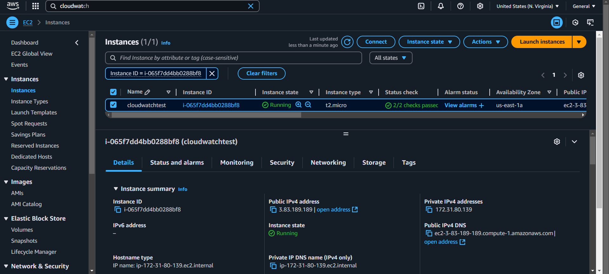

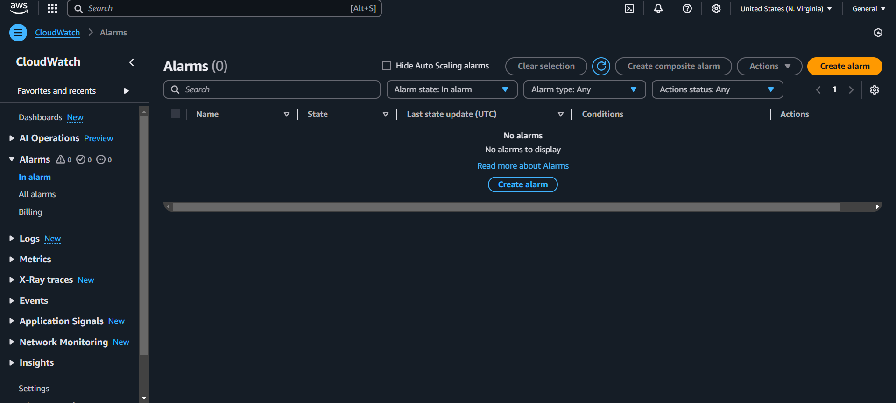

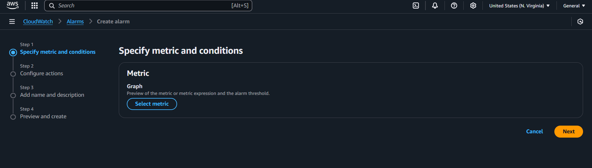

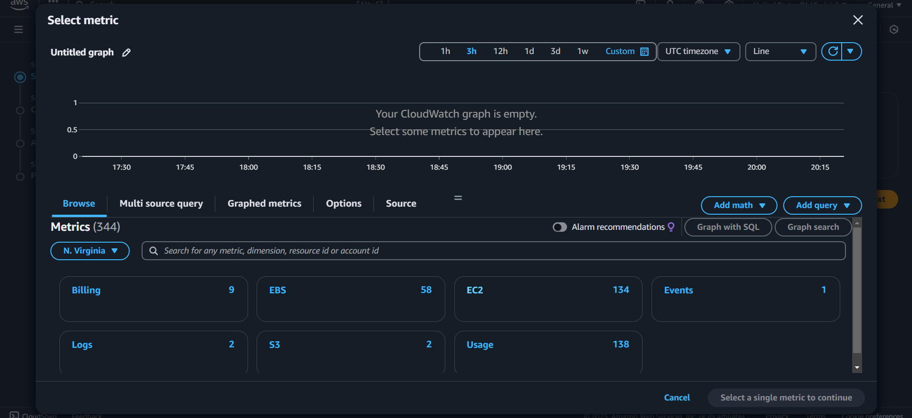

Select ec2

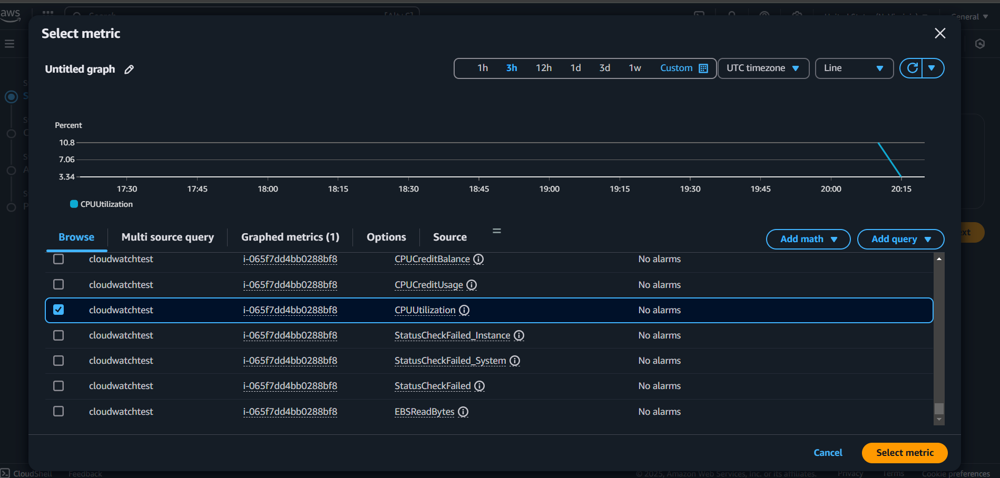

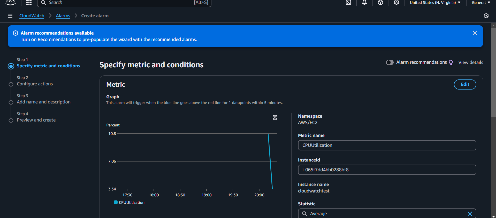

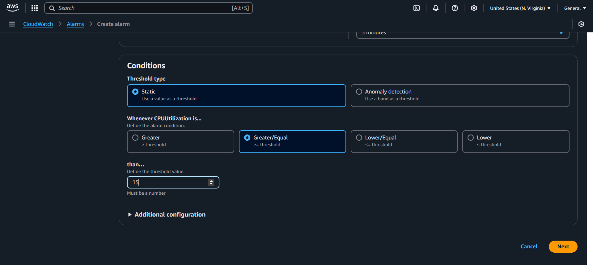

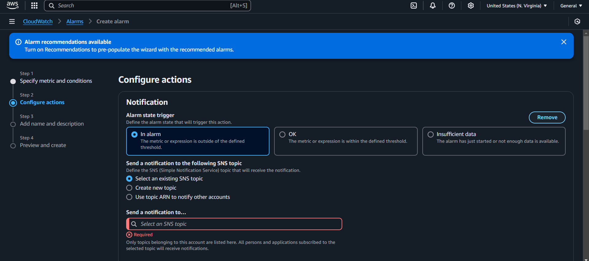

Remove notification then next

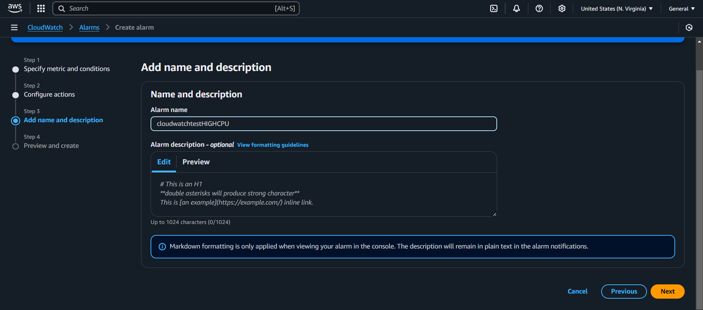

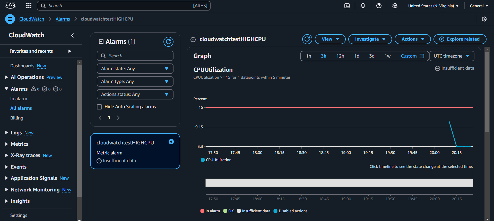

We need to install stress on this instance which will generate artificial cpu load onto a system

sudo yum install stress -y

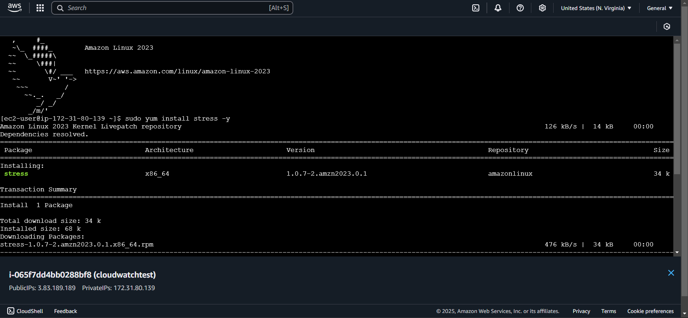

We need to mention the number of cpu the instance has

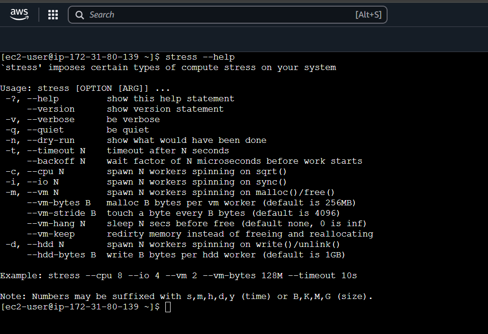

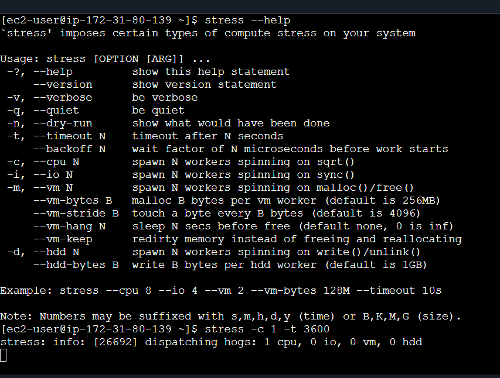

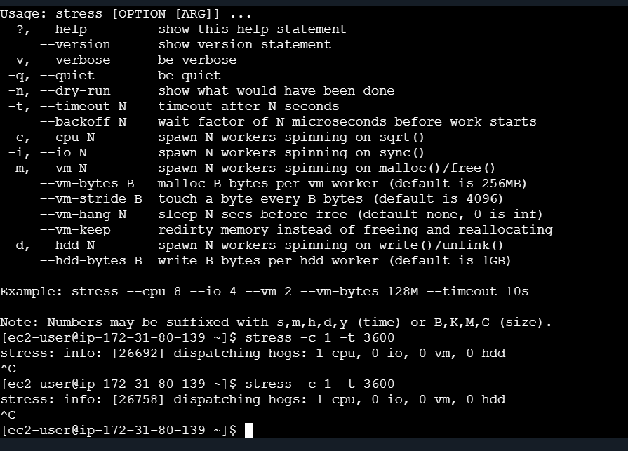

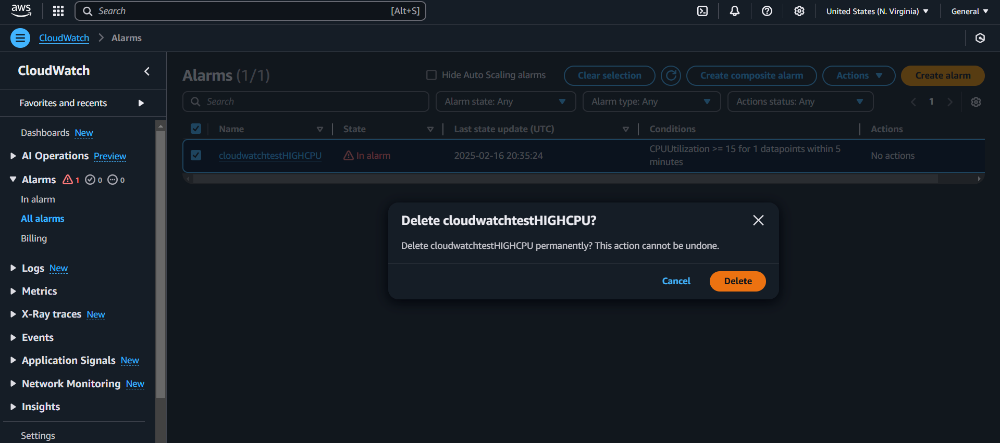

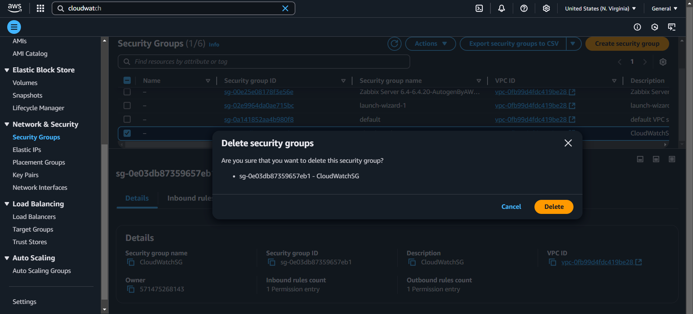

