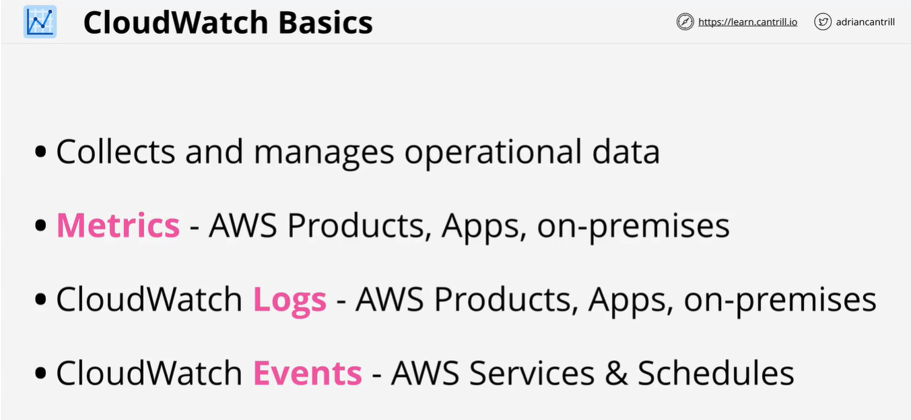
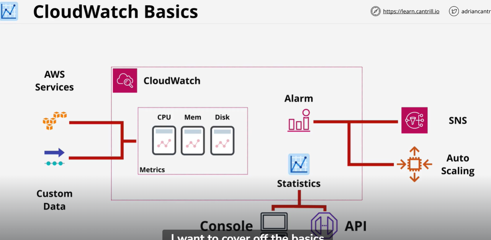
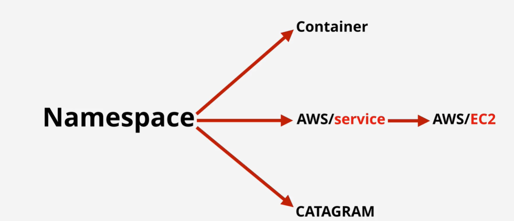
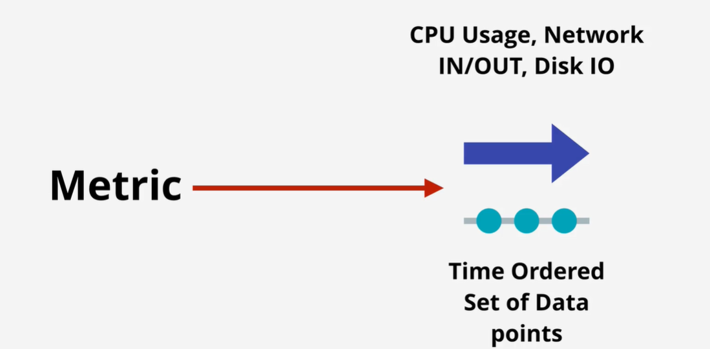
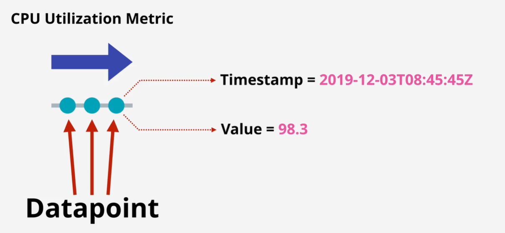
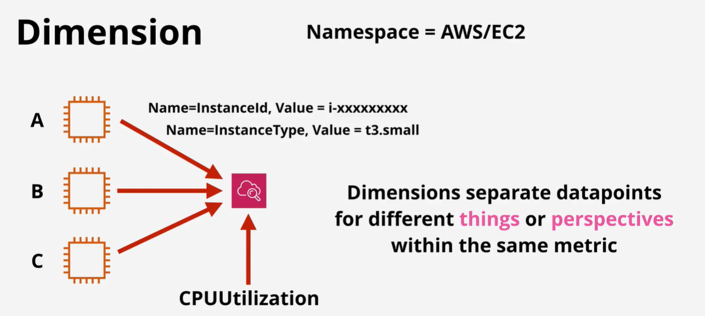
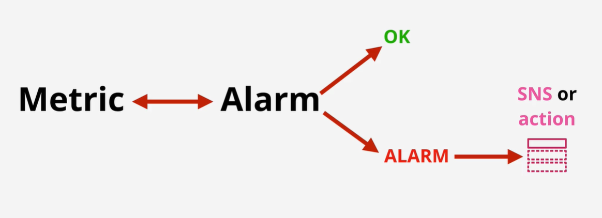

CloudWatch is a core supporting service within AWS which provides metric, log and event management services.

It's used through other AWS services for health and performance monitoring, log management and serveless architectures.

