CloudFormation is an Infrastructure as Code (IaC) product in AWS which allows automation infrastructure creation, update and deletion.

Templates created in YAML or JSON can be used to automate infrastructure operations

Templates are used to create stacks, which are used to interact with resources in an AWS account.

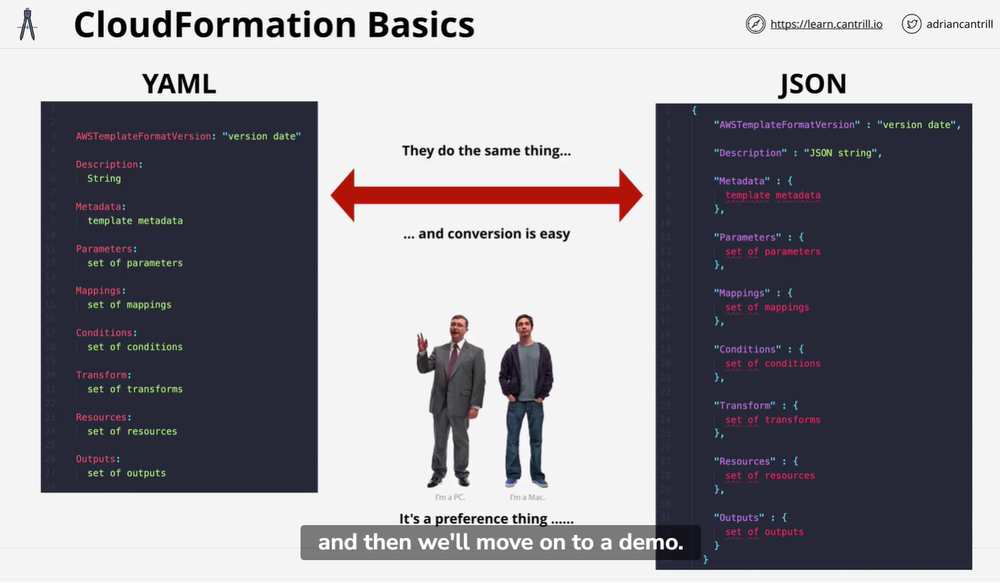

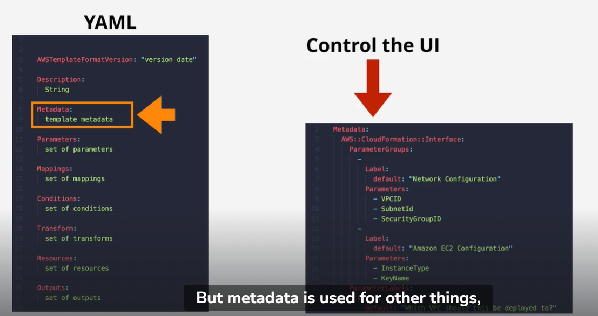

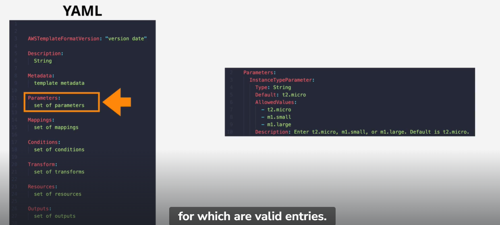

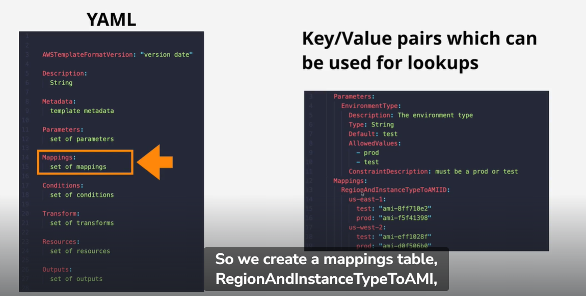

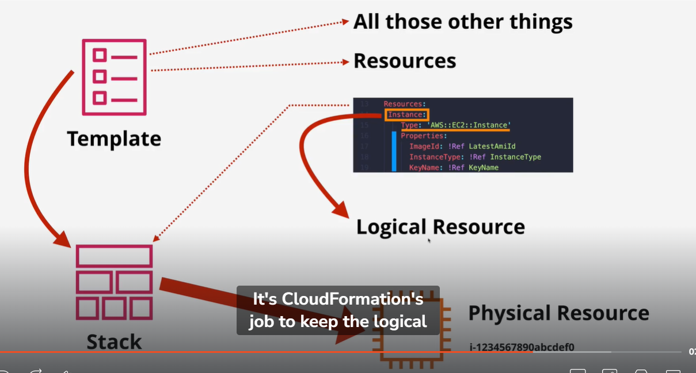

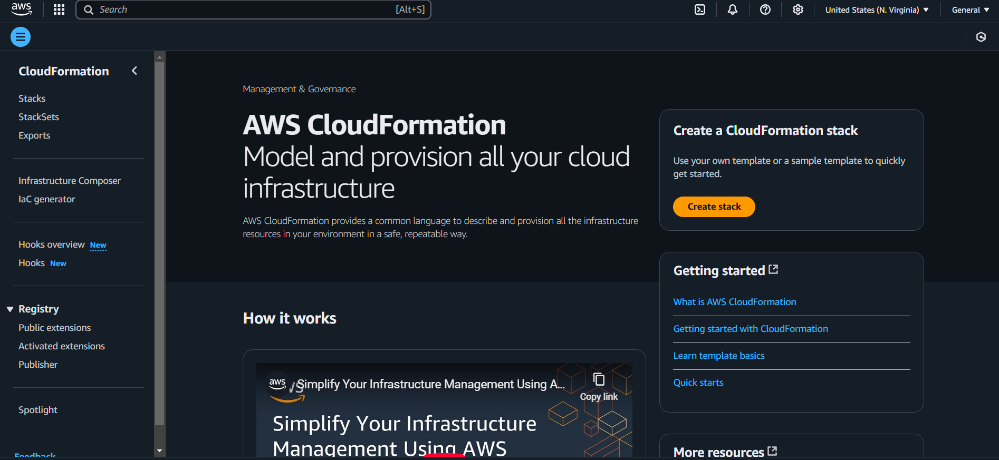

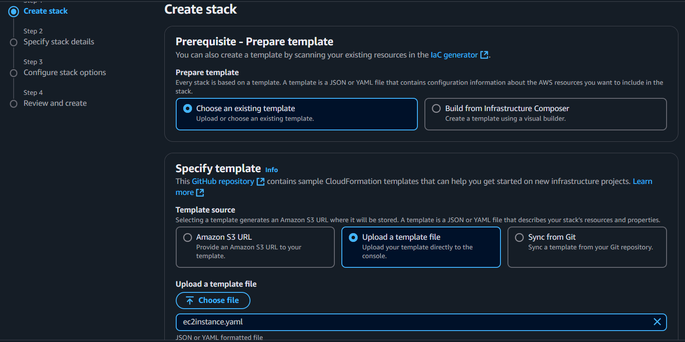

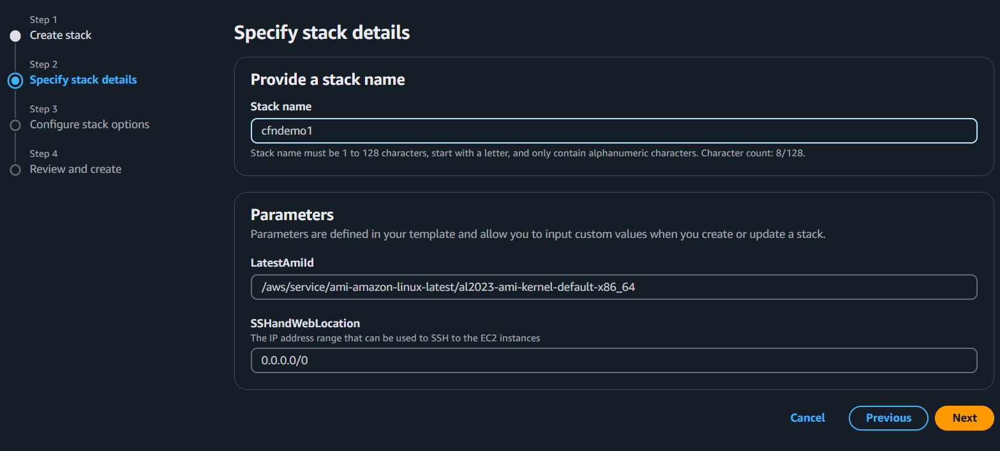

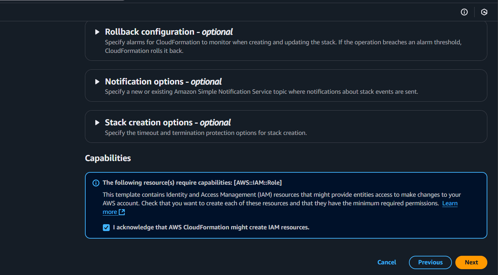

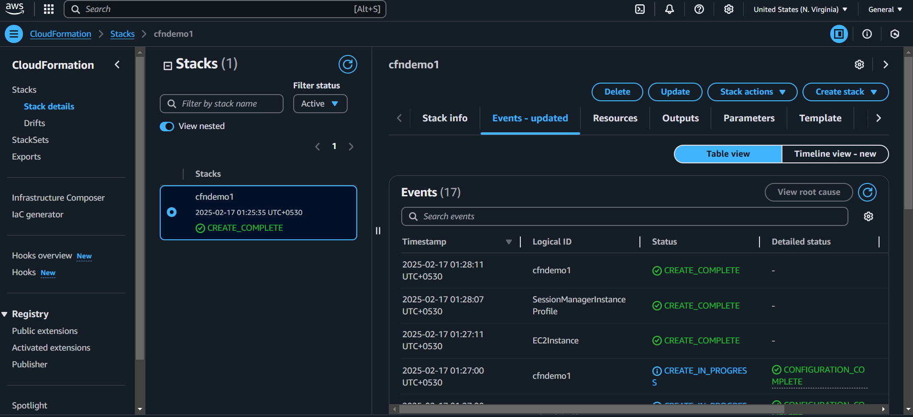

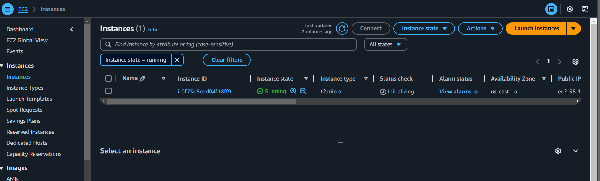

