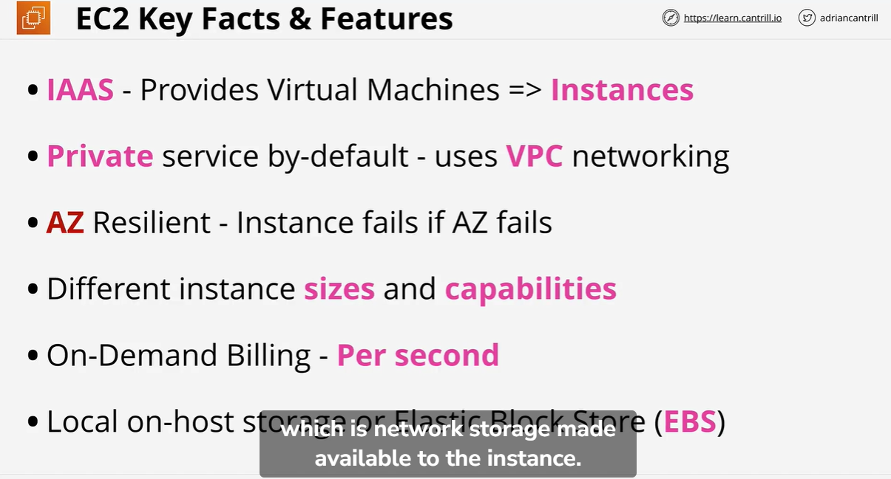
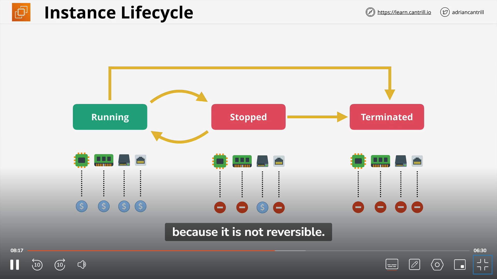
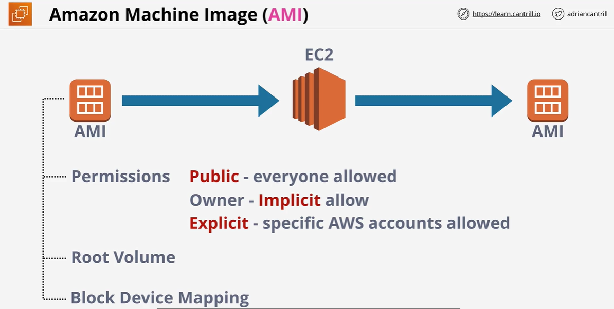

The Elastic Compute Cloud or EC2 is AWS's implement of IAAS - Infrastructure as a service.

It allows you to provision virtual machines known as instances with resources you select and an operating system of your choosing.

An instance is an operating system configured in a certain way with a certain set of allocated resources

4 components

CPU
Ram
Storage
Networking

Even if instance is stopped , we will get the bill for EBS storage

Rdp port - 3389
Ssh port - 22

