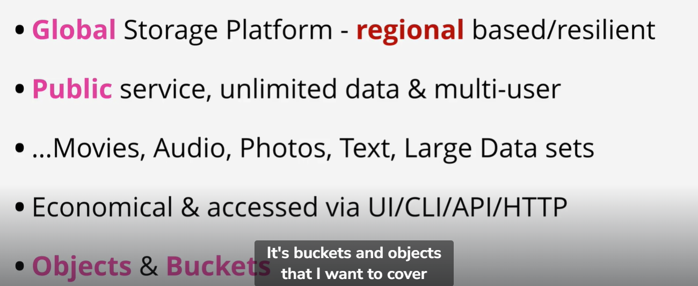
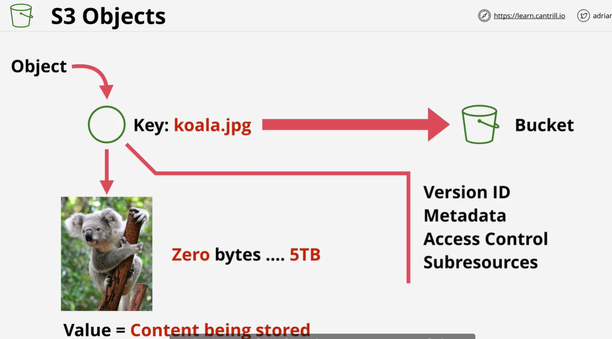
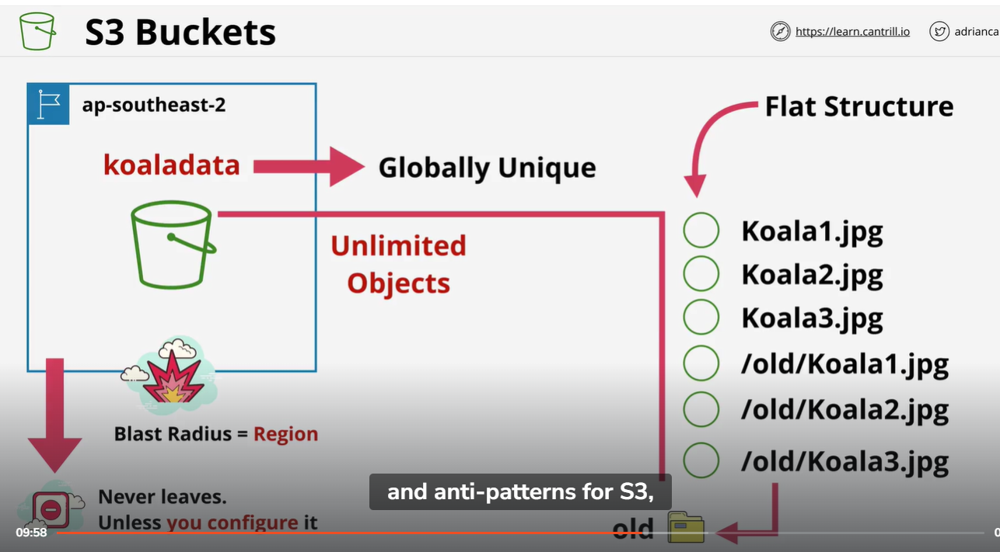
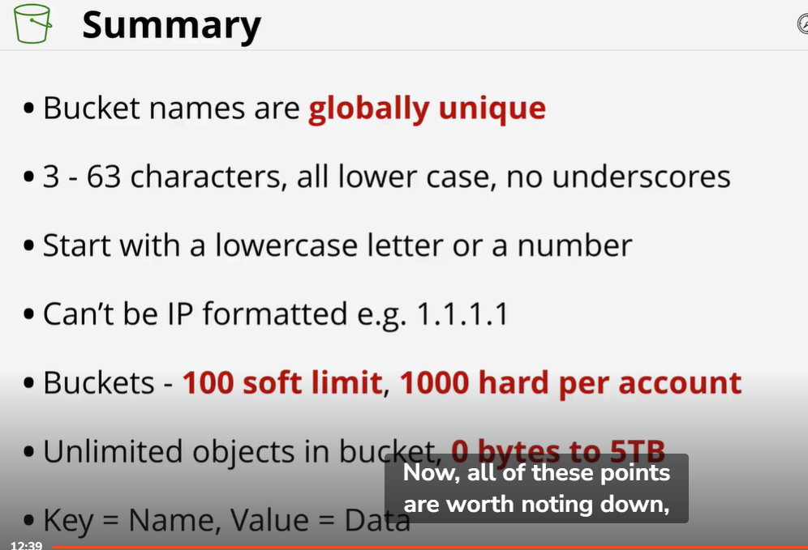
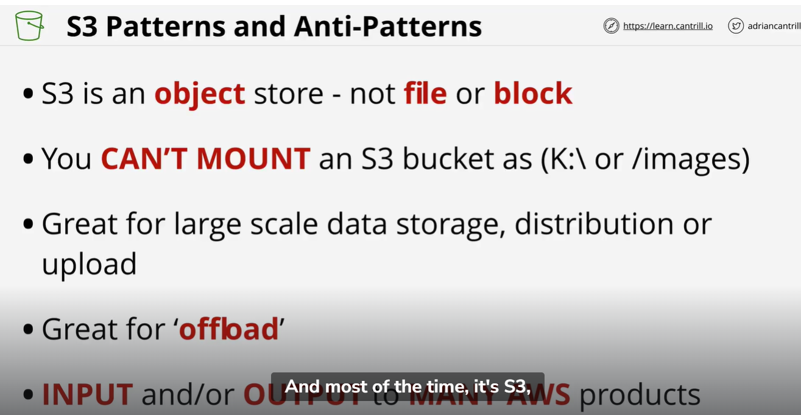

0 to 5tb

Number of buckets we can make :
100 soft limit
1000 hard limit

It is an object store , not file or block

Deleting S3 is a 2 step process
1.  Empty the bucket
2.  Delete the bucket

It is region based
Data is stored in a particular location

Data is copied in availability zones in that region

