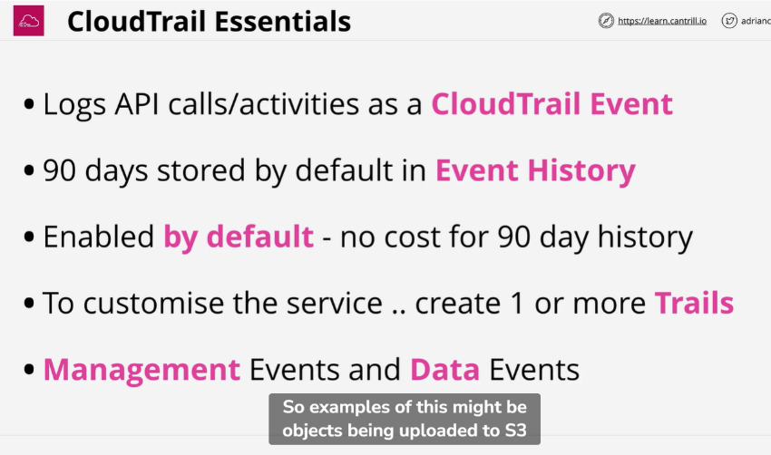
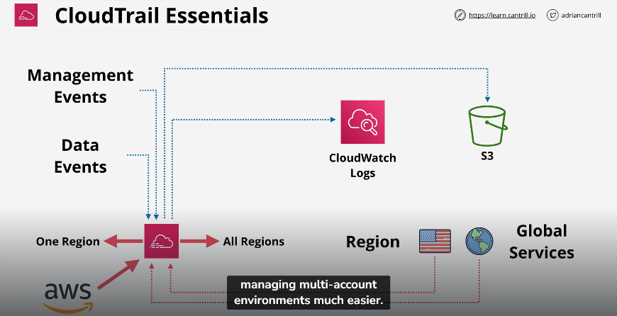
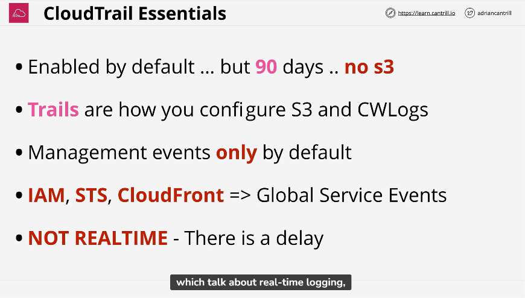

It logs everything in an account
Ex. Deletion of an ec2 instance or an s3 bucket

Cloud train event is an activity of an aws account

It only logs management events like deletion of an s3 bucket
And not data events

Because data events are much higher in volume
Ex. Adding or removing objects from s3

Can log only 1 region or all regions

All global services are logged into us-east-1 n. Virginia

Data events is not enabled by default
It logs only management events by default

Though cloud trail events are stored for max 90 days
The logs can be stored in a s3 bucket for infinite period of time

CloudTrail Is a product which logs API calls and account events.

It's very often used to diagnose security or performance issues, or to provide quality account level traceability.

It is enabled by default in AWS accounts and logs free information with a 90 day retention.

It can be configured to store data indefinitely in S3 or CloudWatch Logs.

