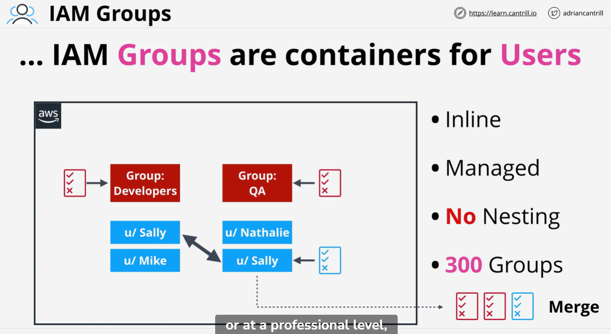
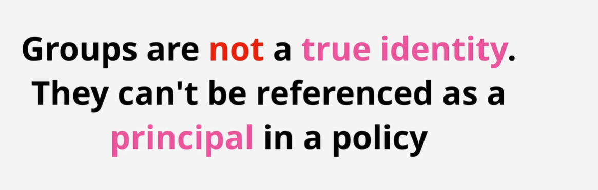

Nesting - groups within groups

You can add IAM users to groups, and add permissions to Groups

Groups are NOT real identities ... can't be used from resource policies and have no credentials to login with.

