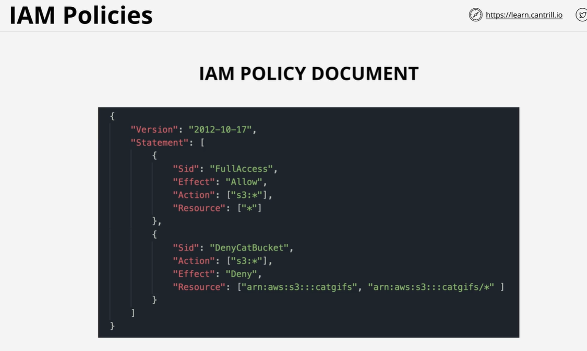
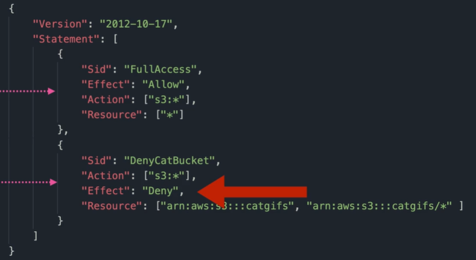
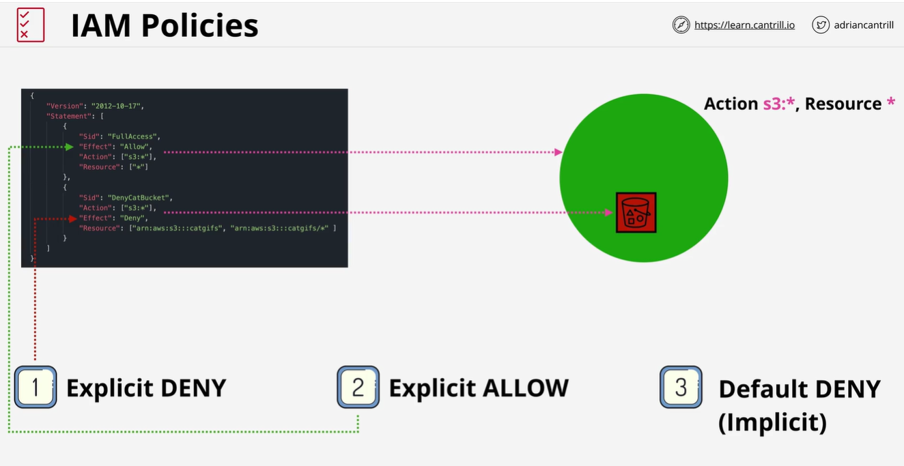
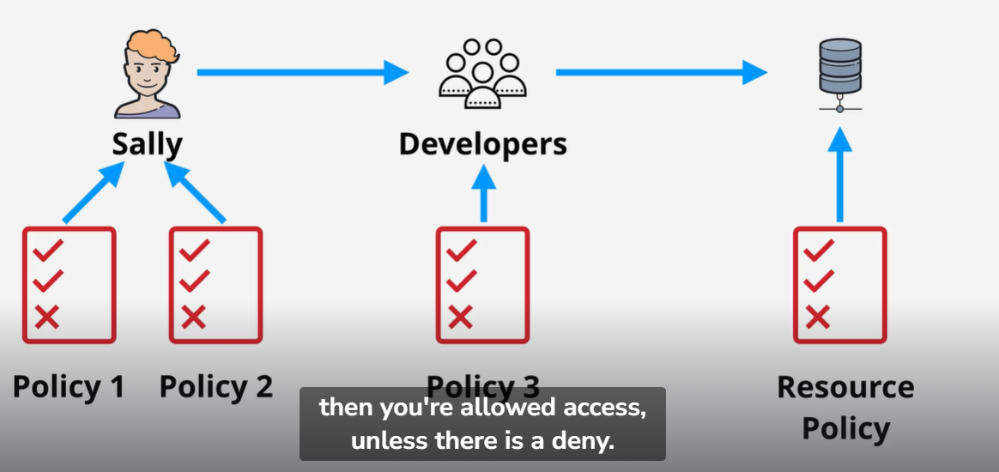
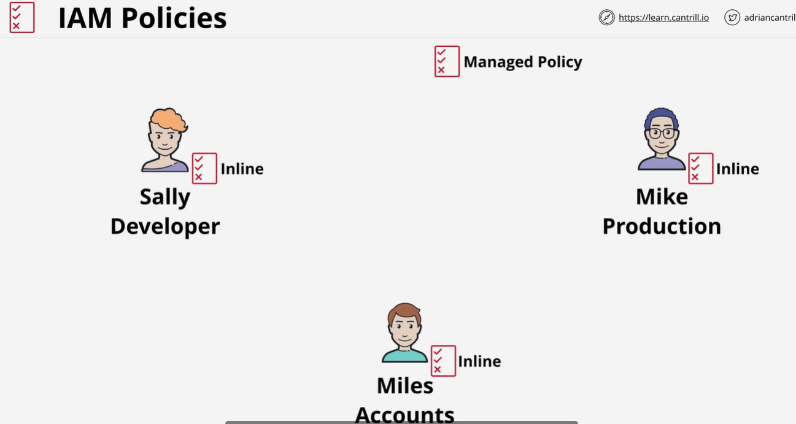
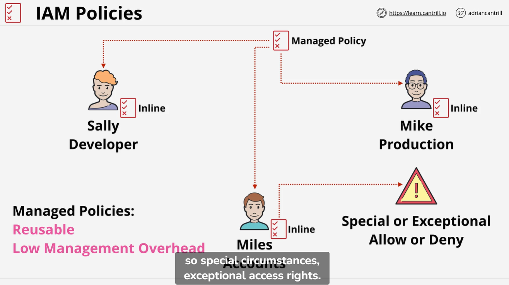

Identity Policies are attached to AWS identities and either ALLOW or DENY access to AWS resources.

There are two effects here

Allow and deny

The deny always wins
It takes more priority

If a person is in different groups and those groups also have different policies

Then aws combines them altogether

Deny wins
Then allow

Inline policies are given to each individual individually
So we have to edit for everyone

We use managed policies when we want to assign policies to a large group

Inline policies are used only in special circumstances
When we want to give an individual more rights or deny some rights

