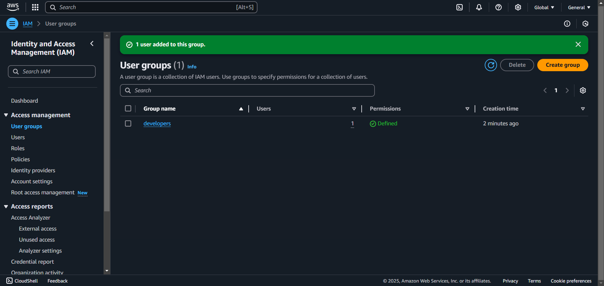
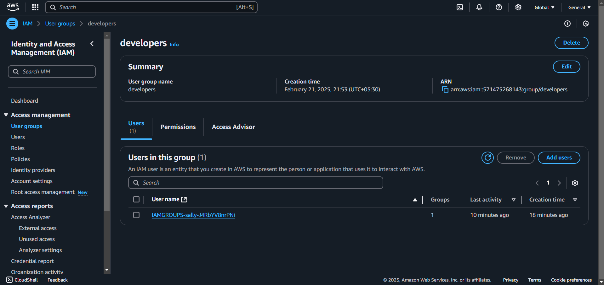
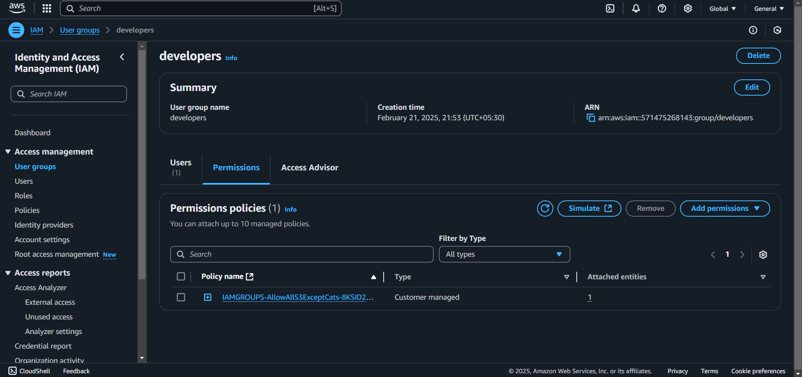

In this \[DEMO\] we investigate how groups can be used to hold permissions for group members.

Permissions which were assigned to the IAM user 'Sally' are migrated to a new development group we create in the demo.

