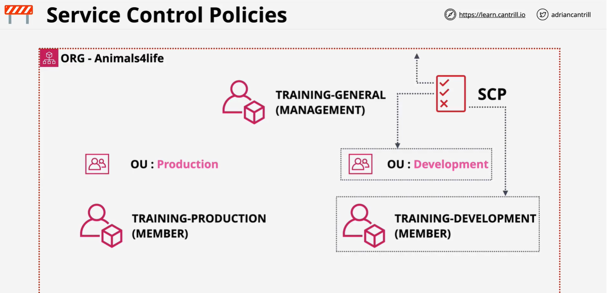
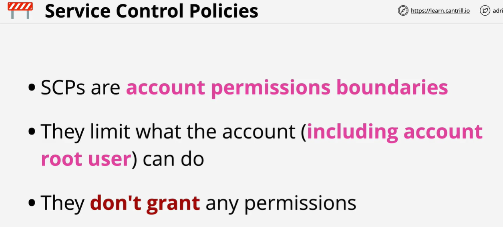
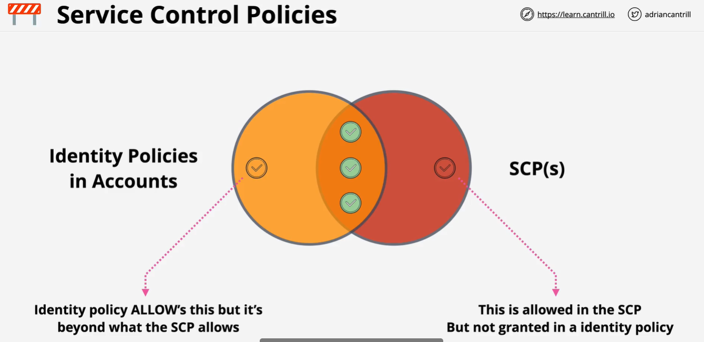

The management account cannot be restricted

Service control policy
Are not permission givers
They just define the limit to which a service can be used
For ex. Size of an ec2 instance

In this lesson I introduce service control policies - a feature of AWS Organizations which allow restrictions to be placed on MEMBER accounts in the form of boundaries.

SCPs can be applied to the organization, to OU's or to individual accounts.

Member accounts can be effected, the MANAGEMENT account cannot.

SCPs DON'T GIVE permission - they just control what an account CAN and CANNOT grant via identity policies.

