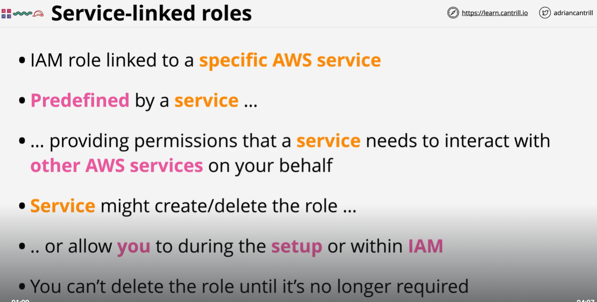
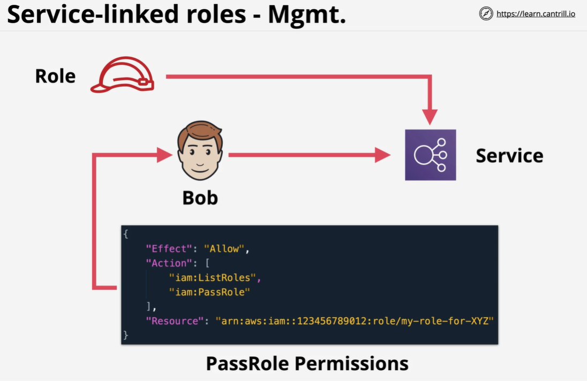

A service-linked role is a unique type of IAM role that is linked directly to an AWS service. Service-linked roles are predefined by the service and include all the permissions that the service requires to call other AWS services on your behalf. The linked service also defines how you create, modify, and delete a service-linked role. A service might automatically create or delete the role. It might allow you to create, modify, or delete the role as part of a wizard or process in the service. Or it might require that you use IAM to create or delete the role.

