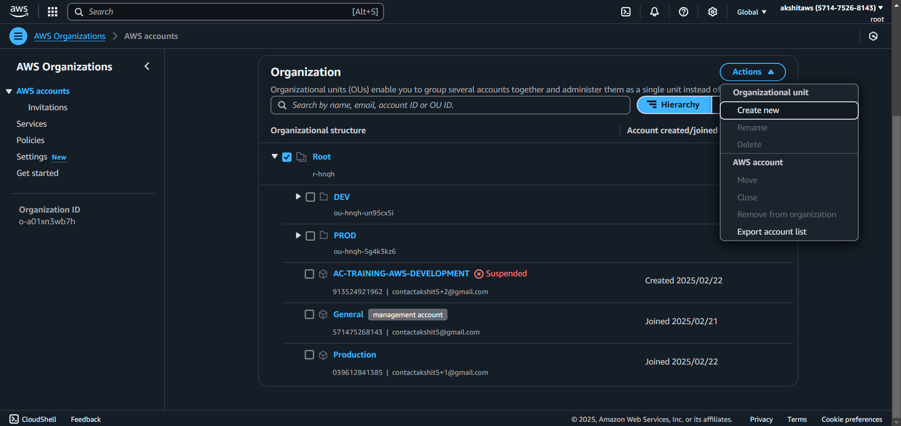

Create new to create new organizational unit
i.e new sub folder

Select an account to move it into an organizational unit

So basically , if you create a policy for a user in an organization , even the root user gets restricted
Which otherwise has full access

For ex. A Json policy that allows access to everything but denies access to s3

