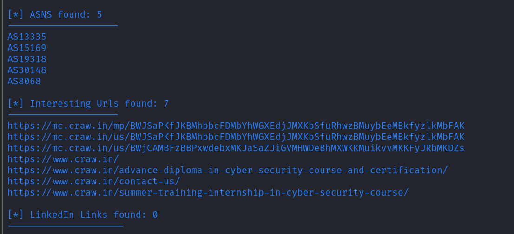
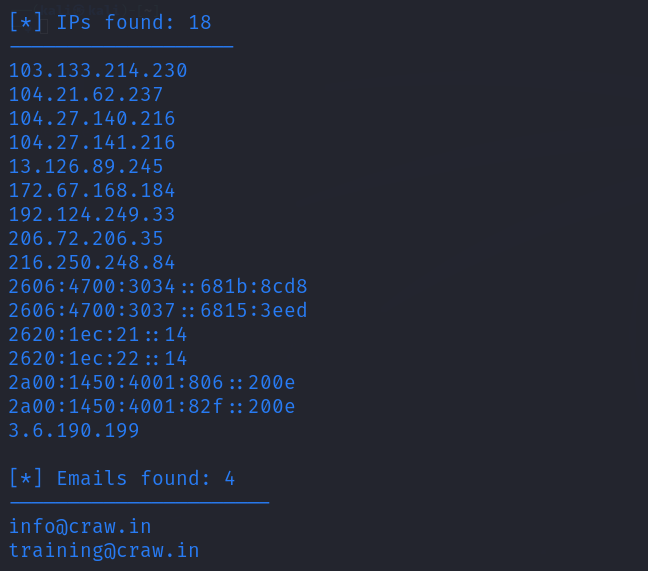
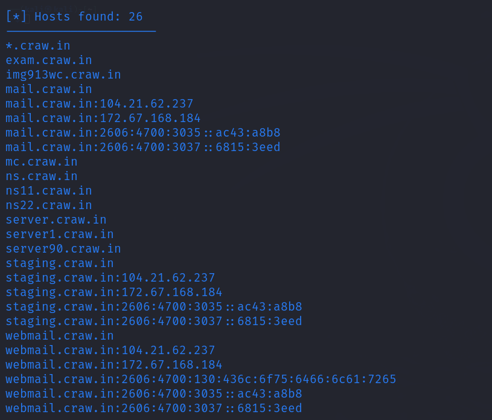

# Osint analysis 

1.  Harvester tool
sudo theHarvester -d craw.in -b all

2.  Cross link
<https://github.com/m8sec/CrossLinked>

git clone <https://github.com/m8sec/CrossLinked.git>

Ls

Cd Crosslinked

Ls

Pip install -r requirements.txt

Chmod +x crosslinked.py

./crosslinked.py -f "{first} {last}@jio.com"jio

Ls

Cat names.txt

Search entire mail on google - go to linkedin

3.  Dig craw.in
Dig amazon.in

4.  Nslookup
Set type=mx

Craw.in

Set type=ns

Amazon.com

5.  Whois craw.in

6.  Dns dumpster.com

7.  <https://www.zaubacorp.com/>
8.  <https://www.wappalyzer.com/> chrome extension

9.  wayback machine
10. Traceart [www.google.com](http://www.google.com)
11. Google dorking
12. Netcraft
13. <https://www.shodan.io/>
Search webcam without honeypot

All the devices compromised or public ips available

Risky running due to honeypots
14. H4X-Tools
15. Userrecon
./userron.sh nameofperson

16. Host craw.in
Host 192.124.xxx.xx

17. Subfinder
Subfinder -d craw.in

18. Dirbuster
Dirb <http://website> link

19. Dmitry
Dmity -help

Ex. Dmitry tesla.com

