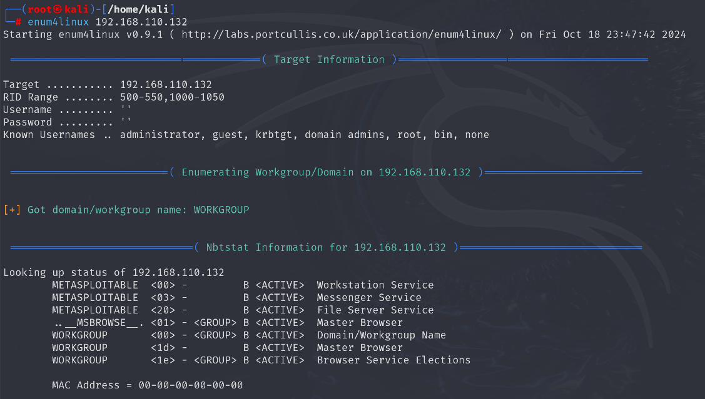

Types of ports
1.  Virtual port/logical port
2.  Physical port ex. Usb , display port

65535 total number of ports

0 to 1023 - well known ports

1024 to 49151 - registered ports

49152 to 65535 - dynamic ports for doing any other activity ex. Phishing

Tools -
1.  Nmap\*
2.  Enum4linux
3.  Msfconsole (multipurpose)
4.  Zenmap (for windows)
5.  Angry ip scanner (windows)
6.  Rust scan (git clone)

# NMAP
Nmap by default scans 1000 ports

By default scans tcp packets

Commands (starting letter small)
1.  Arp-scan -l (gives all devices connected to same wifi)
2.  Netdiscover
3.  Nmap 192.168.xxx.xxx (open metaspoitable and see ip)
4.  Nmap - sS 192.168.xxx.xxx (s-scan , S-synchronization)
5.  Nmap -sV 192.168.xxx.xxx (V-version)
6.  Nmap -sC 192.168.xx.xx ( C- script)
7.  Nmap -sF 192.168.xx.xx (F-fragments)
If there is filtered written it means port open but there is firewall
8.  Nmap -sX 192.xx (Xmas command)
9.  Nmap -sN 192.xx (N - null pakcet)
10. Nmap -p- ip adress (scans all the ports)
11. Nmap -p 12000-15000 ip adress (scans the selected ports)
12. Nmap -p 21 ipadress ( to check if a particular port is open or not)
13. Nmap -sU ip address (scans udp)
14. Nmap -sT ipaddress ( tcp packets)
15. Nmap -O ipaddress ( operation system)
16. Nmap -T5 ipadess (timing 5-fastest , 4-slower than 5 , 3, 2 ,1 ex. T5 , T4 ..)
17. Nmap -sV -sC (can do 2 commands at the same time)
18. Nmap -D RND 10 ipaddress (d- decoy rnd- random)
19. Nmap -A ipaddress (does the work of all other commands)\*
20. Nmap -sCV ipaddress (both script and version)
21. Nmap -Scv T5 (for making command faster)

Three types of flags
1.  Push
2.  Finish
3.  urgent

Network adapter -

NAT (doest allow communication with others)

Bridge ( allows communication)

Important ports

Port 20 - ftp (data - view only not copy paste)

Port 21 - ftp - controller (drag and drop files on your pc)

Port 22 - ssh

Port 23 - telnet

Port 25 - smtp

Port 53 - domain

Port 80 - http

Port 443 - https

Port 139 - smp (netbios-ssn)

Port 445 - smp (microsoft-ds)

# Angry ip scanner 

Download from chrome

Works on windows

# Enum4linux
Command - enum4linux "ip address"

