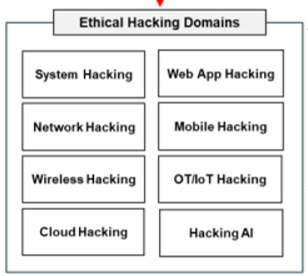
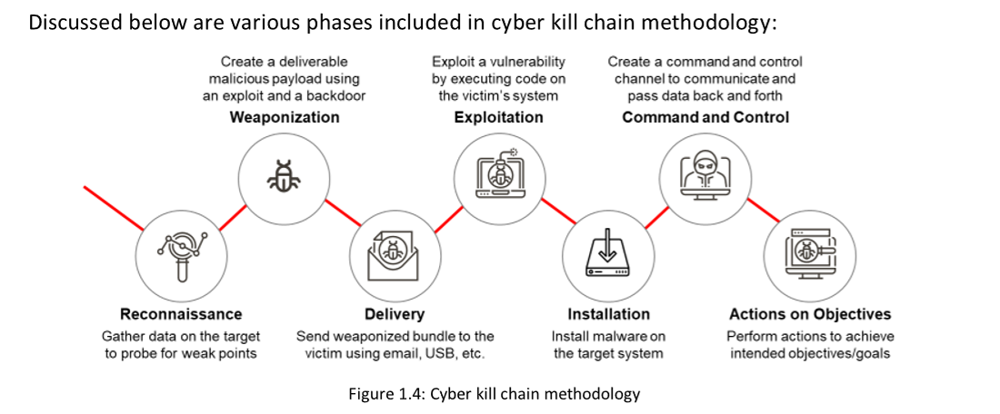
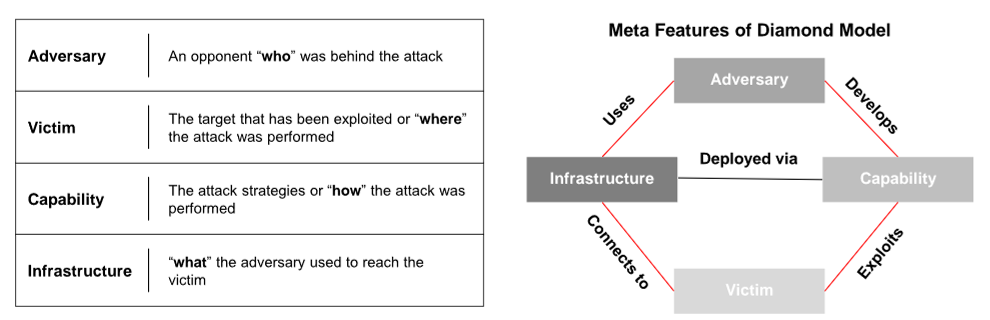

# Cyber Kill Chain Methodology 

The cyber kill chain methodology is a component of intelligence-driven defense for the identification and prevention of malicious intrusion activities. This methodology helps security professionals in identifying the steps that adversaries follow in order to accomplish their goals.

The cyber kill chain is a framework developed for securing cyberspace based on the concept of military kill chains. This method aims to actively enhance intrusion detection and response. The cyber kill chain is equipped with a seven-phase protection mechanism to mitigate and reduce cyber threats.

# Tactics, Techniques, and Procedures (TTPs)

Tactics describe the way the threat actor operates during different phases of an attack. It consists of the various tactics used to gather information for the initial exploitation

To launch an attack successfully, threat actors use several techniques during its execution. These techniques include initial exploitation, setting up and maintaining command and control channels, accessing the target infrastructure

“Procedures” involve a sequence of actions performed by the threat actors to execute different steps of an attack life cycle

# Diamond Model of Intrusion Analysis 

