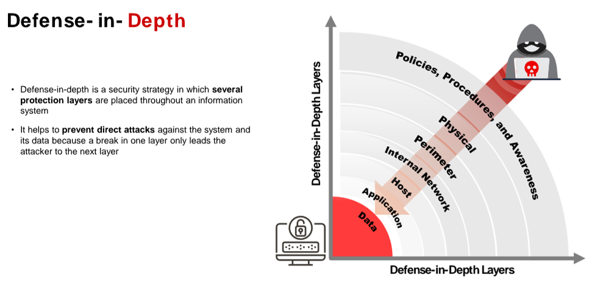
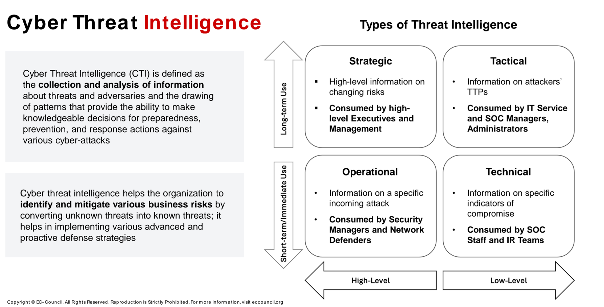
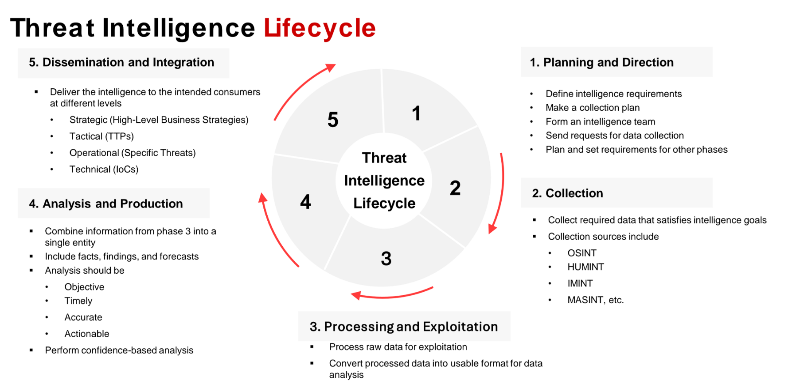

Incident handling and response (IH&R)
involves logging, recording, and resolving incidents

The intelligence is collected through sources like human intelligence (HUMINT), imagery intelligence (IMINT), measurement and signature intelligence (MASINT), signal intelligence (SIGNT), open source intelligence (OSINT), and IoCs,

1\. HUMINT (Human Intelligence):
Intelligence gathered through human interaction (spies, informants, or interviews).
Useful for understanding motivations and plans.
2\. IMINT (Imagery Intelligence):
Visual intelligence from satellites, drones, or photos.
Monitors activities, infrastructure, and terrain changes.
3\. MASINT (Measurement & Signature Intelligence):
Analysis of physical phenomena (radar, sound, radiation).
Tracks hidden objects, weapons tests, or environmental data.
4\. SIGINT (Signal Intelligence):
Intercepts communications (COMINT) or electronic emissions (ELINT).
Identifies enemy networks, encryption, and technologies.
5\. OSINT (Open Source Intelligence):
Publicly available information (social media, news, reports).
Tracks threats, sentiment, and exposed vulnerabilities.
6\. IoCs (Indicators of Compromise):
Evidence of system compromise (malware, suspicious IPs, unusual activity).
Used for detecting, analyzing, and responding to threats.
7\. Other Third Parties:
External entities like threat intelligence providers, security vendors, or cloud providers.
They support threat detection, analysis, and incident response.

Incident handling and response (IH&R)
It involves logging, recording, and resolving incidents that take place in the organization.

