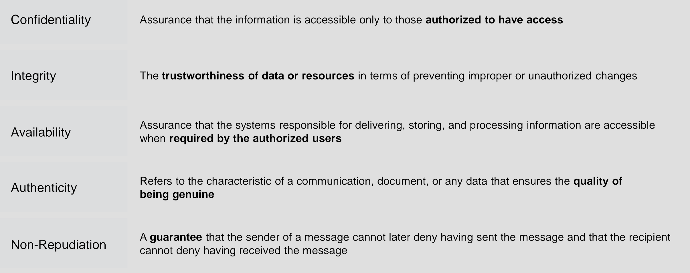
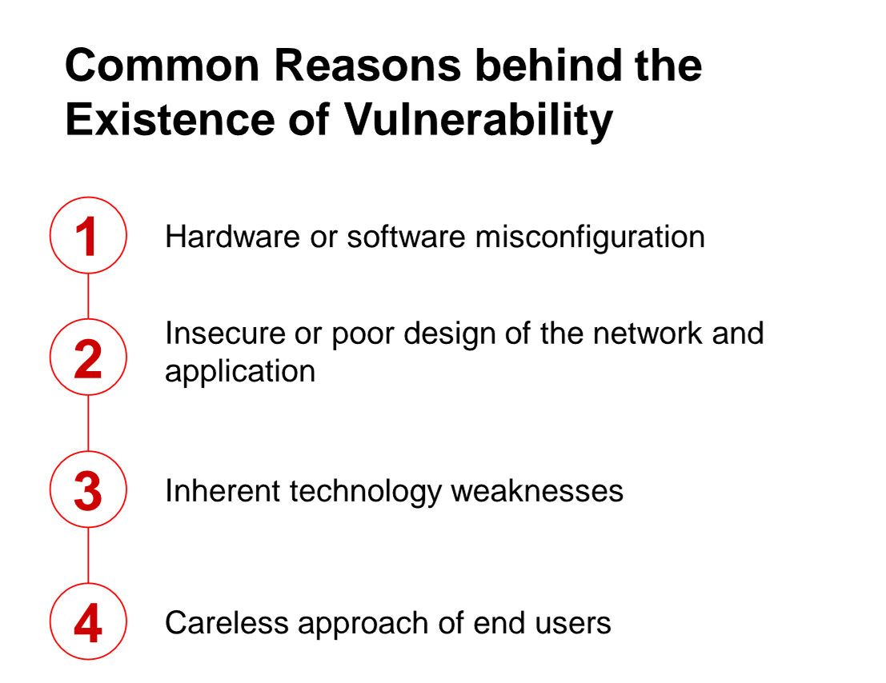
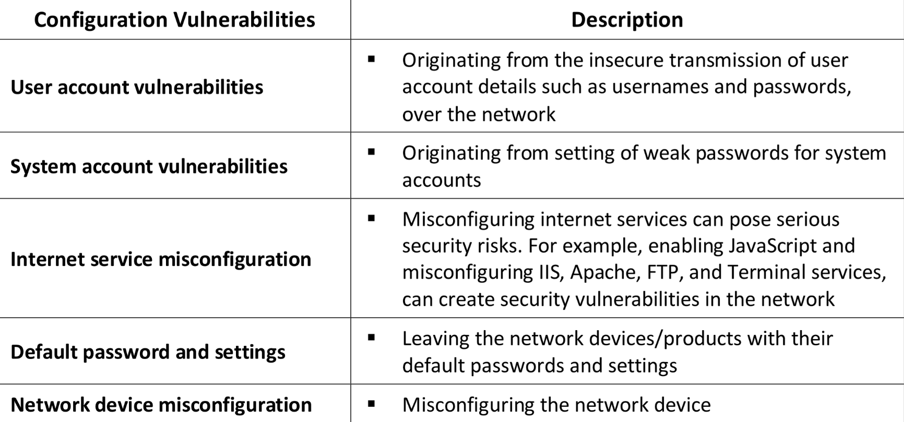
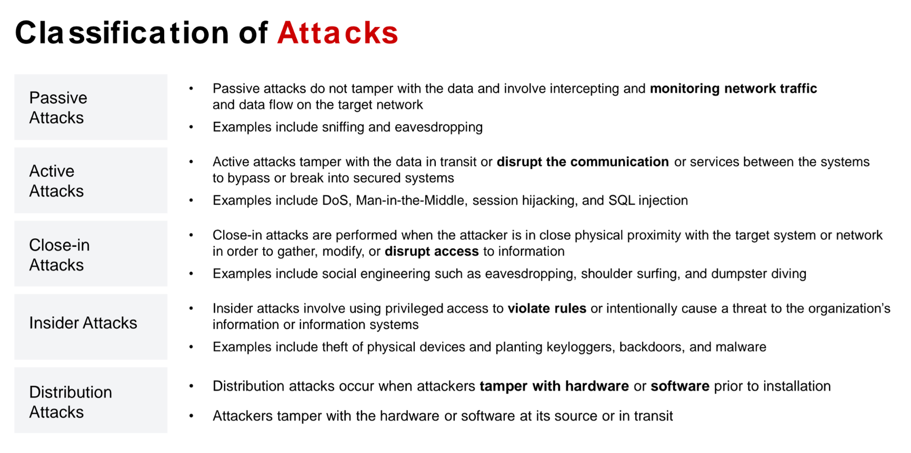

As Sun Tzu states in the Art of War, “If you know yourself but not the enemy, for every victory gained, you will also suffer a defeat.”

Information security is “the state of the well-being of information and infrastructure in which the possibility of theft, tampering, or disruption of information and services is kept low or tolerable.”

