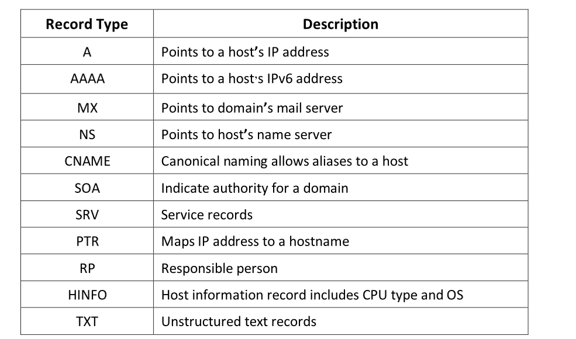
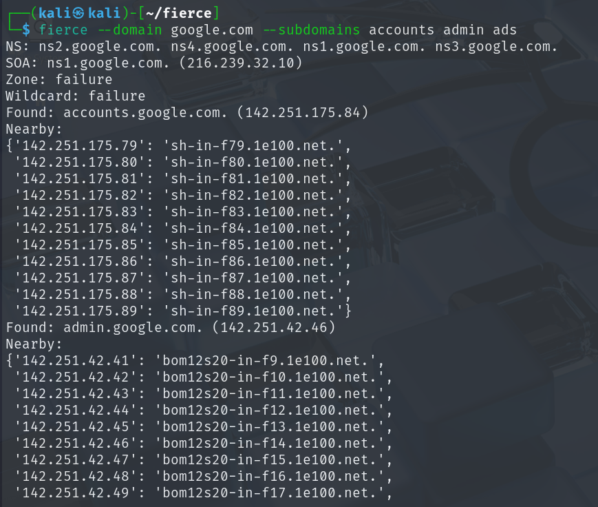
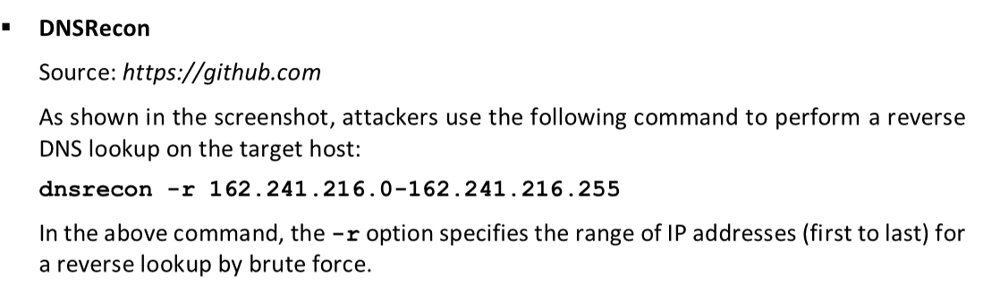
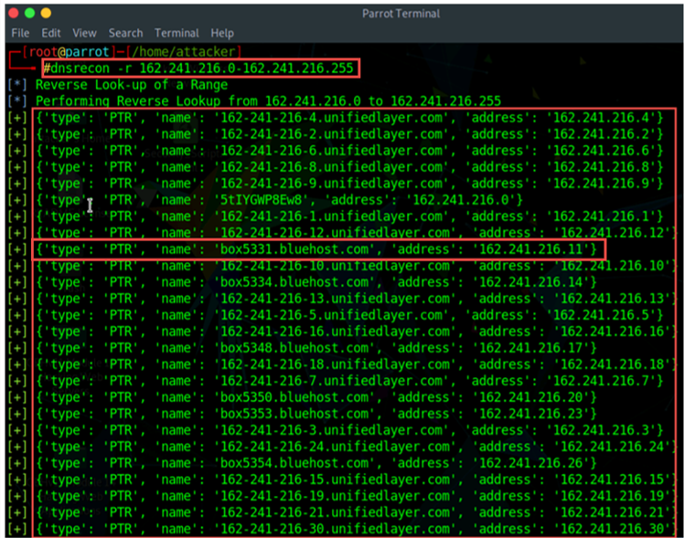

Attackers perform DNS footprinting to gather information about DNS servers, DNS records, and the types of servers used by the target organization. This information helps attackers identify the hosts connected in the target network and further exploit the target organization

SecurityTrails Source: <https://securitytrails.com>

Fierce Source: <https://github.com>

DNS lookup is used to find the IP addresses for a given domain name, and a reverse DNS operation is performed to obtain the domain name of a given IP address.

Reverse Lookup Source: <https://mxtoolbox.com>
