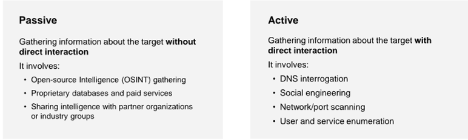
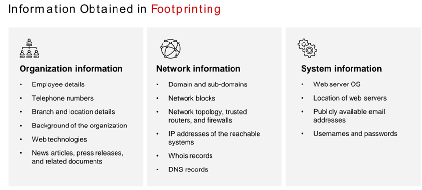
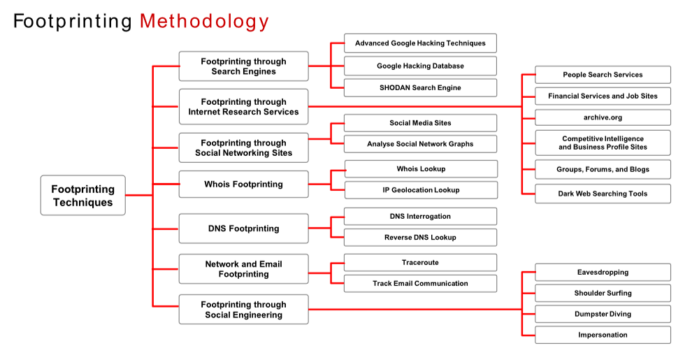

Reconnaissance (also known as footprinting)

By using a combination of tools and techniques, attackers can take an unknown entity (for example, XYZ Organization) and reduce it to a specific range of domain names, network blocks, and individual IP addresses of systems directly connected to the Internet, in addition to other details pertaining to its security posture.

