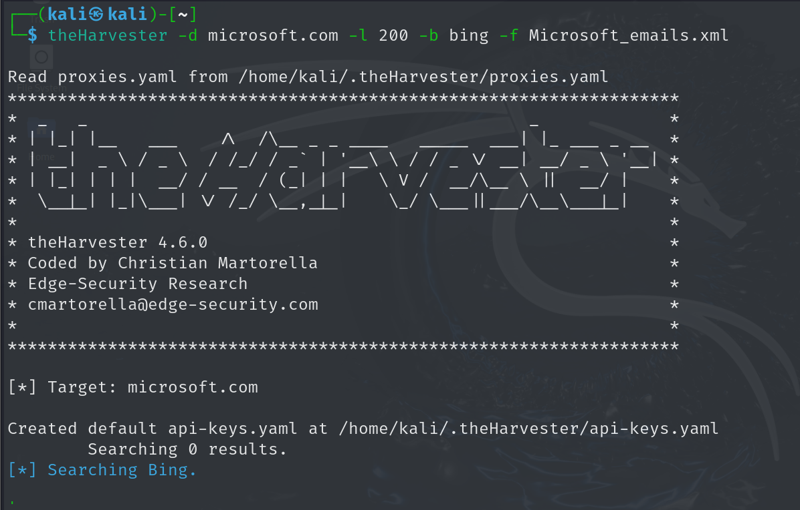
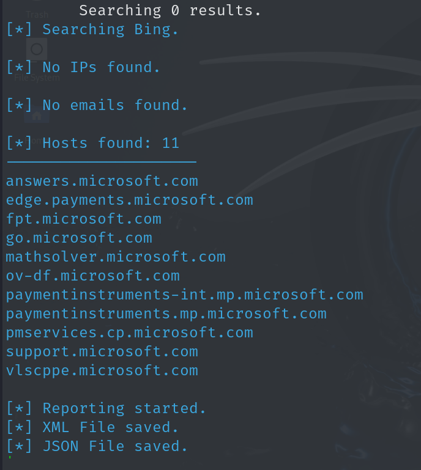
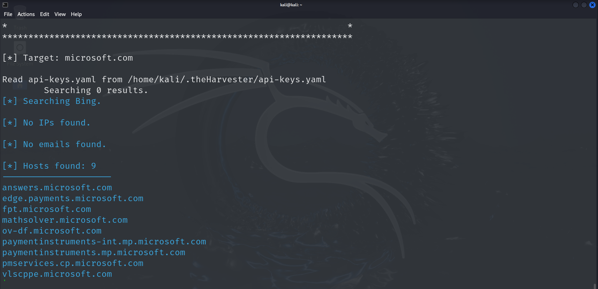

Sub-domains provide insights into the different departments and business units in an organization. Identifying such sub-domains may reveal critical information regarding the target, such as the source code of the website and documents on the webserver. Access restrictions can be applied based on the IP address, domain or subnet, username, and password. The sub-domain helps to access the private functions of an organization. Most organizations use common formats for sub-domains. Therefore, a hacker who knows the external URL of a company can often discover the sub-domain through trial and error, or by using a service such as Netcraft.

Netcraft Source: <https://www.netcraft.com>

DNSdumpster Source: <https://dnsdumpster.com>

Pentest-Tools Find Subdomains Source: <https://pentest-tools.com>

