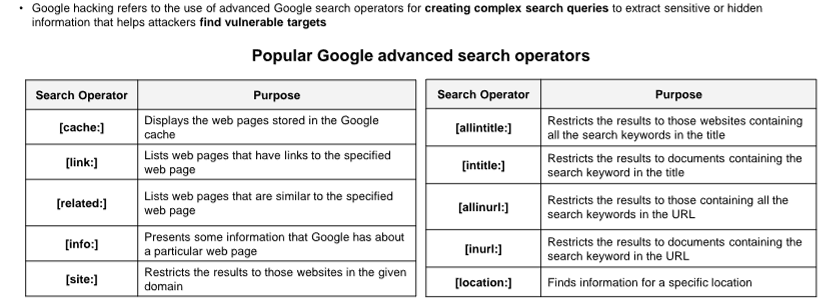
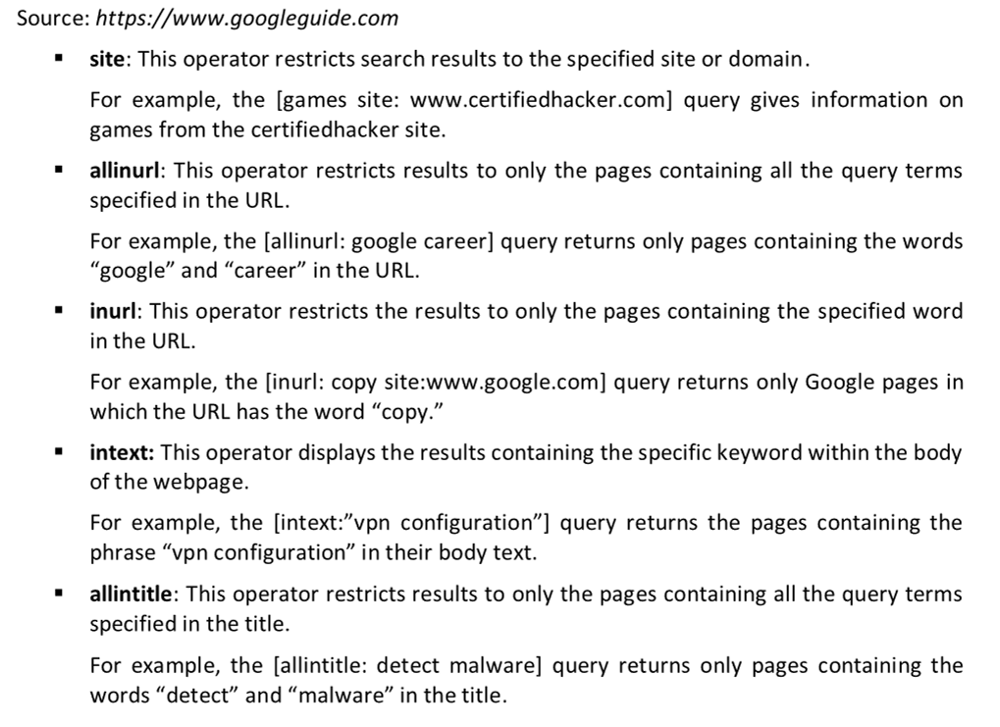
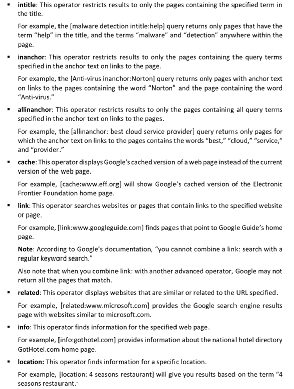
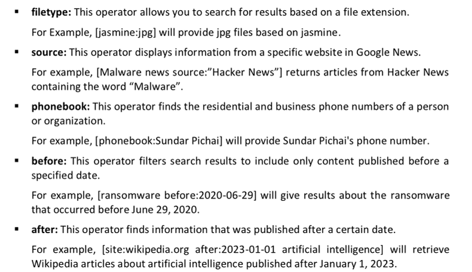
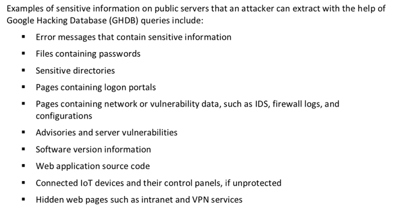
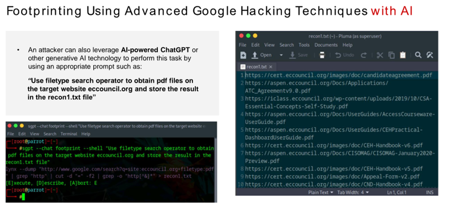

Google hacking refers to the use of advanced Google search operators for creating complex search queries to extract sensitive or hidden information that helps attackers find vulnerable targets

The syntax to use an advanced search operator is as follows: operator: search_term

