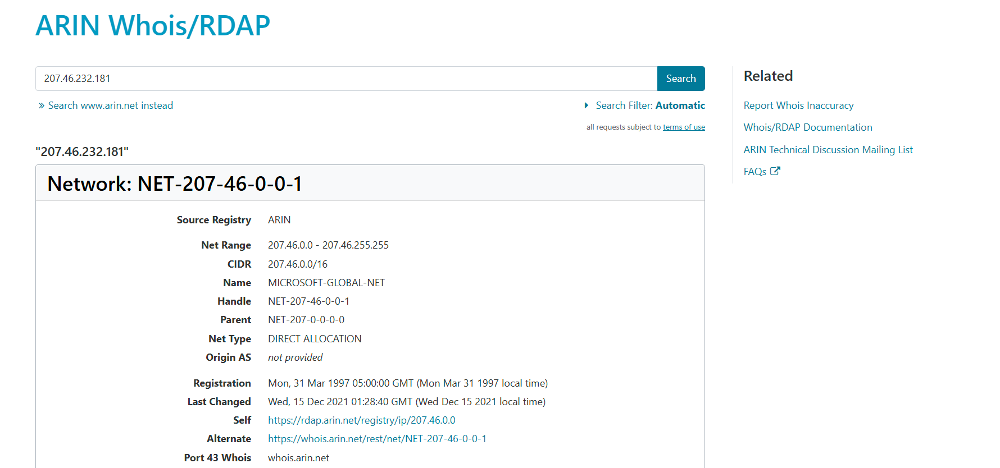
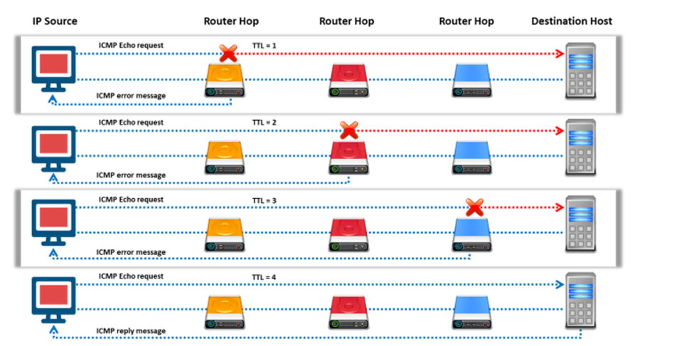
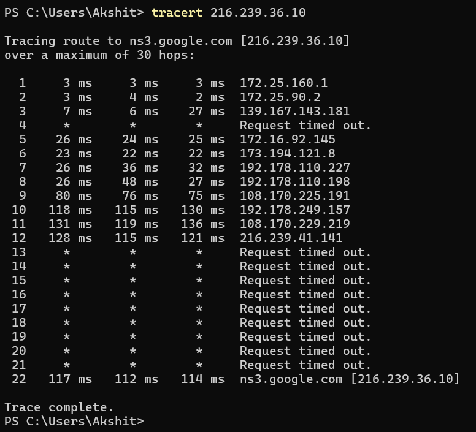
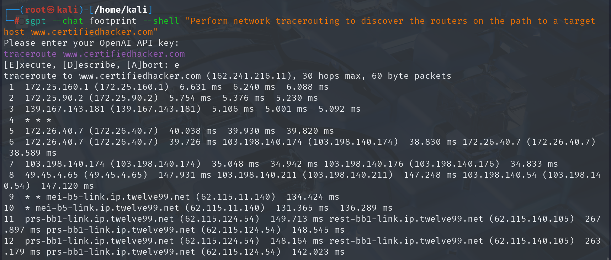
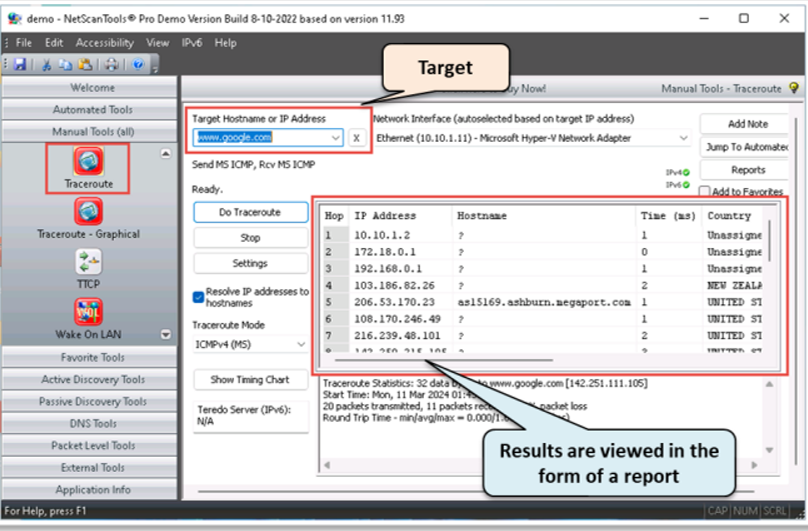
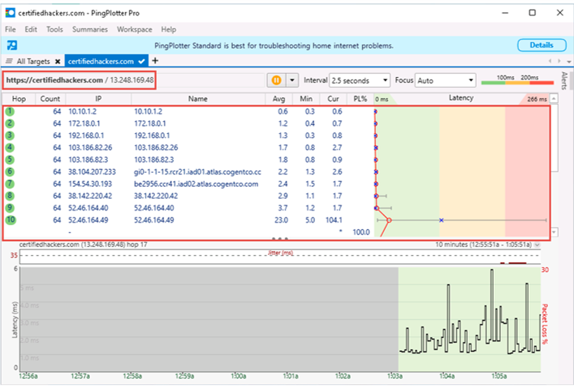

# Locate the Network Range 

Obtaining private IP addresses can be useful to attackers. The Internet Assigned Numbers Authority (IANA) has reserved the following three blocks of IP address space for private internets: 10.0.0.0–10.255.255.255 (10/8 prefix), 172.16.0.0–172.31.255.255 (172.16/12 prefix), and 192.168.0.0–192.168.255.255 (192.168/16 prefix).

Using the network range, an attacker can obtain information about how the network is structured and which machines in the network are alive. The network range also helps identify the network topology, access control device, and OS used in the target network. To find the network range of the target network, one must enter the server IP address (gathered in Whois footprinting) in the ARIN Whois database search tool. A user can also visit the ARIN website (<https://www.arin.net/about/welcome/region>) and enter the server IP into the SEARCH Site or Whois text box. This yields the network range of the target network. Improperly set-up DNS servers offer attackers a good chance of obtaining a list of internal machines in the network. Additionally, if an attacker traces a route to a machine, it could be possible to obtain the internal IP address of the gateway, which can be useful

# Traceroute

Traceroute uses the ICMP protocol and Time to Live (TTL) field of the IP header to find the path of the target host in the network.

The Traceroute utility can detail the path through which IP packets travel between two systems. The utility can trace the number of routers the packets travel through, the round-trip time (duration in transiting between two routers), and, if the routers have DNS entries, the names of the routers and their network affiliation. It can also trace geographic locations. It works by exploiting a feature of the Internet Protocol called TTL. The TTL field indicates the maximum number of routers a packet may traverse. Each router that handles a packet decrements the TTL count field in the ICMP header by one. When the count reaches zero, the router discards the packet and transmits an ICMP error message to the originator of the packet.

The utility records the IP address and DNS name of the router and sends out another packet with a TTL value of two. This packet makes it through the first router and then times-out at the next router in the path. This second router also sends an error message back to the originating host. Traceroute continues to do this and records the IP address and name of each router until a packet finally reaches the target host or until it decides that the host is unreachable. In the process, it records the time taken for each packet to make a round trip to each router. Finally, when it reaches the destination, the normal ICMP ping response will be sent back to the sender. The utility helps to reveal the IP addresses of the intermediate hops in the route to the target host from the source.

tracert 216.239.36.10

# TCP Traceroute

Many devices in any network are generally configured to block ICMP traceroute messages. In this scenario, an attacker uses TCP or UDP traceroute, which is also known as Layer 4 traceroute. Go to the terminal in Linux operating system and type the tcptraceroute command along with the destination IP address or domain name as follows:

"sudo tcptraceroute [www.google.com](http://www.google.com)"
# 
# UDP Traceroute

Like Windows, Linux also has a built-in traceroute utility, but it uses the UDP protocol for tracing the route to the destination. Go to the terminal in the Linux operating system and type the traceroute command along with the destination IP address or domain name as follows:
traceroute [www.google.com](http://www.google.com)

# Traceroute with AI

NetScanTools Pro Source: <https://www.netscantools.com>

PingPlotter Source: <https://www.pingplotter.com>

PingPlotter allows attackers to collect traceroute data for target hosts using ICMP, UDP, and TCP packets. It automatically discovers the network hops and tracks latency and packet loss over time. Using this tool, attackers can visualize the traceroute data in readable graphs. This tool aids attackers in identifying bandwidth bottlenecks, WiFi interference, or hardware faults on the target network.
Figure

# Tracking Email Communications

Email tracking monitors the email messages of a particular user. This kind of tracking is possible through digitally time-stamped records that reveal the time and date when the target receives and opens a specific email

Information about the victim gathered using email tracking tools includes: ▪ Recipient's System IP address: Allows tracking of the recipient’s IP address ▪ Geolocation: Estimates and displays the location of the recipient on the map and may even calculate the distance from the attacker’s location
▪ Email Received and Read: Notifies the attacker when the email is received and read by the recipient
▪ Read Duration: The time spent by the recipient in reading the email sent by the sender
▪ Proxy Detection: Provides information about the type of server used by the recipient
▪ Links: Checks whether the links sent to the recipient through email have been checked
▪ Operating System and Browser information: Reveals information about the operating system and the browser used by the recipient. The attacker can use this information to find loopholes in that version of the operating system and browser to launch further attacks
▪ Forward Email: Determines whether the email sent to the user is forwarded to another person
▪ Device Type: Provides information about the type of device used to open and read the email, e.g., desktop computer, mobile device, or laptop
▪ Path Travelled: Tracks the path through which the email traveled via email transfer agents from source to destination system
Collecting

eMailTrackerPro Source: <http://www.emailtrackerpro.com>

IP2LOCATION’s Email Header Tracer Source: <https://www.ip2location.com>

