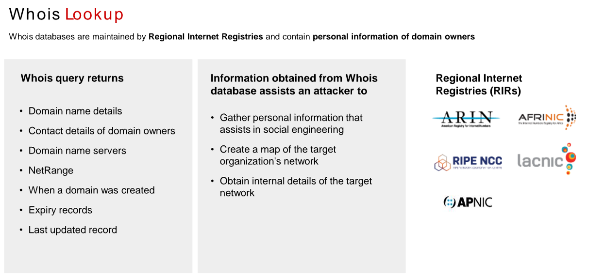
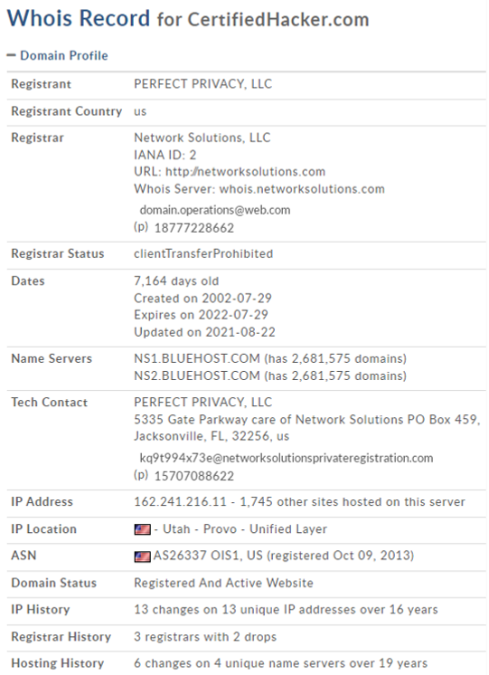
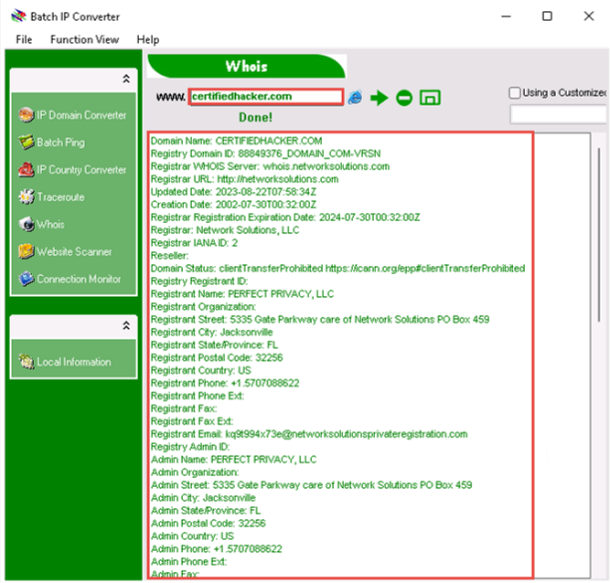

Whois is a query and response protocol used for querying databases that store the registered users or assignees of an Internet resource, such as a domain name, an IP address block, or an autonomous system. This protocol listens to requests on port 43 (TCP). Regional Internet Registries (RIRs) maintain Whois databases, which contain the personal information of domain owners.

<https://whois.domaintools.com>

<https://www.tamos.com>

IP2Location Source: <https://www.ip2location.com>

