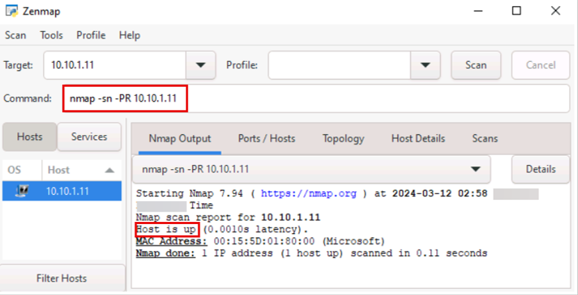
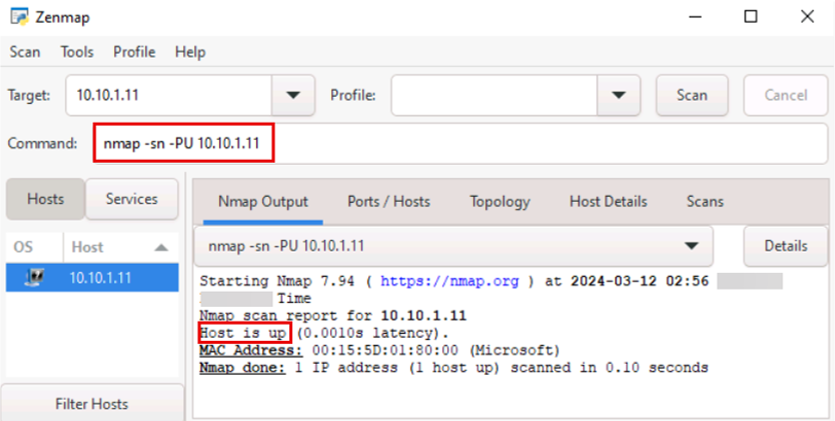
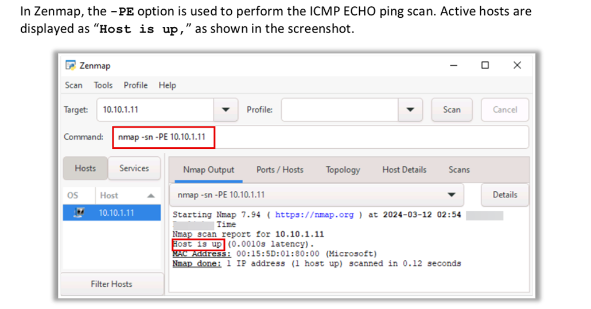
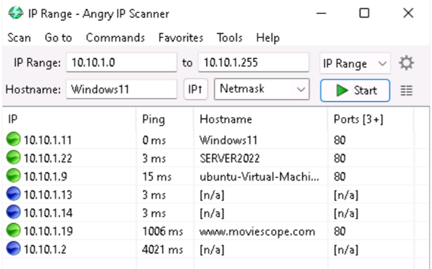

# ARP Ping Scan 

In the ARP ping scan, the ARP packets are sent for discovering all active devices in the IPv4 range even though the presence of such devices is hidden by restrictive firewalls. In most networks, many IP addresses are unused at any given time, specifically in the private address ranges of the LAN. Hence, when the attackers try to send IP packets such as ICMP echo request to the target host, the OS must determine the hardware destination address (ARP) corresponding to the target IP for addressing the ethernet frame correctly. For this purpose, a series of ARP requests are issued. ARP scan is used to show the MAC address of the network interface on the device, and it can also show the MAC addresses of all devices sharing the same IPv4 address on the LAN. If the host IP with the respective hardware destination address is active, then the ARP response will be generated by the host; otherwise, after a certain number of ping attempts, the original OS gives up on the host.

# UDP Ping Scan 

# 
# ICMP ECHO Ping Scan

Attackers use the ICMP ping scan to send ICMP packets to the destination system to gather all necessary information about it.

Angry IP Scanner Source: <https://angryip.org>

