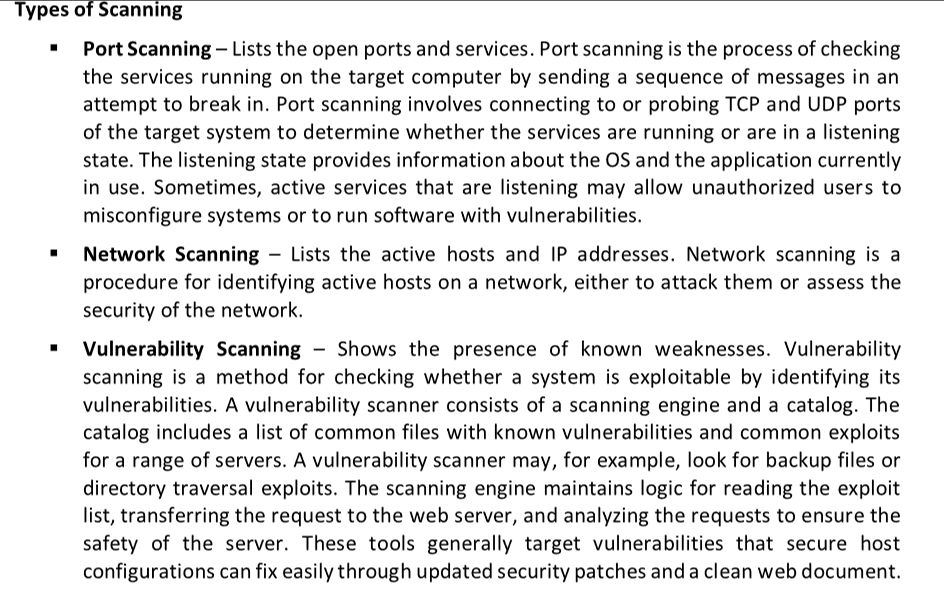
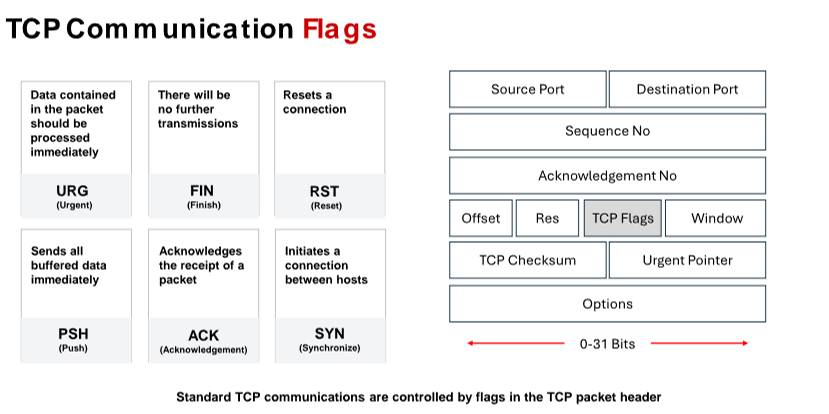
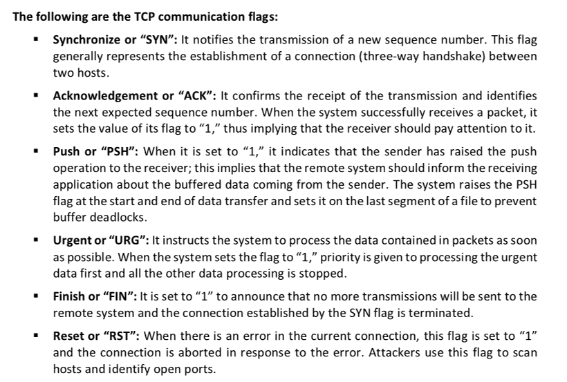
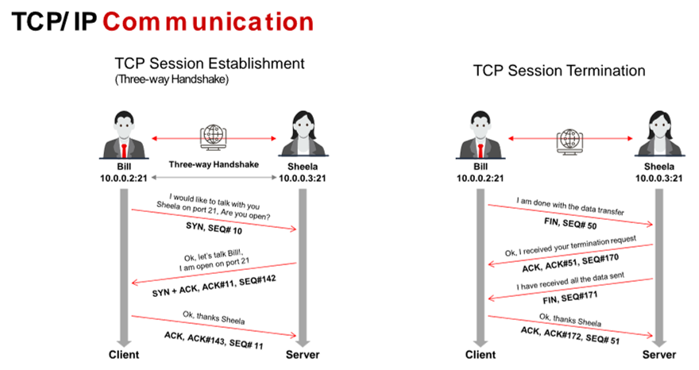
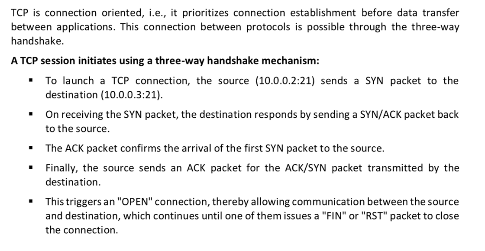
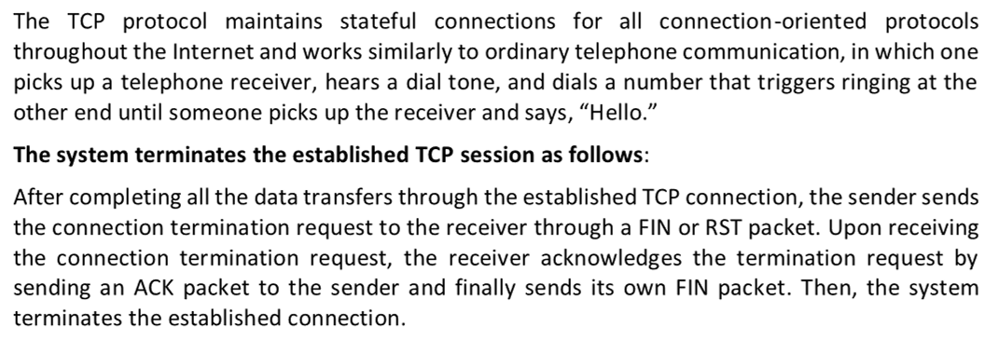

Scanning is the process of gathering additional detailed information about the target using highly complex and aggressive reconnaissance techniques. Network scanning refers to a set of procedures used for identifying hosts, ports, and services in a network. Network scanning is also used for discovering active machines in a network and identifying the OS running on the target machine.

▪ Discover the network’s live hosts, IP addresses, and open ports of the live hosts. Using the open ports, the attacker will determine the best means of entering into the system.
▪ Discover the OS and system architecture of the target. This is also known as fingerprinting. An attacker can formulate an attack strategy based on the OS’s vulnerabilities.
▪ Discover the services running/listening on the target system. Doing so gives the attacker an indication of the vulnerabilities (based on the service) that can be exploited for gaining access to the target system.

The size of each flag is 1 bit. As there are six flags in the TCP Flags section, the size of this section is 6 bits. When a flag value is set to “1,” that flag is automatically turned on.

# 
# Scanning Tools

Nmap Source: <https://nmap.org>

Nmap ("Network Mapper") is a security scanner for network exploration and hacking. It
allows you to discover hosts, ports, and services on a computer network, thus creating a "map" of the network. It sends specially crafted packets to the target host and then analyzes the responses to accomplish its goal.

Hping3 Source: <https://salsa.debian.org>

NetScanTools Pro Source: <https://www.netscantools.com>

