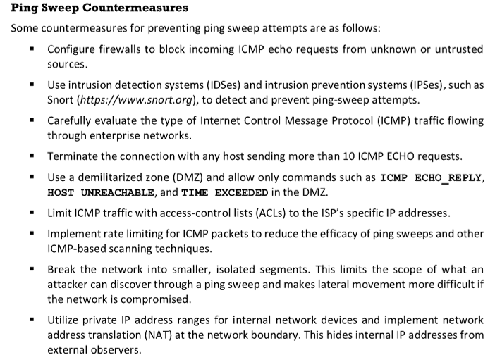
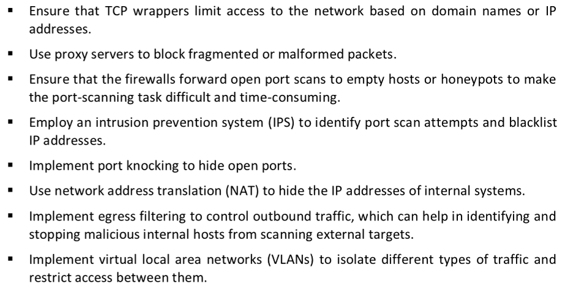
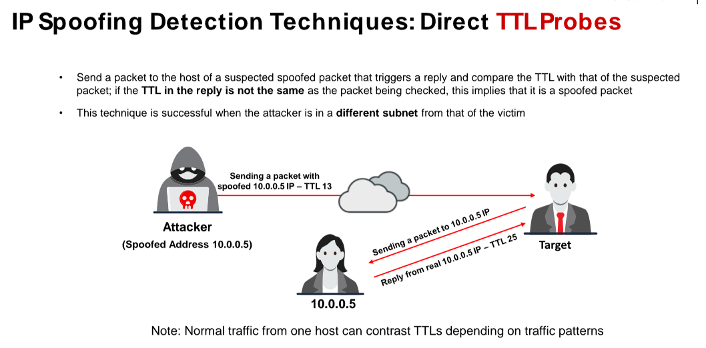
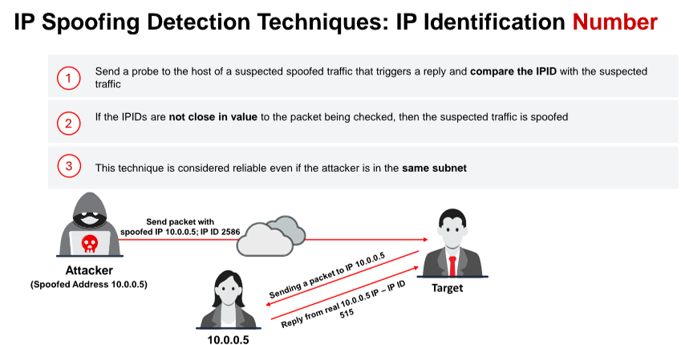
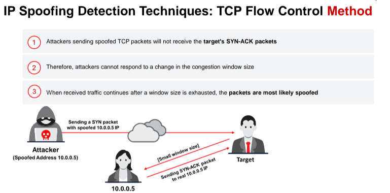
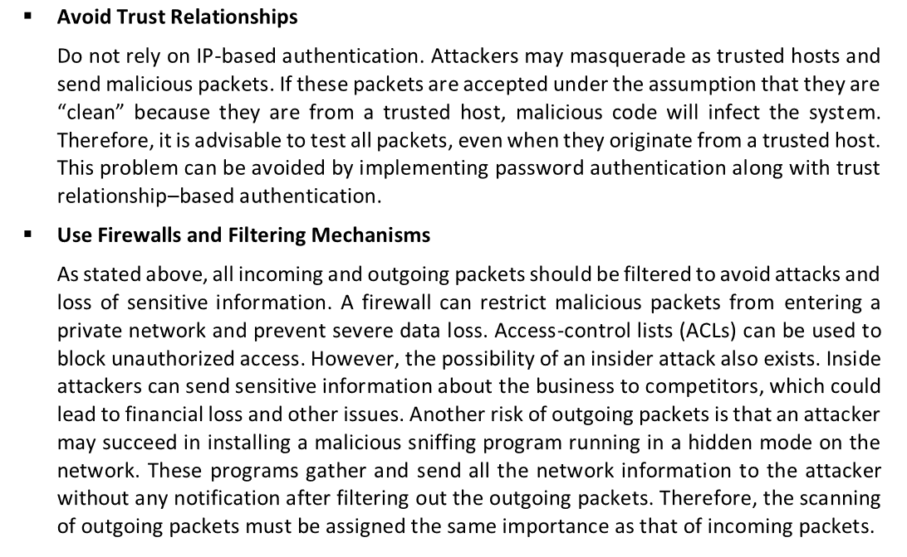
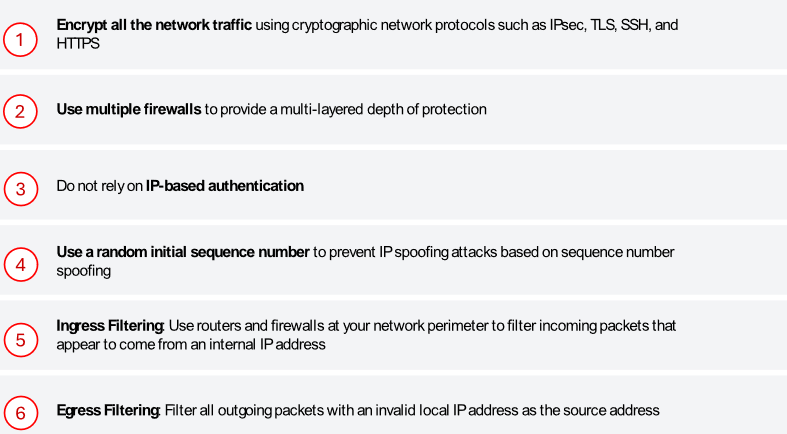
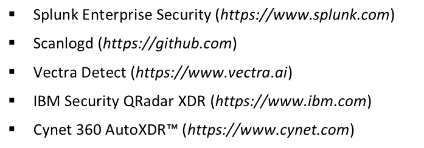

# Port Scanning Countermeasures 

▪ Configure firewall and intrusion detection system (IDS) rules to detect and block probes. ▪ The firewall should be capable of detecting the probes sent by attackers using port-scanning tools. It should not allow traffic to pass through after simply inspecting the TCP header. The firewall should be able to examine the data contained in each packet before allowing traffic to pass through it.
▪ Run the port scanning tools against hosts on the network to determine whether the firewall accurately detects the port scanning activity.
▪ Ensure that the router, IDS, and firewall firmware are updated with their latest releases/versions.
▪ Configure commercial firewalls to protect the network against fast port scans and SYN floods.
▪ Hackers use tools such as Nmap and perform OS detection to sniff the details of a remote OS. Thus, it is important to employ an IDS in such cases. Snort (<https://www.snort.org>) is a very useful intrusion detection and prevention technology, mainly because signatures are frequently available from public authors.
▪ Keep as few ports open as possible and filter the rest, as an intruder may attempt to enter through any open port. Use a custom rule set to lock down the network, block unwanted ports at the firewall, and filter the following ports: 135–159, 256–258, 389, 445, 1080, 1745, and 3268.
▪ Block unwanted services running on the ports and update the service versions. ▪ Ensure that the versions of services running on the ports are non-vulnerable. ▪ Block inbound ICMP message types and all outbound ICMP type-3 unreachable messages at border routers arranged in front of the company’s main firewall.
▪ Attackers attempt to perform source routing and send packets to the targets, which may not be reachable via the Internet, using an intermediate host that can interact with the target. Hence, it is necessary to ensure that the firewall and router can block such source-routing techniques.
▪ Ensure that the mechanisms used for routing and filtering at the routers and firewalls, respectively, cannot be bypassed using a particular source port or source routing methods.

# Banner Grabbing Countermeasures 

# IP Spoofing Countermeasures 

# Scanning Detection and Prevention Tools 

