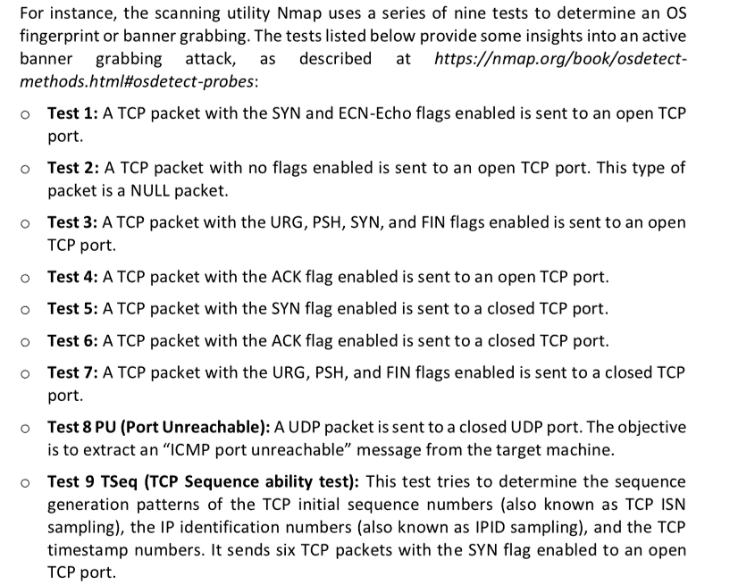
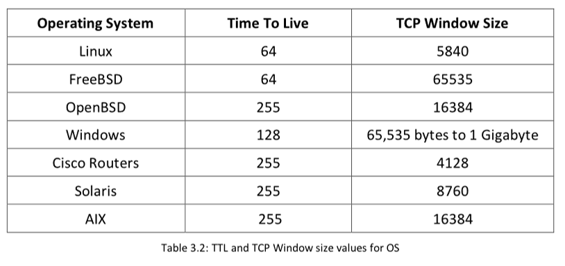
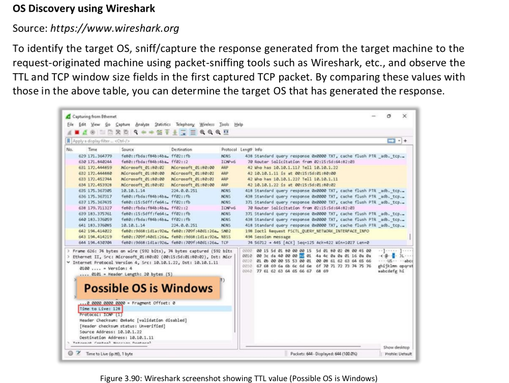
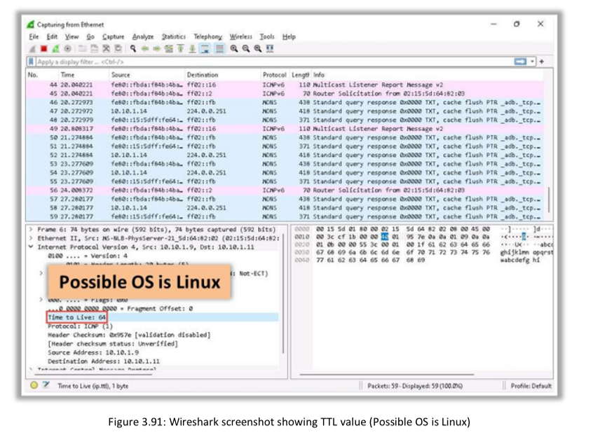
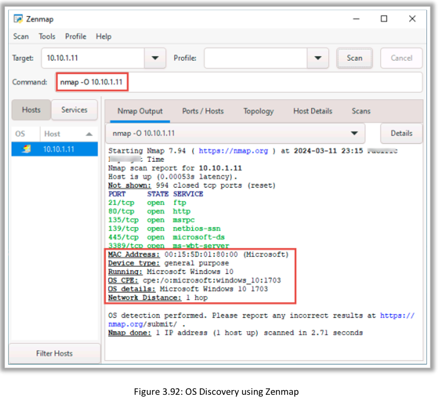
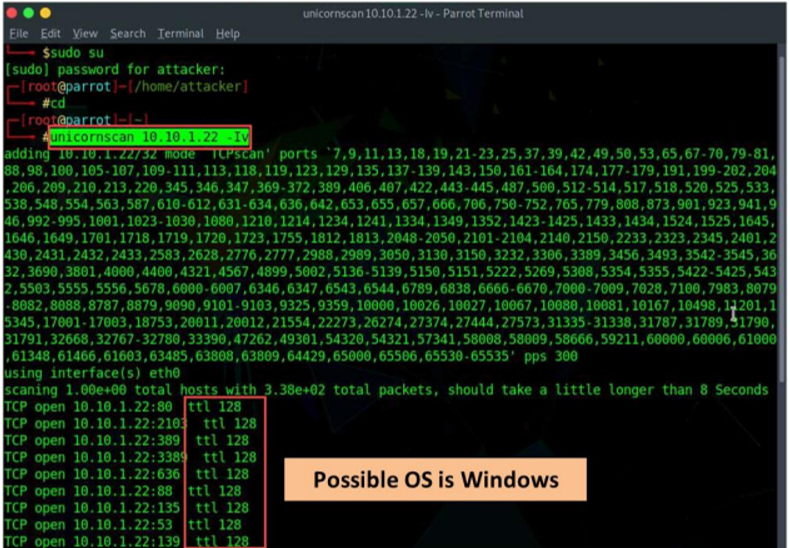
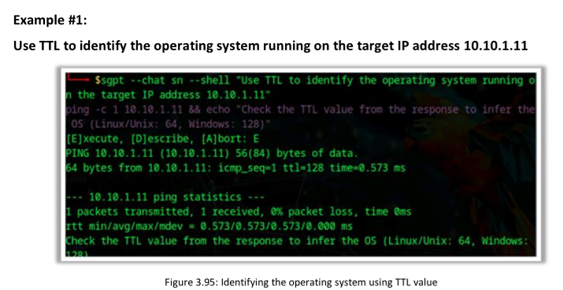
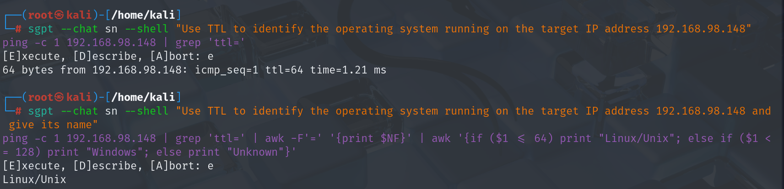

Banner grabbing, or "OS fingerprinting," is a method used to determine the OS that is running on a remote target system. It is an important scanning method, as the attacker will have a higher probability of success if the OS of the target system is known (many vulnerabilities are OS-specific). The attacker can then formulate an attack strategy based on the OS of the target system.

# Active Banner Grabbing 
Active banner grabbing applies the principle that an OS’s IP stack has a unique way of responding to specially crafted TCP packets. This happens because of different interpretations that vendors apply while implementing the TCP/IP stack on a particular OS. In active banner grabbing, the attacker sends a variety of malformed packets to the remote host, and the responses are compared with a database. Responses from different OS vary because of differences in TCP/IP stack implementation

Why Do Different OS Responses Reveal Their Identity?
Each operating system (OS) has a unique way of generating sequence numbers when handling network packets. This behavior can act like a digital fingerprint, making it possible to guess which OS is running on a device. Let’s explore how different systems handle sequence numbers:

🔹 Old UNIX Systems (like early Linux, BSD):
Behavior: They generate sequence numbers in a predictable way — increasing by the same fixed amount every time (like counting by 1, 2, 3…).
Example: If the first sequence number is 1000, the next might be 1064, then 1128, and so on (64 increments each time).
Why this is useful to attackers: Predictable patterns make it easier to spoof or hijack connections, as attackers can guess future sequence numbers.
🔹 Linux & Modern OS (like Ubuntu, macOS):
Behavior: They use random or unpredictable sequence numbers to enhance security. Every time a packet is sent, the sequence number is chosen randomly or with unpredictable increments.
Example: The first number might be 45231, then 78492, then 1203 — no clear pattern.
Why this is useful to attackers: The randomness makes it harder to spoof packets, but the randomness itself (or small quirks) can still reveal the OS type when tested carefully.
🔹 Windows Systems:
Behavior: Windows uses a time-dependent sequence. The sequence number increases based on the system’s internal clock — it increments a certain amount for each millisecond that passes.
Example: If 10 ms pass, the sequence number increases by 10 (the exact step size depends on the Windows version).
Why this is useful to attackers: By measuring how much the sequence number grows over time, attackers can recognize that the target is likely a Windows machine.

# 🕵️ What Is Passive Banner Grabbing?
Passive banner grabbing is a way to identify a system’s OS or services without directly scanning or sending packets to it. Instead of interacting with the target, attackers sniff the network traffic and analyze the packets the target is already sending.

This technique is stealthy because it doesn’t trigger security alerts, unlike active scans!

🧩 How Does It Work?
Attackers collect packets from the target and look for patterns that reveal information about the OS. Let’s break it down:

Error Messages:
Servers sometimes reveal their OS, software version, or security tools in error messages (like a 404 page).
Example: An error message saying “Apache/2.4.51 (Ubuntu)” immediately tells you the server runs Apache on Ubuntu.
Sniffing Network Traffic:
Capturing packets with tools like Wireshark allows attackers to analyze how the system handles certain parameters.
URL Extensions:
Web extensions can hint at the underlying server and OS.
.aspx → Microsoft IIS server on Windows
.php → Likely running on Apache or Nginx (Linux)
📊 Key Packet Features to Analyze:
TTL (Time To Live):
Each OS sets a default TTL value. For example, Linux uses 64, and Windows uses 128. The TTL decreases by 1 for each hop, so attackers can guess the original TTL and match it to an OS.

Window Size:
The size of the TCP window (how much data a system can accept) varies by OS.

Linux: 32120
Windows: 65535 (but can change)
DF (Don’t Fragment) Bit:
Many OS set this flag, but a few don’t (like older BSD systems).

TOS (Type of Service):
This value controls packet priority but is less useful for OS detection since it can change depending on the application.

📚 Example:
An attacker captures a packet with:

TTL: 45 (originally 64, minus 19 hops)
Window Size: 32120
DF Bit: Set
TOS: 0
By comparing this with a database of known values, they might conclude the system is running Linux Kernel 2.2.x.

✅ Why Use Passive Banner Grabbing?
Stealthy: No direct interaction with the target, so it avoids detection by firewalls and IDS.
Useful for Proxies & Firewalls: Helps spot proxy servers or rogue devices on the network.
Quick Insights: Even small packet traces can provide valuable OS and service clues.
🚨 Downsides:

Less accurate than active methods.
OS settings (like TTL or window size) can be changed to confuse attackers.

OS Discovery using Unicornscan Source: <https://sourceforge.net>

# OS Discovery with AI 

