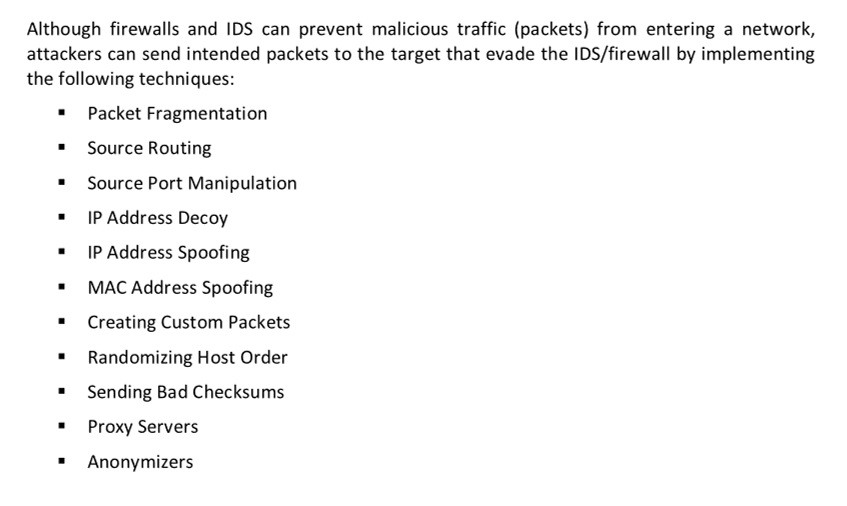

# Packet Fragmentation
Packet fragmentation refers to the splitting of a probe packet into several smaller packets (fragments) while sending it to a network. When these packets reach a host, the IDS and firewalls behind the host generally queue all of them and process them one by one. However, since this method of processing involves greater CPU and network resource consumption, the configuration of most IDS cause them to skip fragmented packets during port scans.

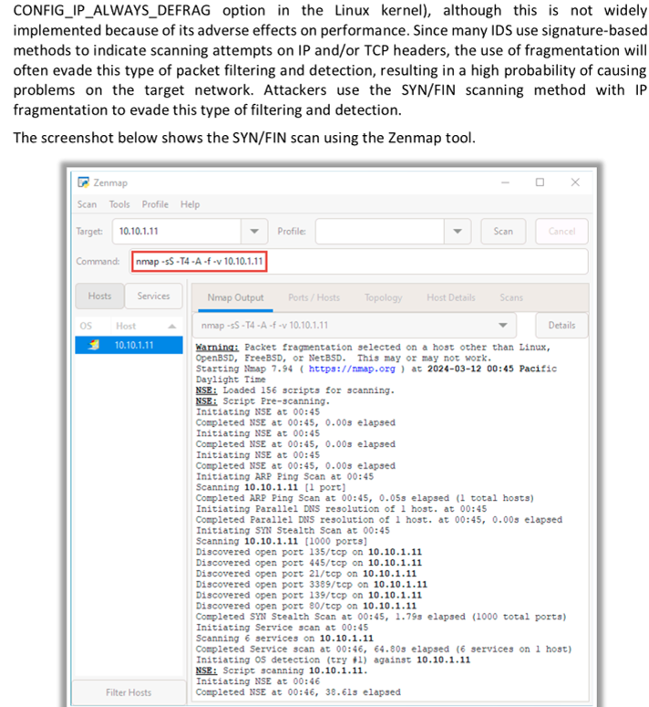

# Source Routing 

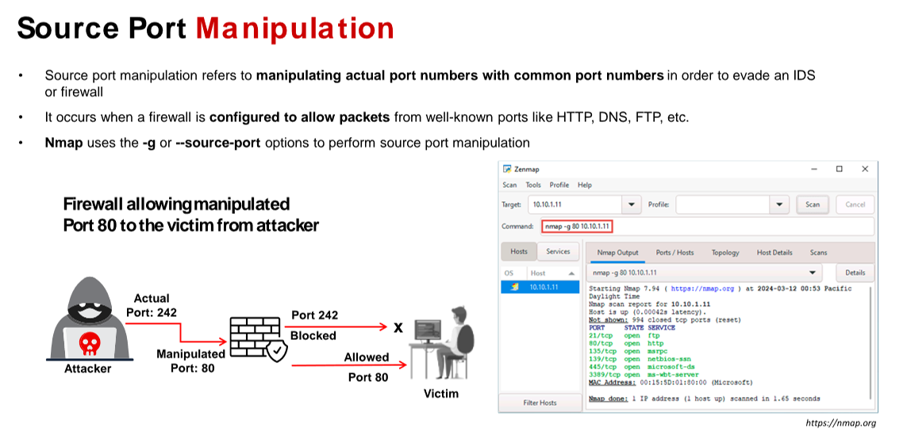

# IP Address Decoy 

The IP address decoy technique refers to generating or manually specifying IP addresses of the decoys to evade IDS/firewalls. It appears to the target that the decoys as well as the host(s) are scanning the network. This technique makes it difficult for the IDS/firewall to determine which IP address is actually scanning the network and which IP addresses are decoys

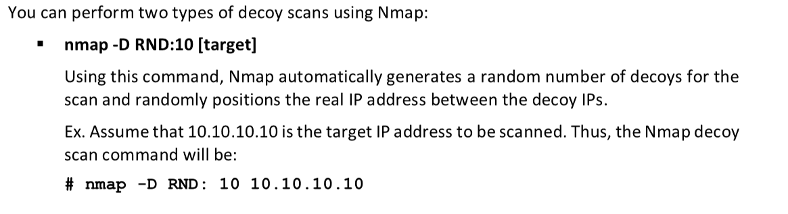

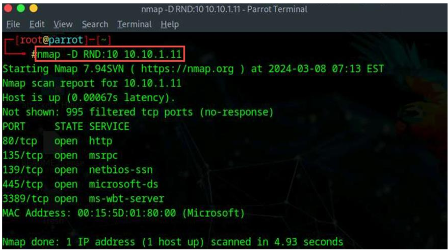

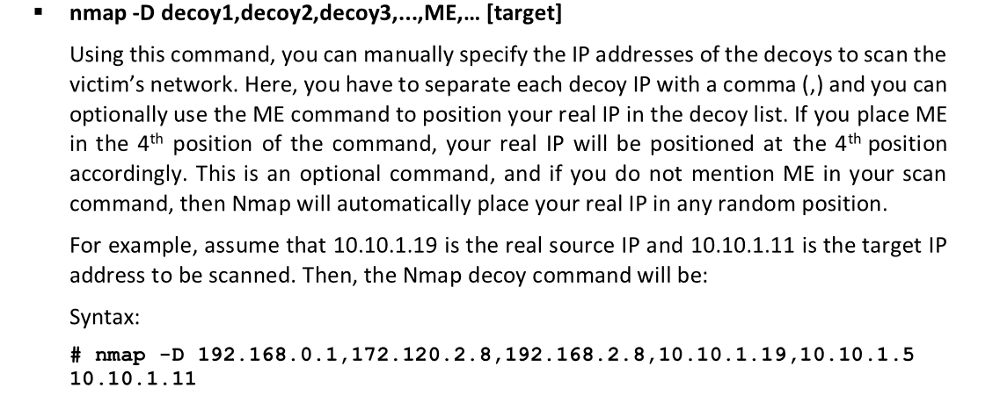

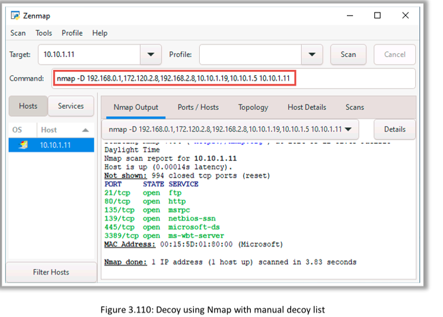

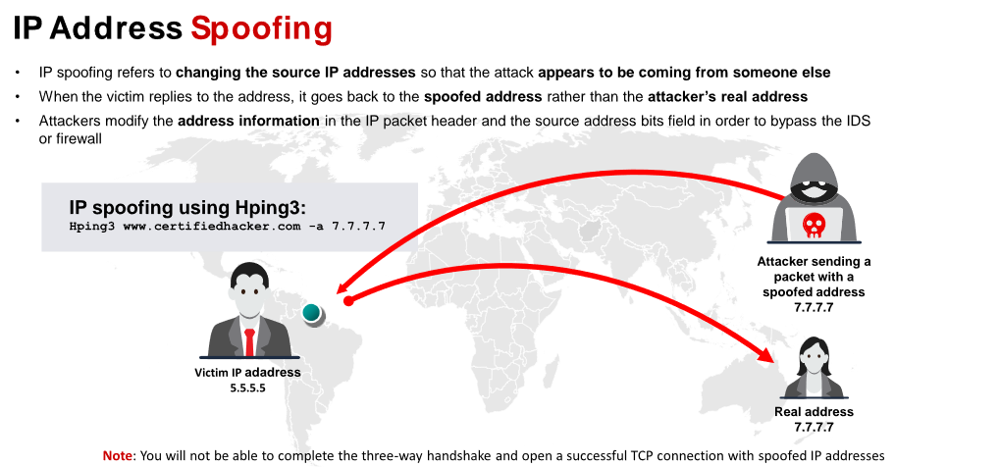

# MAC Address Spoofing 

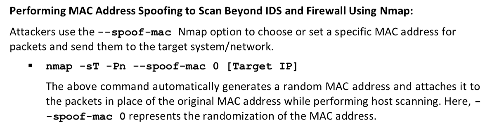

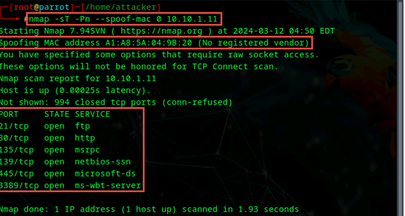

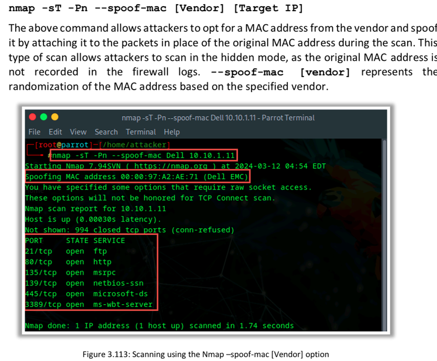

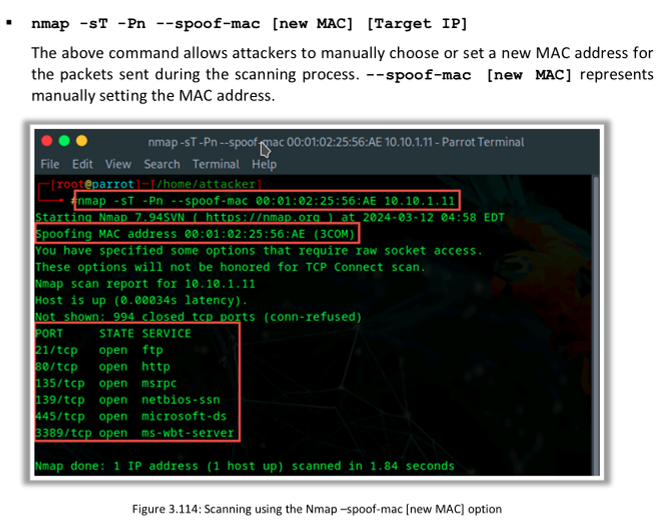

# Creating Custom Packets 

Colasoft Packet Builder Source: <https://www.colasoft.com>

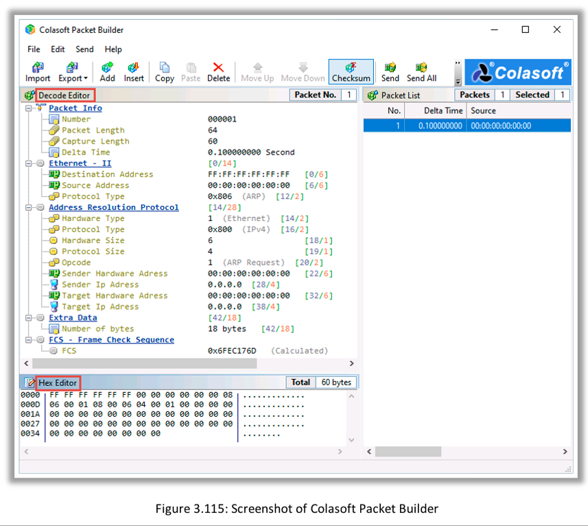

There are three views in the Packet Builder: Packet List, Decode Editor, and Hex Editor. • Packet List displays all the constructed packets. When you select one or more packets in Packet List, the first highlighted packet is displayed in both Decode Editor and Hex Editor for editing.
• In Hex Editor, the data of the packet are represented as hexadecimal values and ASCII characters; nonprintable characters are represented by a dot (".") in the ASCII section. You can edit either the hexadecimal values or the ASCII characters.
• Decode Editor allows the attacker to edit packets without remembering the value length, byte order, and offsets. You can select a field and change the value in the edit box.

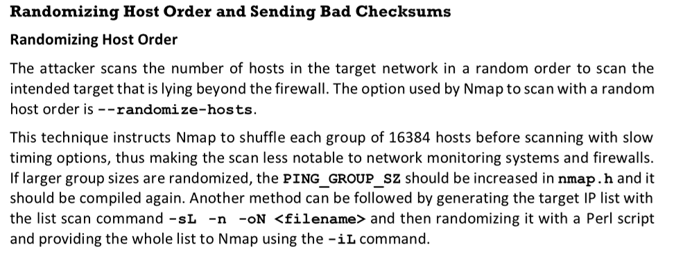

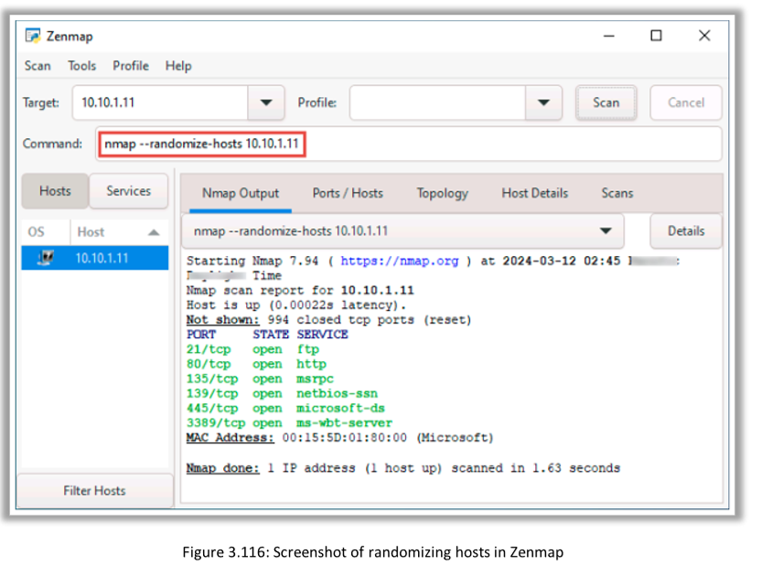

🧠 What Are Checksums?
A checksum is a small value that helps verify the integrity of data during transmission. It’s like a digital fingerprint for a packet.

Here’s how it works:

When a system sends a packet, it calculates a checksum based on the packet's contents (like a math summary).
The receiving system recalculates the checksum when it gets the packet.
If the checksums match, the packet is valid!
✅ Match: Packet is accepted.
❌ Mismatch: Packet is discarded (since it might be corrupted or tampered with).
In TCP/UDP, checksums help ensure that the data wasn’t corrupted during transmission.

🕵️ What Is "Sending Bad Checksums"?
Attackers sometimes intentionally send packets with invalid or incorrect checksums to see how a system responds.

🛡️ Properly configured firewalls/IDS: Drop the packet silently (no response).
🛑 Weakly configured systems or firewalls: Might still respond, leaking useful information!
🧩 Why Use Bad Checksums?
It’s a sneaky technique! Attackers can use it to:

Bypass Firewalls/IDS: Some firewalls only inspect packet headers but don’t validate checksums, accidentally leaking responses.
Fingerprint Firewalls: By analyzing whether a system responds or stays silent, attackers can guess if a firewall or IDS is present and how it’s configured.

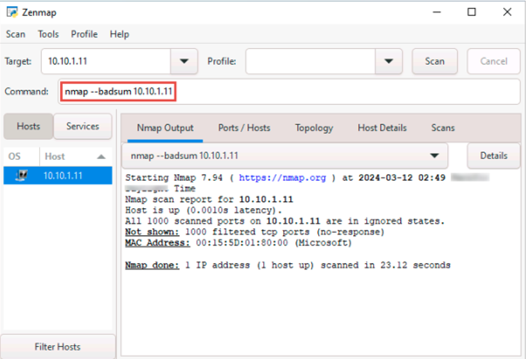

# Proxy Servers 

A proxy server is an application that can serve as an intermediary for connecting with other computers.

How does a proxy server work?
Initially, when you use a proxy to request a particular web page on an actual server, the proxy server receives it. The proxy server then sends your request to the actual server on your behalf. It mediates between you and the actual server to transmit and respond to the request, as shown in the figure below.

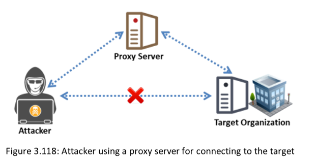

When the attacker uses a proxy to connect to the target system, the server logs will record the proxy's source address rather than the attacker’s source address
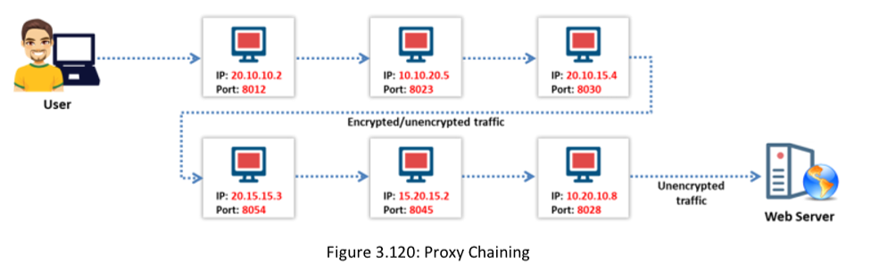

