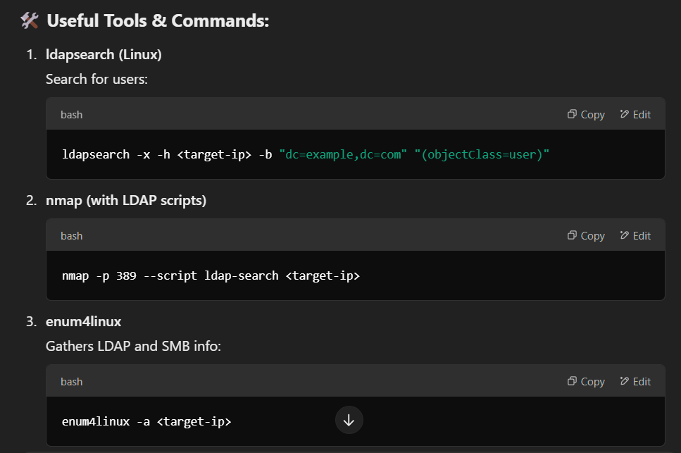

🔑 What is LDAP?
Lightweight Directory Access Protocol for accessing and managing directory services (like Active Directory).
Stores users, groups, computers, and domain structure info.

🛠️ Ports:
389 (TCP/UDP) → Unencrypted LDAP
636 (TCP) → Secure LDAP (LDAPS)

🎯 What Can You Enumerate?
Usernames & account details
Email addresses & phone numbers
Group memberships
Domain and organizational units (OUs)

🚩 Attack Scenarios:
Anonymous Bind → Access LDAP data without credentials.
Password Spraying/Brute-force → Test weak credentials.
Privilege Escalation → Find admin accounts or service accounts for attacks like Kerberoasting.

🛡️ Mitigation Tips:
Disable anonymous binds.
Force LDAPS (port 636) for encryption.
Use strong passwords and monitor queries.

✅ Key Exam Points:
Know LDAP ports (389/636).
Understand basic enumeration tools (ldapsearch, nmap, enum4linux).
Recognize common LDAP attack vectors.
Be able to recommend security fixes.
