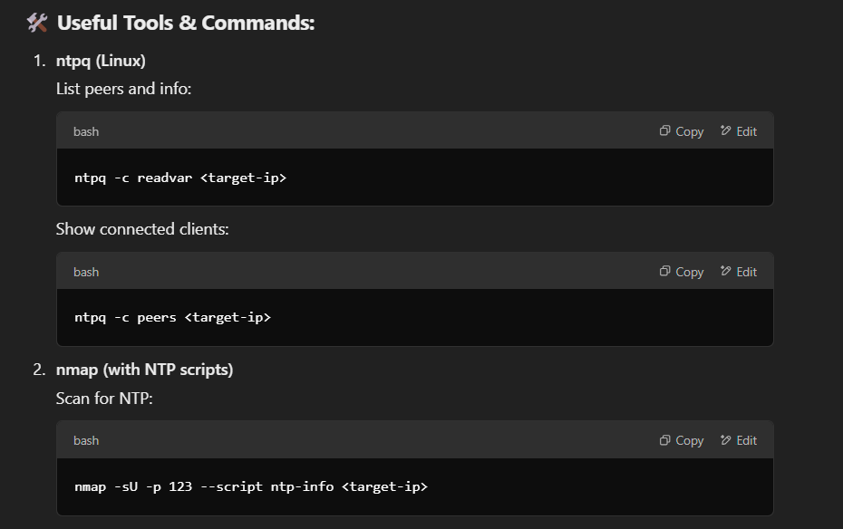
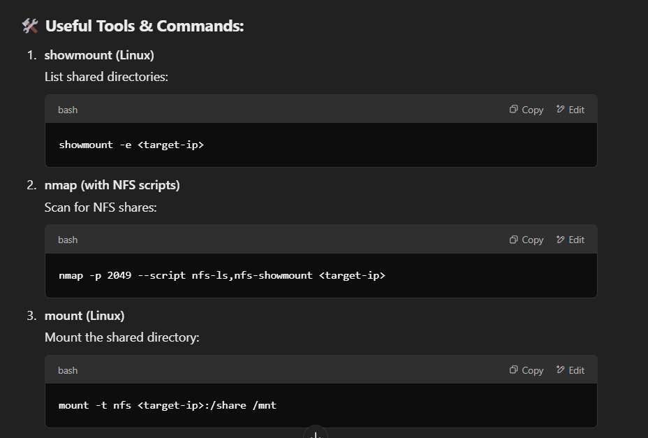

📘 NTP Enumeration — Quick Notes for CEH v13

🔑 What is NTP?
Network Time Protocol syncs clocks between devices.
Attackers can abuse it to gather system info or launch DDoS attacks (NTP amplification).

🛠️ Port:
UDP 123

🎯 What Can You Enumerate?
System time and date
Connected hosts and IPs
Uptime and OS versions

🚩 Attack Scenarios:
NTP Amplification DDoS → Reflect large traffic to overwhelm a target.
Time Spoofing → Manipulate system clocks to cause outages or desync.

🛡️ Mitigation Tips:
Restrict NTP queries to trusted IPs.
Update NTP servers to patch vulnerabilities.
Disable monlist command (used in amplification attacks).

📘 NFS Enumeration — Quick Notes for CEH v13

🔑 What is NFS?
Network File System allows remote file sharing over a network.
Misconfigurations can lead to unauthorized access to shared files or directories.

🛠️ Ports:
TCP/UDP 2049

🎯 What Can You Enumerate?
Shared directories and mount points
Permissions (read/write)
Exported file systems

🚩 Attack Scenarios:
Unauthorized Access → Mount and browse shared directories.
Privilege Escalation → Exploit weak file permissions to escalate access.
File Manipulation → Modify or delete critical files if write access is enabled.

🛡️ Mitigation Tips:
Restrict NFS access to specific IP ranges.
Use root squash to prevent remote root access.
Enforce strong permissions on shared directories.
Encrypt NFS traffic with Kerberos or VPN.

✅ Key Exam Points:
Know the ports: NTP (123/UDP), NFS (2049/TCP/UDP).
Memorize essential commands (ntpq, showmount, nmap scripts).
Understand common attack vectors (e.g., NTP amplification, unauthorized NFS access).
Be ready to recommend practical mitigations.
