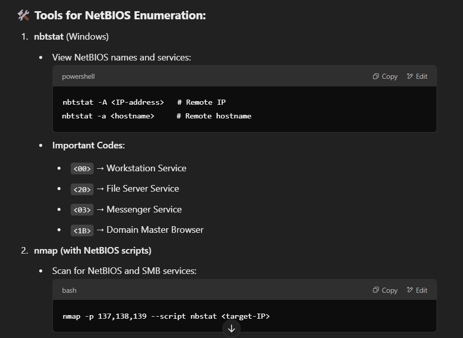
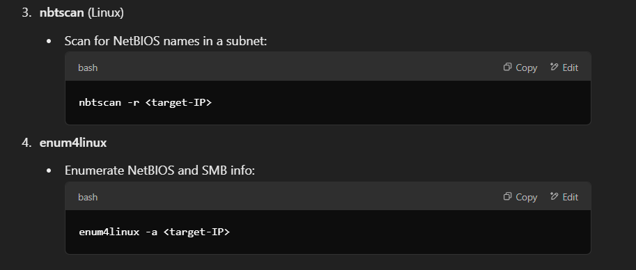

📘 NetBIOS Enumeration — CEH v13 Notes

🔑 What is NetBIOS?
NetBIOS (Network Basic Input/Output System) is a legacy protocol that allows communication between devices in a LAN.
It provides name resolution, session management, and data transfer services.
Works with NetBIOS over TCP/IP (NetBT) to run on modern networks.

🛠️ NetBIOS Ports:
UDP 137 → Name Service (name registration and resolution)
UDP 138 → Datagram Service (connectionless communication)
TCP 139 → Session Service (connection-oriented communication)

🕵️ Why is NetBIOS Enumeration Important?

Attackers can gather sensitive information, like:
Hostnames and IP addresses
Shared folders and printers
Domain and workgroup names
Usernames
Network shares (with permissions)

This information can help attackers:
Perform credential brute-force attacks
Access unprotected shares
Use null sessions to gather more data

🛡️ Mitigation and Hardening Tips:
Disable NetBIOS over TCP/IP (unless absolutely needed).
Block ports 137-139 on the firewall.
Enforce SMB signing and use SMBv3.
Disable null sessions and anonymous access.
Implement strong password policies for all accounts.
Regularly scan and monitor network traffic for suspicious activity.

🎯 Key Takeaways for the Exam:
Understand NetBIOS services and ports.
Learn the tools and commands to enumerate NetBIOS information.
Know how to identify and exploit misconfigurations (null sessions, open shares).
Be ready to suggest remediation measures to secure NetBIOS services.

