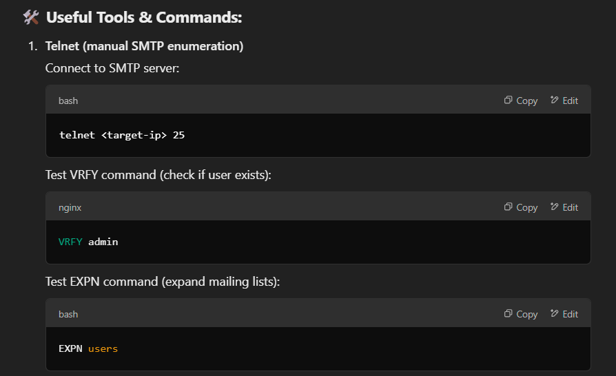
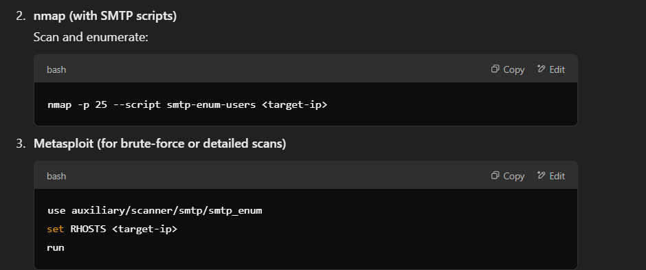
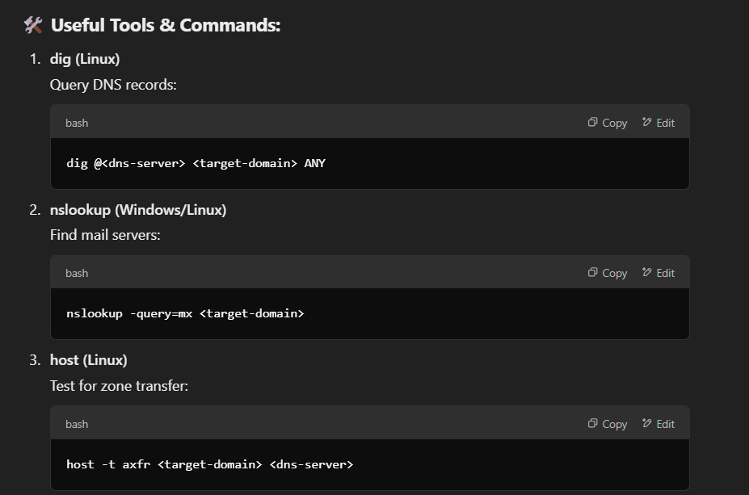
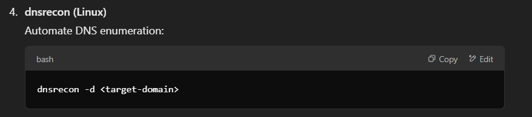

📘 SMTP Enumeration — Quick Notes for CEH v13

🔑 What is SMTP?
Simple Mail Transfer Protocol for sending and relaying emails.
Attackers can enumerate valid email addresses and users through misconfigured servers.

🛠️ Ports:
25 (TCP) → Unencrypted SMTP
465 (TCP) → SMTP with SSL
587 (TCP) → SMTP with STARTTLS (TLS encryption)

🎯 What Can You Enumerate?
Usernames and valid email addresses
Mail server software and version
Internal IP addresses (if leaking headers)

🚩 Attack Scenarios:
Username enumeration → Gather valid users for password attacks.
Email spoofing and phishing → Craft realistic phishing campaigns.
Relay exploitation → Abuse open relays to send spam or malicious emails.

🛡️ Mitigation Tips:
Disable unnecessary SMTP commands (like VRFY/EXPN).
Use authentication and encryption (TLS, SPF, DKIM, DMARC).
Limit IPs allowed to send mail through the server.

📘 DNS Enumeration — Quick Notes for CEH v13

🔑 What is DNS?
Domain Name System translates domain names to IP addresses.
DNS enumeration reveals hostnames, IPs, subdomains, and internal networks.

🛠️ Ports:
53 (TCP/UDP)

🎯 What Can You Enumerate?
Subdomains and hostnames
IP addresses and records (A, AAAA, MX, etc.)
Mail servers (MX records)
Zone transfers (if misconfigured)

🚩 Attack Scenarios:
Zone transfer attacks → Steal a full DNS zone file.
Subdomain discovery → Map out infrastructure for attack paths.
Cache poisoning → Redirect users to malicious sites.

🛡️ Mitigation Tips:
Disable zone transfers or restrict them to trusted IPs.
Implement DNSSEC to prevent spoofing and tampering.
Monitor DNS queries for suspicious patterns.

✅ Key Exam Points:
Know the ports: SMTP (25, 465, 587), DNS (53).
Memorize core commands: telnet, dig, nslookup, host.
Understand key attacks: SMTP user enumeration, DNS zone transfers.
Be ready to recommend hardening techniques.
