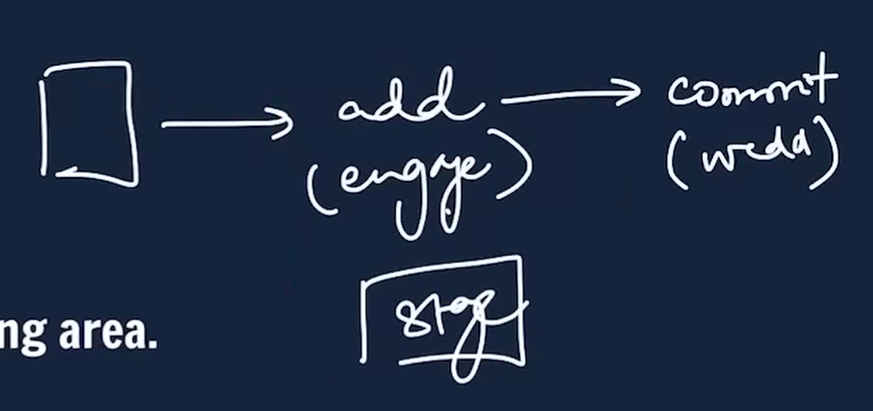
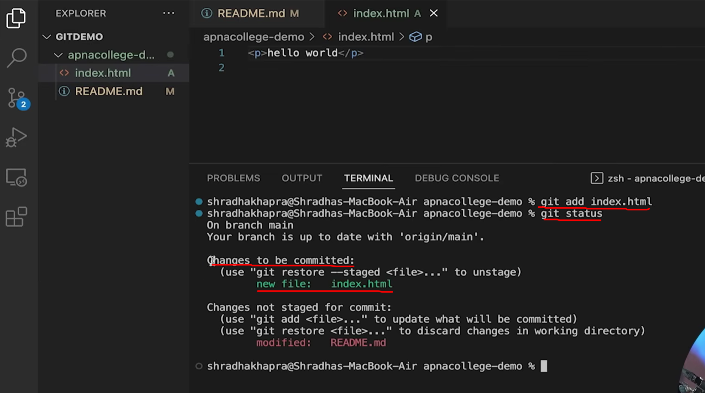
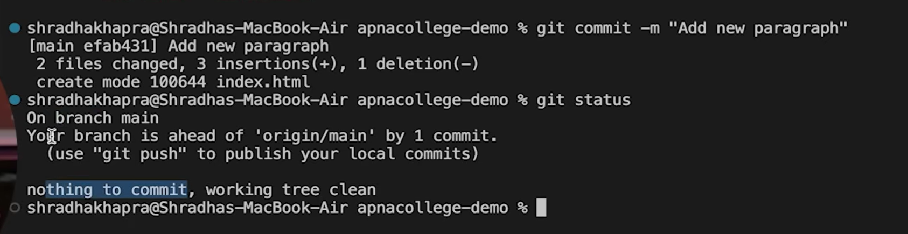

## Add

add - adds new or changed files in your working directory to the Git staging area.
```
git add <- file name->
```





```
git add README.md
git add .  #the "." here specifies to change all files at once
```


All the changes are now ready to be commited

## Commit

commit - it is the record of change
```
git commit -m "some message"
```



It says "your branch is ahead of 'origin/main by 1 commit"

Which means the files are updated in local machine but not on GitHub 


no new "index.html" here

so for this we will use push command