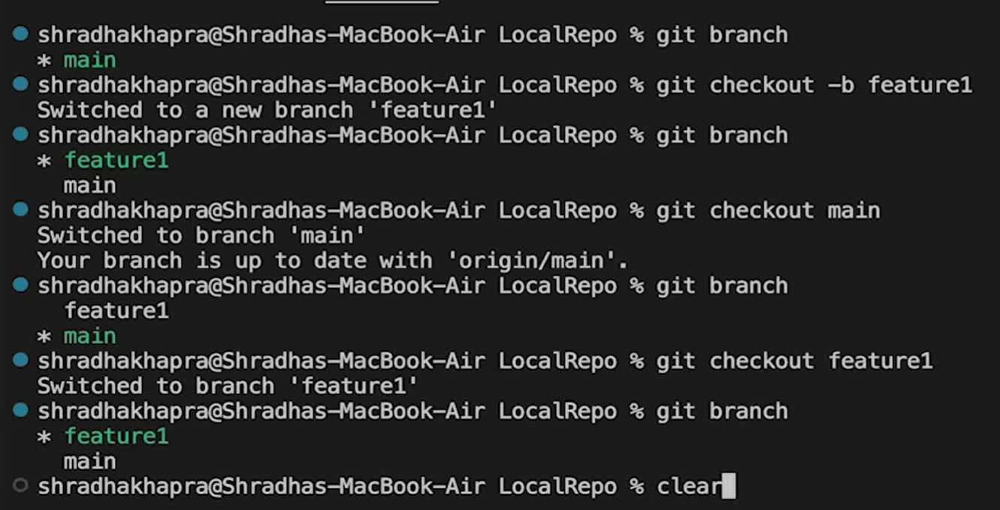
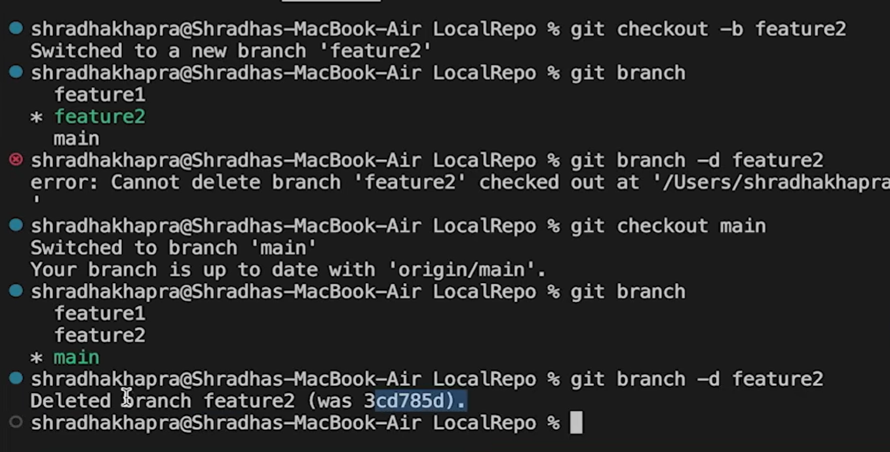
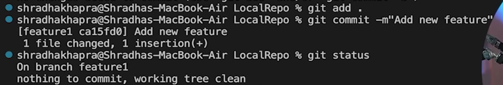
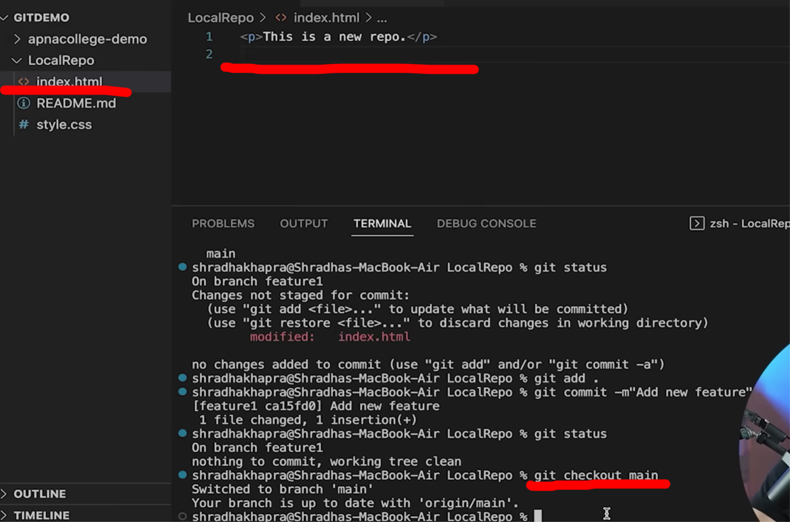
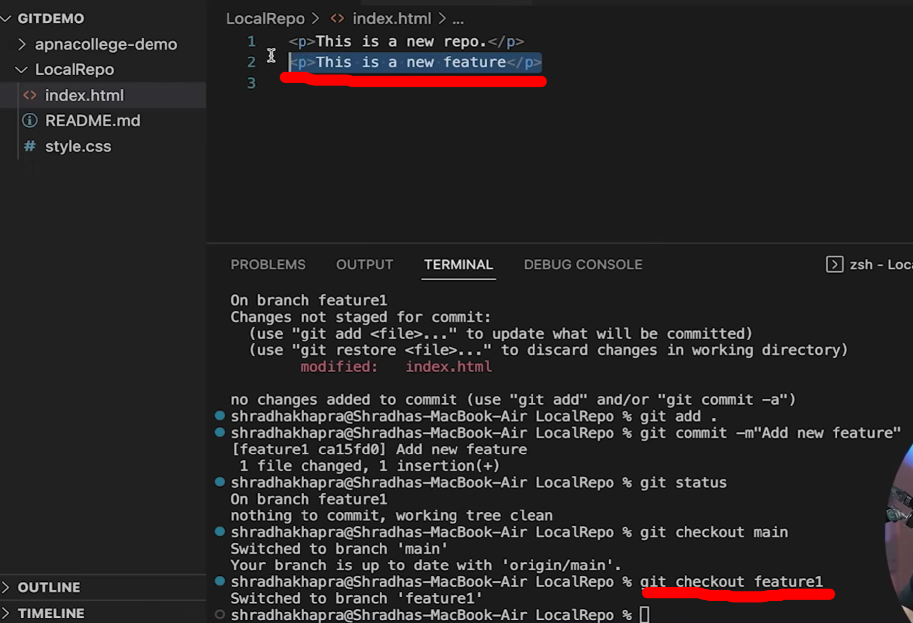
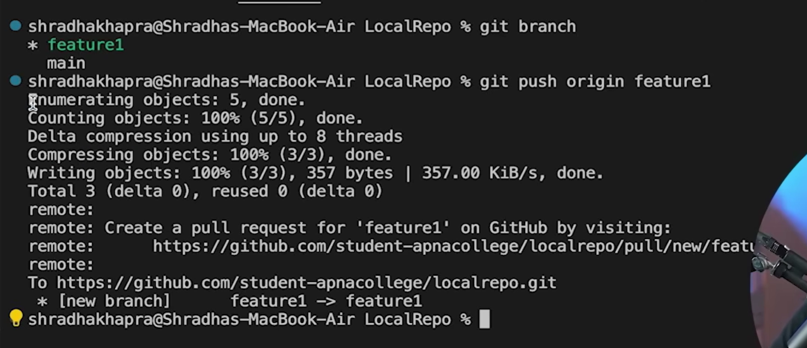
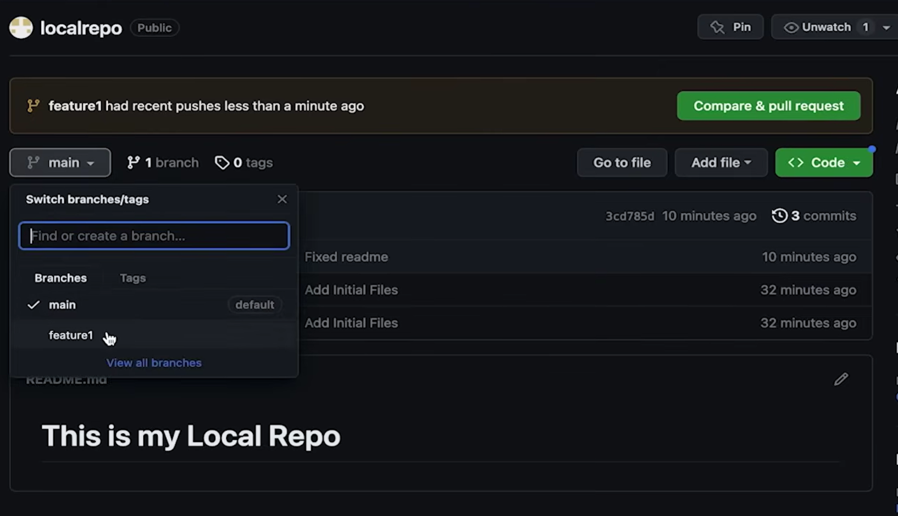

```
git branch (to check branch)
git branch -M main (to rename branch)
git checkout <- branch name -> (to navigate)
git checkout -b <- new branch name -> (to create new branch)
git branch -d <- branch name -> (to delete branch)
```






Now when we make a new file or make changes it will be in that particular branch only





If we now shift to main branch we can see that the line has disappeared which we had added in index.html



If we shift to feature1 branch , the lines come again



Now we will push our changes to feature 1 branch



Now we can see that new branch is also made and updated on github

