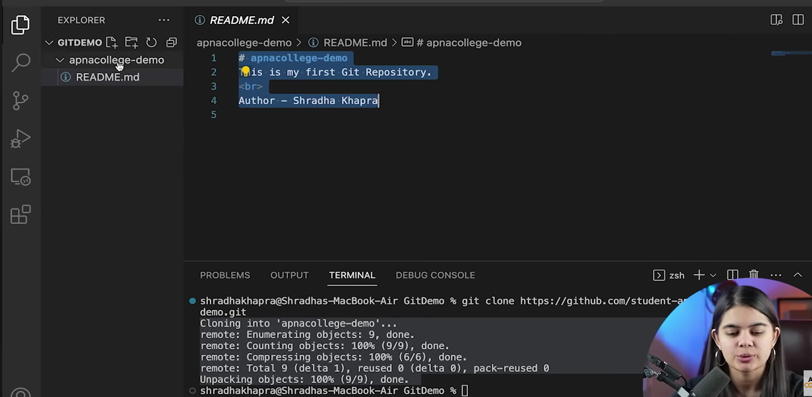
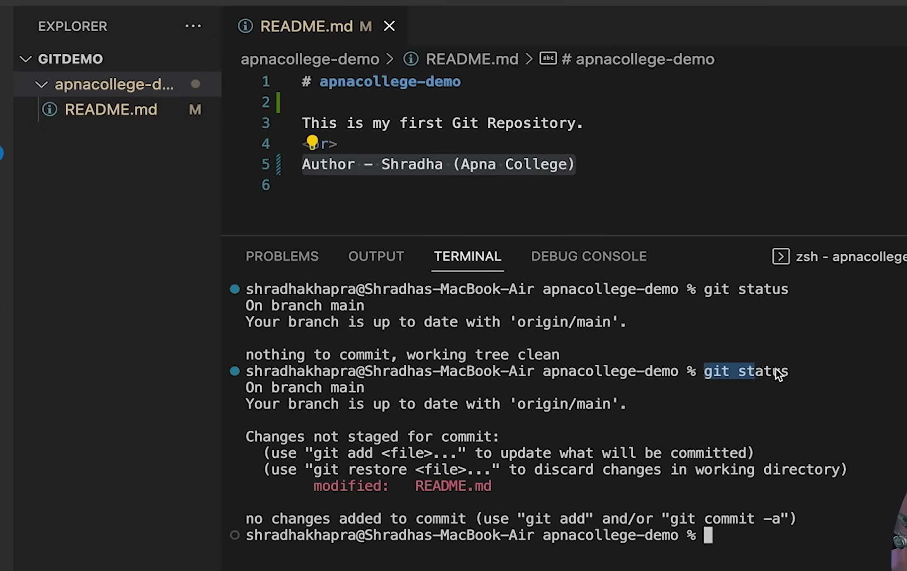
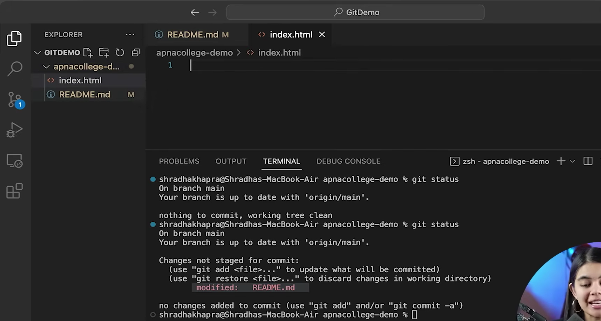
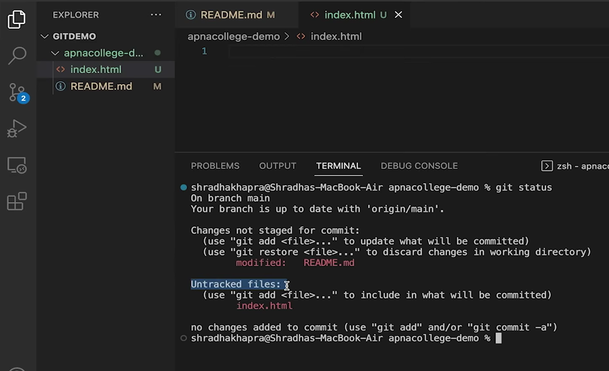

Local - laptop/pc
remote - github

## Clone

Clone - Cloning a repository on our local machine
copy/duplicte

```
git clone <- some link ->
```



```
git clone <- some link ->
cd <directory name>
clear
ls
```


It will list all hidden files also
```
ls -a
```
change from power shell to git bash

".git" folder checks versioning

## Status

status - displays the state of the code
```
git status
```


"nothing to commit" means the code is up to date
i.e the same code is in github online which is on the local folder



it we change something in readme.md file and then do "git status"

after we do a change , it is a 2 step process
1. add
2. commit
until we do both of the steps we can see the status using "git status"


make new file "index.html"


now "git status" shows 2 pending changes in red


## Types of Statuses

1. untracked - new files that git doesn't yet track
2. modified - changed
3. staged - file is ready to be committed
4. unmodified - unchanged

if we do a change to a file/change a file - it gets modified status
and if we add a new file it get untracked status

First we need to "add" all these changes
as soon as we add these files , these files become staged (ready to commit now)
then we finally commit the files


