A fork is a new repository that shares code and visibility settings with the original "upstream" repository.

**Fork is a rough copy.**

for example we want to do open source contributions 

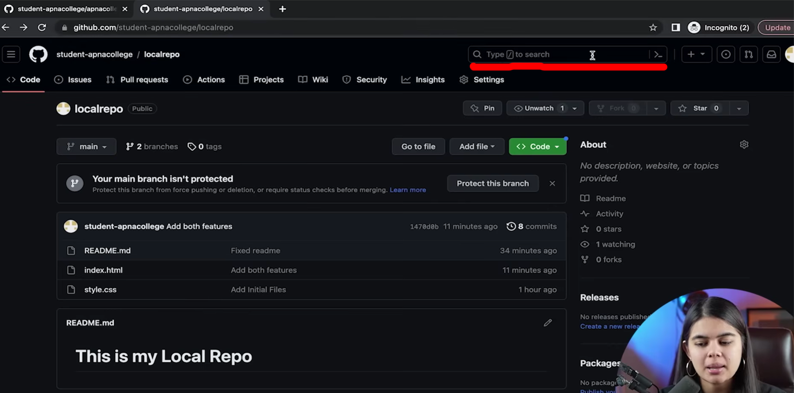

first we search up the repo 

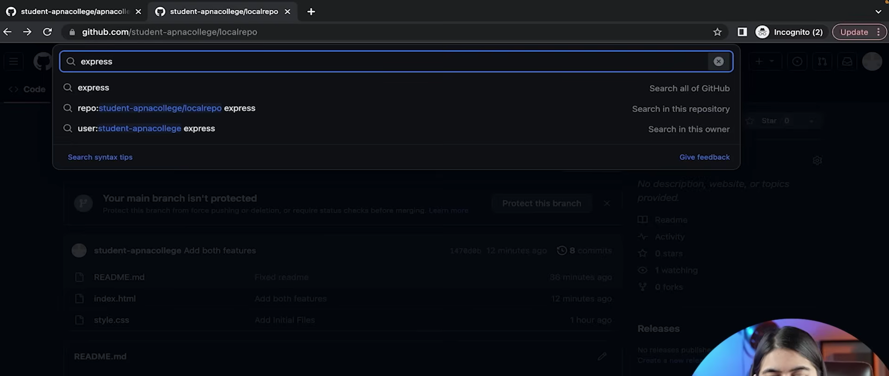

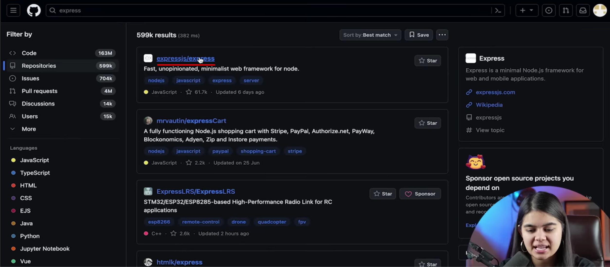

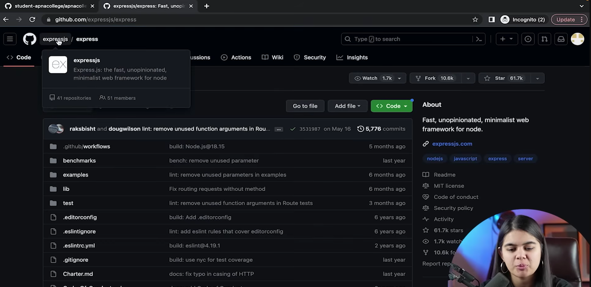
we get to the official repo of express js

now we want to make a copy of this project on our github account
i.e to 'fork' or make a rough copy

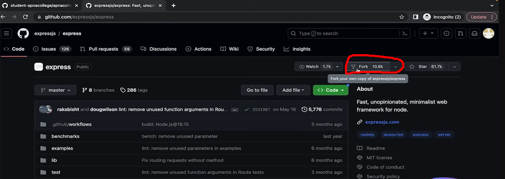

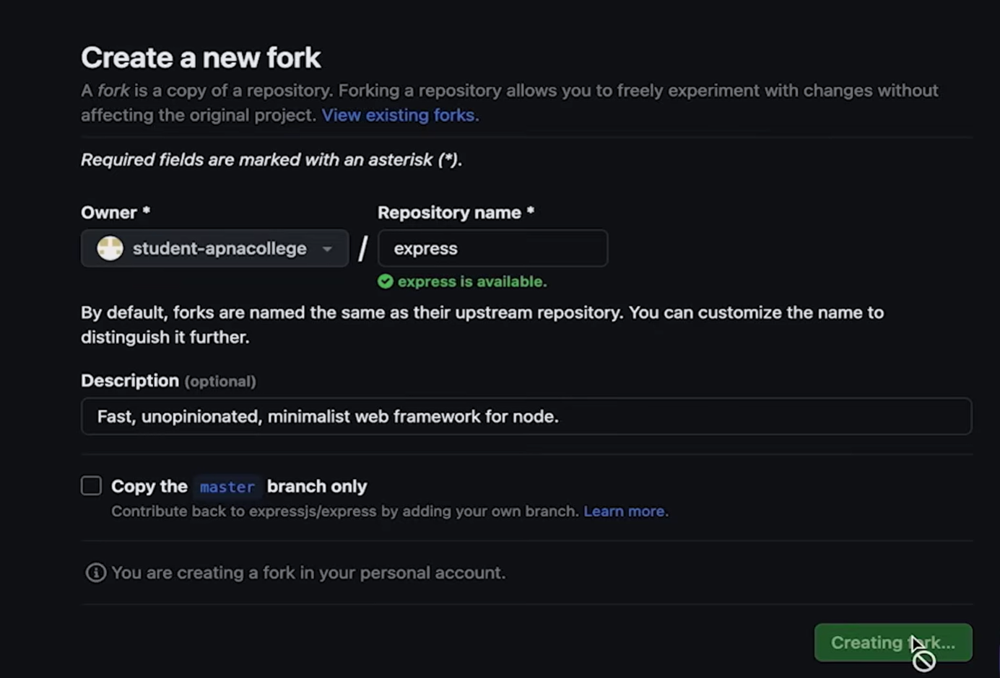
we can either copy the master branch only or copy the entire project

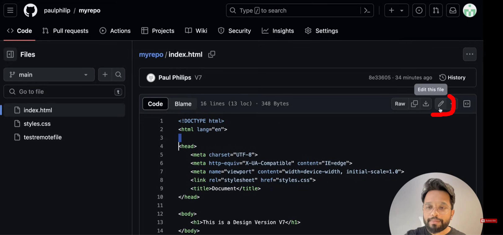
then we can go to the files individually and click on edit

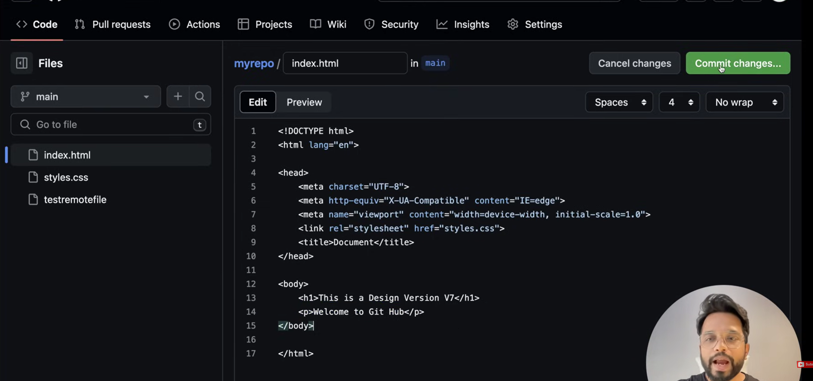
edit the file accordingly and commit changes

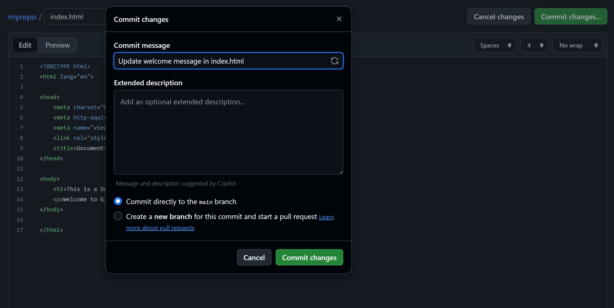

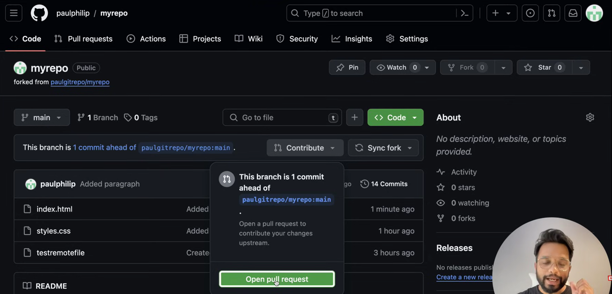
on our forked repo , we will now get the option to contribute
'open pull request' - is to notify the owner that we are suggesting some changes

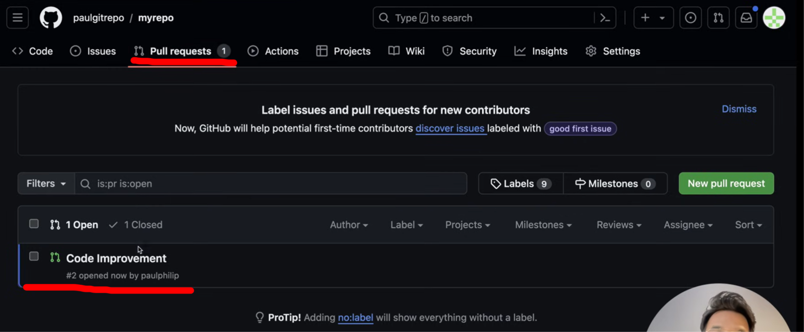
now , if we go to the pull request tab
we can see our pull request on top

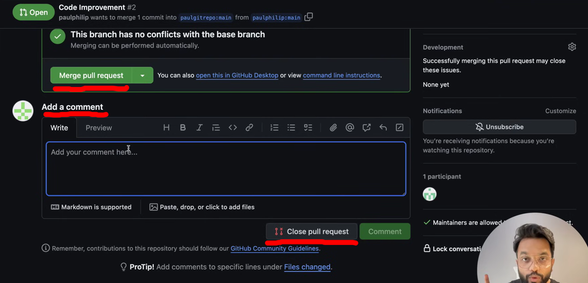
on owner side , we have options to 'merge pull request' or 'close pull request' or 'add a comment'

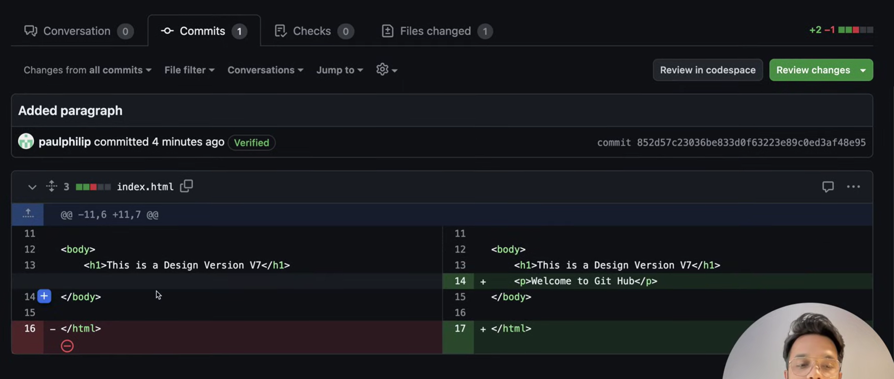
we can go to the commit tab to see what all change the person has done

