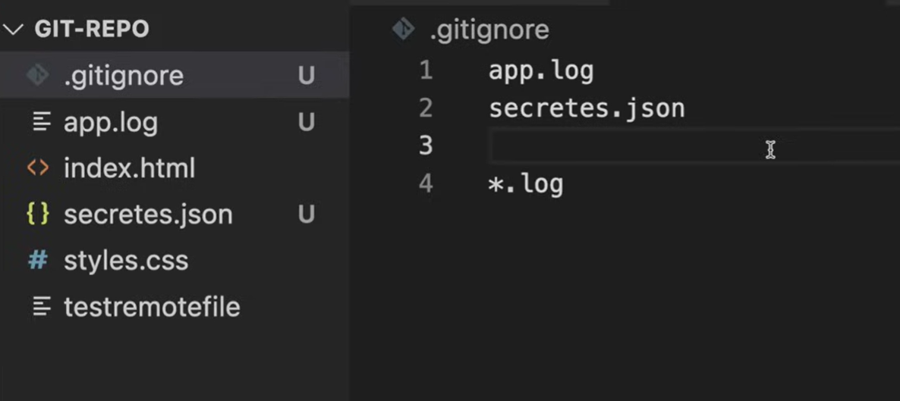
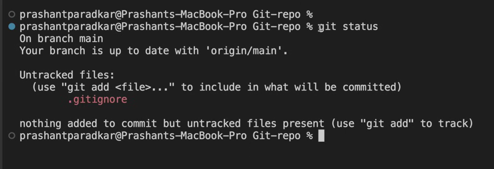
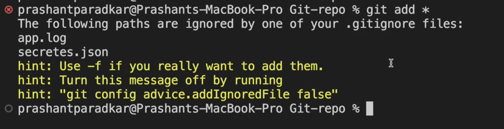

If we are pushing a repo online 

and we want some files to never get pushed online

we add a ".gitignore" file and in that we mention the names of all the files which we do not want to upload



"*.log" means all files will be ignored


if we do 'git status'
if says untracked file is only one 
even though we had created many files
this is because all new files are in ".gitignore" file 



```
git status
git add .gitignore
git commit -m "Adding gitignore file"
git push
```


